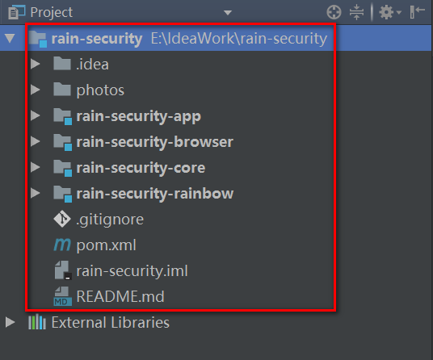

#### 一步一步实现 Spring Boot & Spring Security 保护应用

* 项目简介：
> 使用Spring Boot & Spring Security 打造企业级安全认证，为我们的应用保驾护航。
* 项目结构：

* 技术栈：
    * [1].Spring Boot 1.5.7
    * [2].Spring Security
    * [3].Spring Social
    
* 更多细节：
    * Spring Boot & Restful 零碎知识铺垫：
        * [Restful API Example](./rain-security-rainbow/RestfulAPI%20Example.md)
        * [Restful API Document :Swagger](./rain-security-rainbow/Swagger使用.md)
        * [Spring Boot File Upload&Download](./rain-security-rainbow/SpringBoot文件上传下载.md)
        * [Spring Boot Async Task Example](./rain-security-rainbow/SpringBoot异步任务执行.md)
        * [Spring Boot Mutiple Module Problem 01](./rain-security-rainbow/SpringBoot使用Maven打包的时候找不到Main.md)
        * [Spring Boot Mutiple Module Problem 02](./rain-security-rainbow/SpringBoot找不到jar报中的Component注解.md)
        * [WireMock的使用](./rain-security-rainbow/WireMock的使用.md)
        
    * Spring Boot & Spring Security 应用：
        * [Spring Security 基于Form表单提交](./rain-security-rainbow/SpringSecurity基于Form表单提交.md)
        * [Spring Security 获取用户信息](./rain-security-rainbow/SpringSecurity获取用户信息.md)
        * [Spring Security 个性化用户认证流程](./rain-security-rainbow/SpringSecurity个性化用户认证流程.md)
        * [Spring Security 基于图片验证码的实现](./rain-security-rainbow/SpringSecurity基于图片验证码的实现.md)
        * [Spring中@Autowired%20注解%20注入map](./rain-security-rainbow/Spring中@Autowired%20注解%20注入map、list与@Qualifier.md)
        * [SpringSecurity基于App获取短信验证码的实现](./rain-security-rainbow/SpringSecurity基于App获取短信验证码的实现.md)
        * [SpringSecurity中RememberMe功能的实现](./rain-security-rainbow/SpringSecurity中RememberMe功能的实现.md)
        * [Spring Security 短信验证码登录](./rain-security-rainbow/SpringSecurity短信验证码登录.md)
        * [OAuth原理和相关知识总结](./rain-security-rainbow/OAuth原理和相关知识总结.md)
        * [SpringSecuritySocialJDBCUsersConnectionRepository](./rain-security-rainbow/SpringSecuritySocialJDBCUsersConnectionRepository.md)
        * [SpringSocial-QQ登录实现](./rain-security-rainbow/SpringSocial-QQ登录实现.md)
        * [SpringBoot Session管理](./rain-security-rainbow/SpringBootSession管理.md)
        * [Spring Security中Auth2的实现](./rain-security-rainbow/SpringSecurity中Auth2的实现.md)
        * [SpringSecurityOAuth重构用户名密码登陆](./rain-security-rainbow/SpringSecurityOAuth重构用户名密码登陆.md)
        * [SpringSecurityOAuth重构短信验证码登录](./rain-security-rainbow/SpringSecurityOAuth重构短信验证码登录.md)
        * [SpringSecurityOAuth重构社交登录](./rain-security-rainbow/SpringSecurityOAuth重构社交登录.md)
