#### OAuth2使用JWT替换默认Token
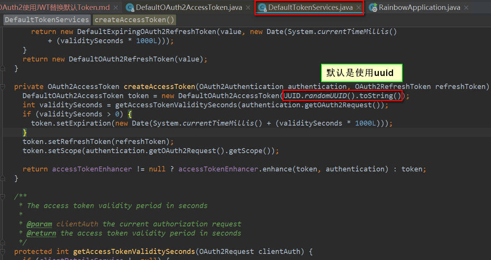

* JWT（Json Web Token）开放标准
    * 自包含
    * 密签
    * 可扩展

#####  使用JWT标准重构代码   
* 重构代码
    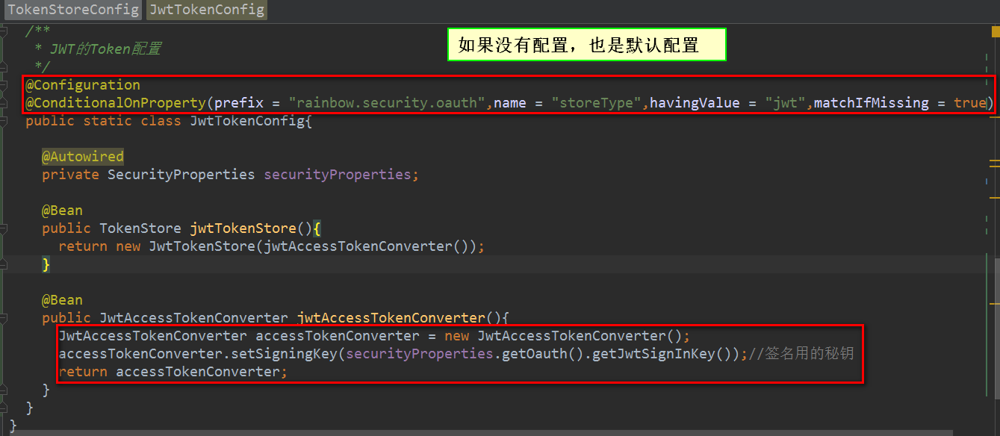

    ```java
    package com.jhon.rain.security.app;
    
    import com.jhon.rain.security.core.properties.SecurityProperties;
    import org.springframework.beans.factory.annotation.Autowired;
    import org.springframework.boot.autoconfigure.condition.ConditionalOnProperty;
    import org.springframework.context.annotation.Bean;
    import org.springframework.context.annotation.Configuration;
    import org.springframework.data.redis.connection.RedisConnectionFactory;
    import org.springframework.security.oauth2.provider.token.TokenStore;
    import org.springframework.security.oauth2.provider.token.store.JwtAccessTokenConverter;
    import org.springframework.security.oauth2.provider.token.store.JwtTokenStore;
    import org.springframework.security.oauth2.provider.token.store.redis.RedisTokenStore;
    import org.springframework.stereotype.Component;
    
    /**
     * <p>功能描述</br> RedisToken的存储配置 </p>
     *
     * @author jiangy19
     * @version v1.0
     * @FileName TokenStoreConfig
     * @date 2017/10/29 10:32
     */
    @Configuration
    public class TokenStoreConfig {
    
        @Autowired
        private RedisConnectionFactory redisConnectionFactory;
    
    
        @Bean
        @ConditionalOnProperty(prefix = "rainbow.security.oauth",name = "storeType",havingValue = "redis")
        public TokenStore redisTokenStore(){
            return new RedisTokenStore(redisConnectionFactory);
        }
    
        /**
         * JWT的Token配置
         */
        @Configuration
        @ConditionalOnProperty(prefix = "rainbow.security.oauth",name = "storeType",havingValue = "jwt",matchIfMissing = true)
        public static class JwtTokenConfig{
    
            @Autowired
            private SecurityProperties securityProperties;
    
            @Bean
            public TokenStore jwtTokenStore(){
                return new JwtTokenStore(jwtAccessTokenConverter());
            }
    
            @Bean
            public JwtAccessTokenConverter jwtAccessTokenConverter(){
                JwtAccessTokenConverter accessTokenConverter = new JwtAccessTokenConverter();
                accessTokenConverter.setSigningKey(securityProperties.getOauth().getJwtSignInKey());//签名用的秘钥
                return accessTokenConverter;
            }
        }
    }
    ```
    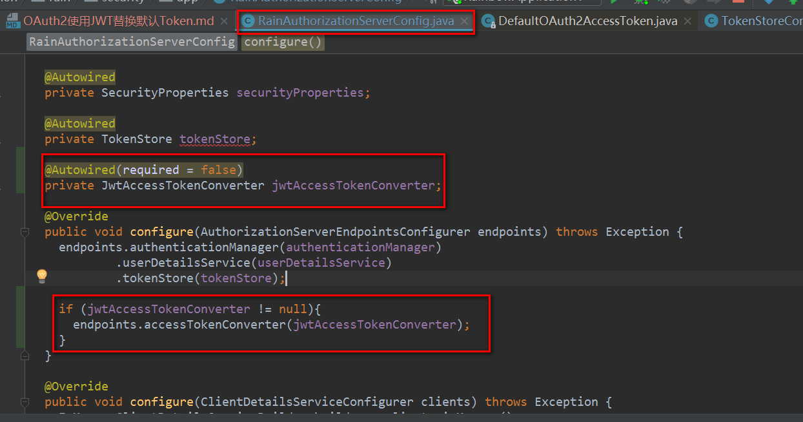

* 测试效果：
    

    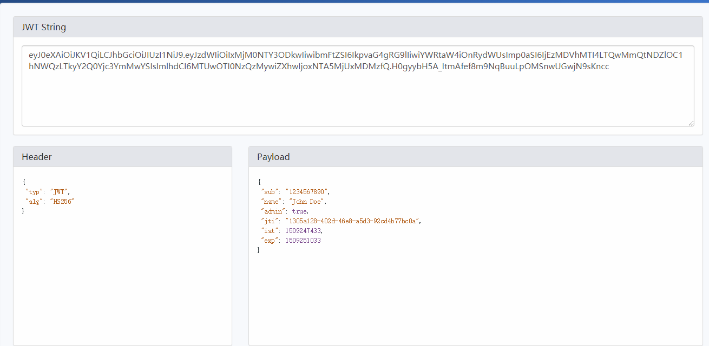


##### 扩展JWT
* 如何扩展，accessTokenEnhancer才是入口：
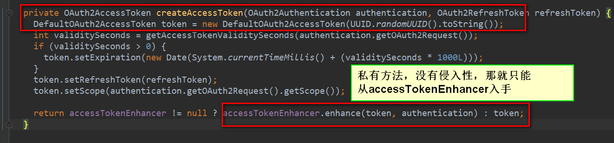
* 自定义TokenEnhancer接口的实现：
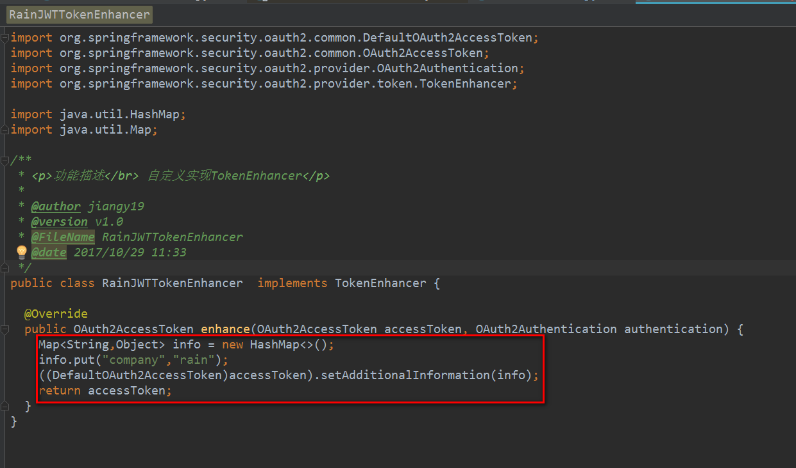
* 将实现类申明为Bean注册到Spring容器中，其中@ConditionalOnMissingBean是为了扩展
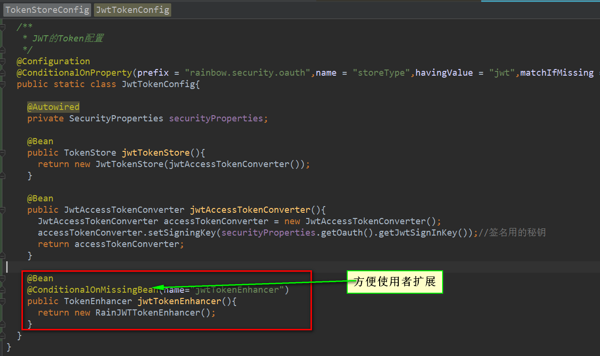
* 修改服务提供者类的配置信息，将TokenEnhancer配置加入：
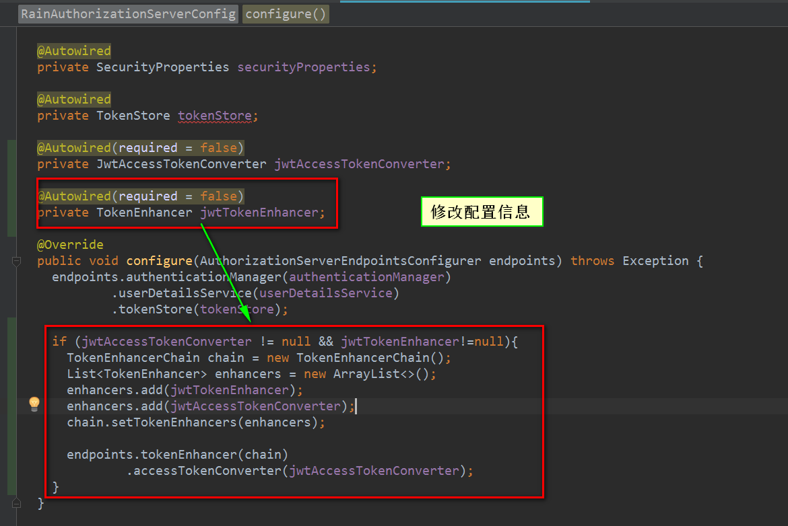
* 查看接口调用结果
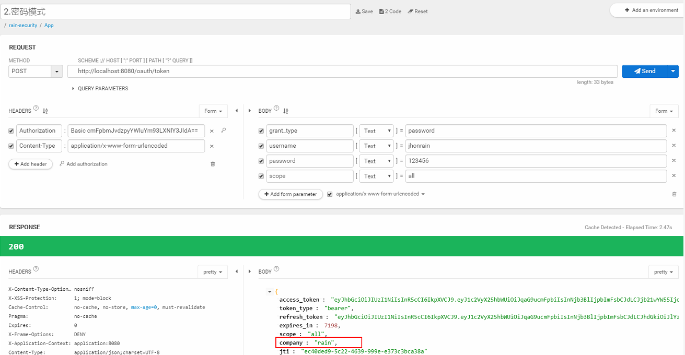
* TOKEN的反向解析
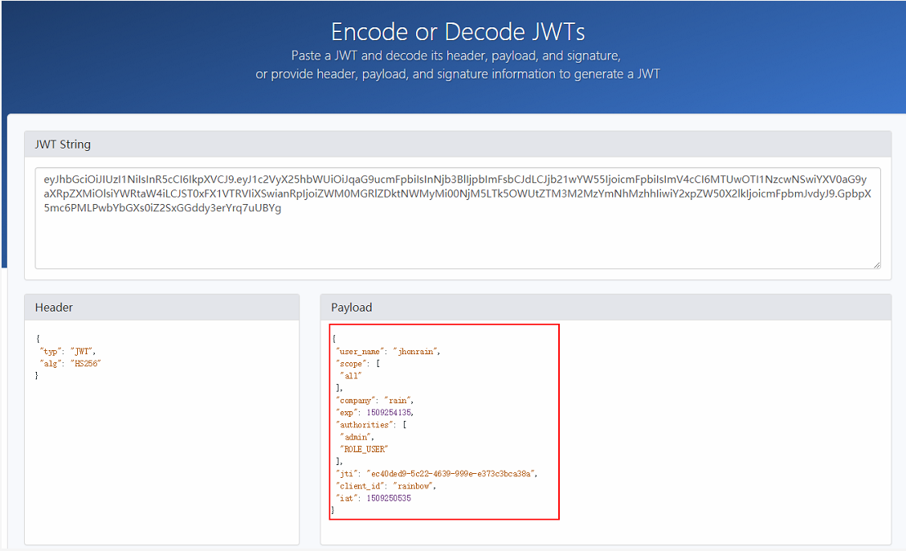


##### 获取特殊信息
* 添加 json web token 解析依赖
    ```xml
    <!--解析JWT TOKEN-->
    <dependency>
        <groupId>io.jsonwebtoken</groupId>
        <artifactId>jjwt</artifactId>
        <version>0.7.0</version>
    </dependency>
    ```
* 修改代码：
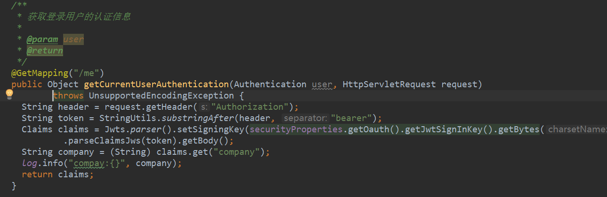

* 查看请求结果：
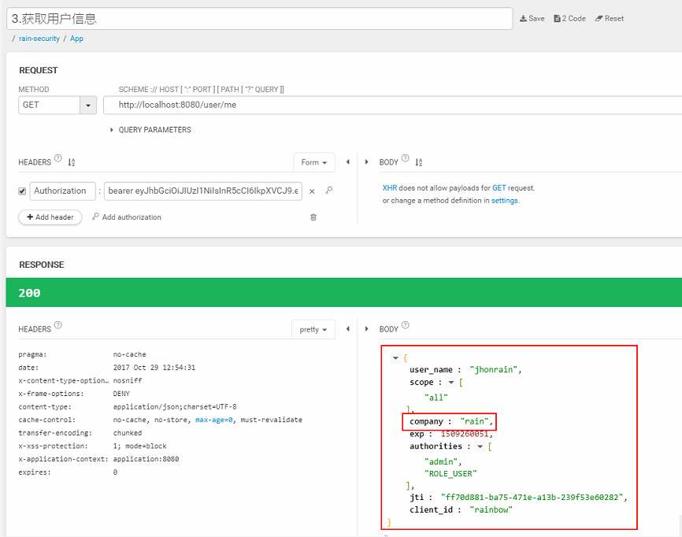

##### 刷新Token
* RefreshToken的过期时间配置（一般可以设置长一点：一个星期或者一个月）
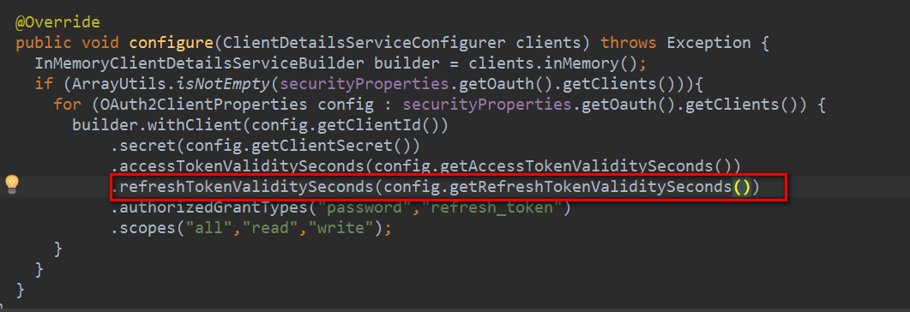
* 请求结果
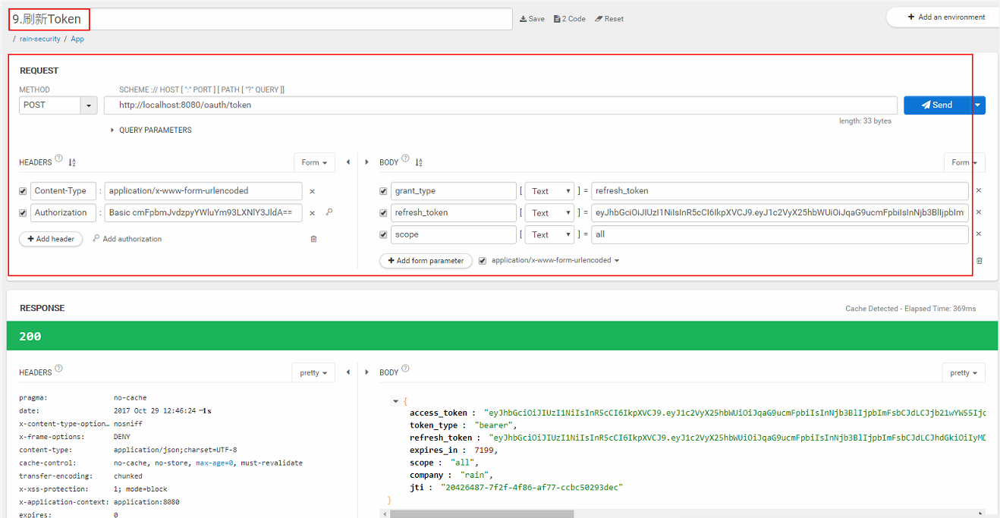