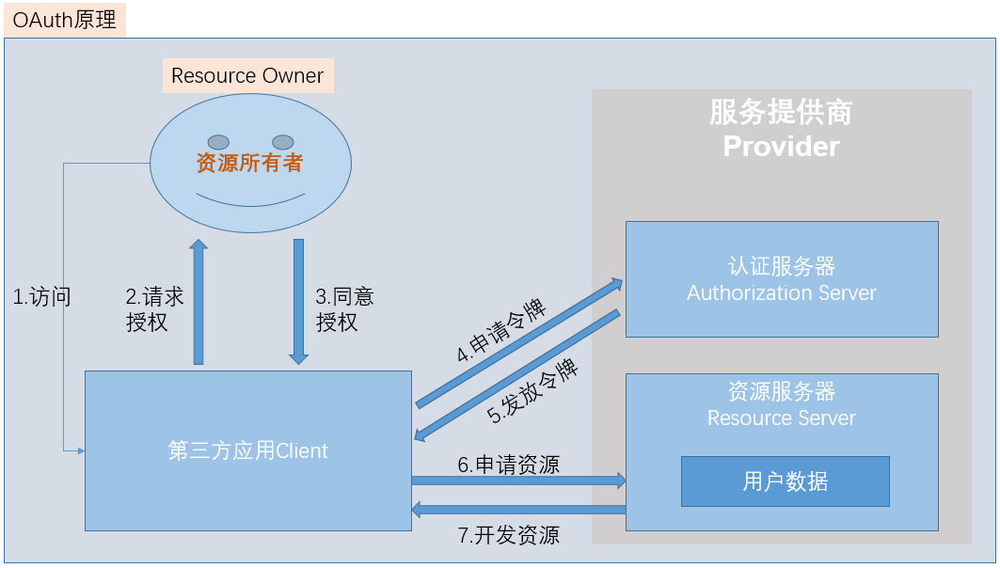
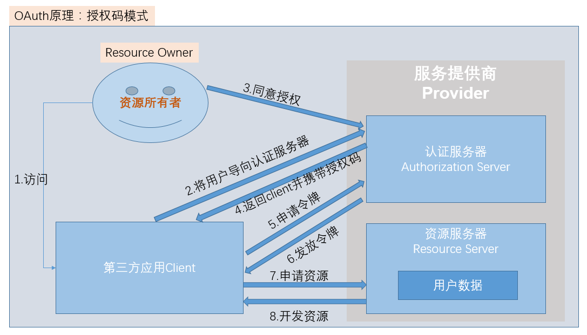

#### OAuth原理和相关知识总结

##### OAuth原理图

##### OAuth协议中的授权模式 [步骤二中的请求授权的模式]
* 授权码模式(authorization code)

1.用户同意授权动作是在认证服务器上完成的
2.同意授权后，返回的并不是令牌，而是一个授权码，通过授权码再去获取令牌

* 简化模式 (implicit)

* 密码模式 (resource owner password credentials)

* 客户端模式 (client credentials)
