#### SpringSecurityOAuth令牌配置

* 令牌的配置
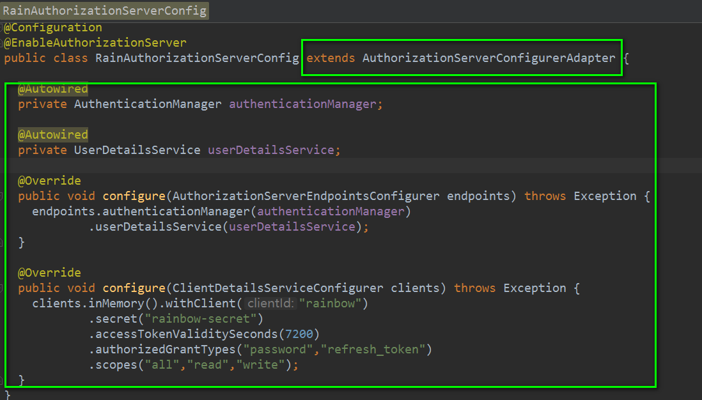

* 配置支持多个应用
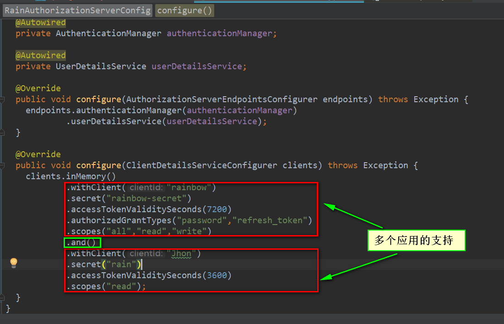

* 多个应用支持可配置

    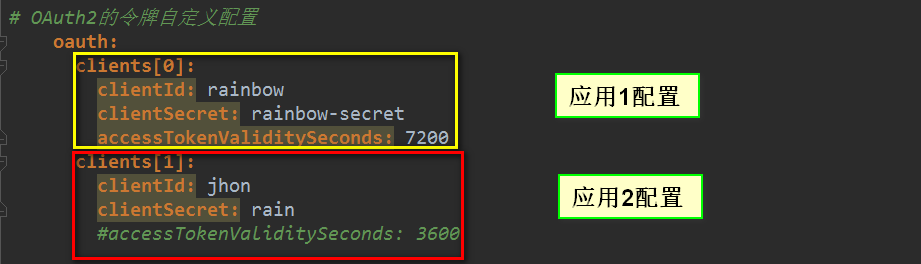

    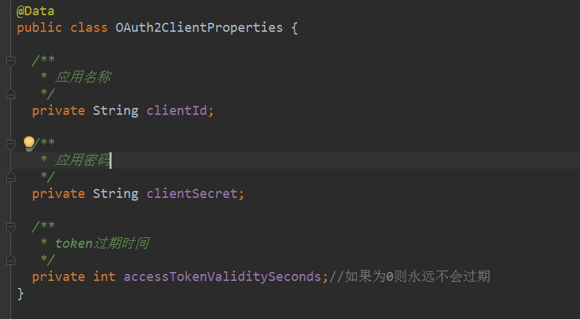


* 应用1：
    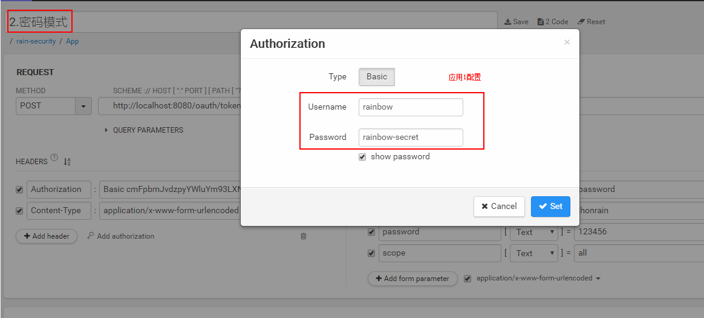

    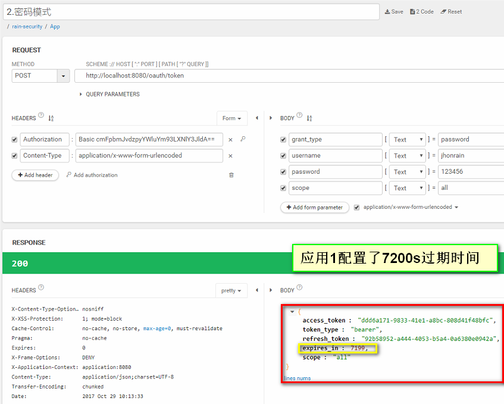

* 应用2：
    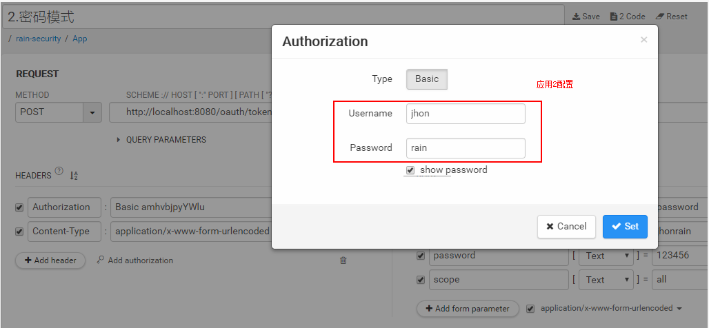

    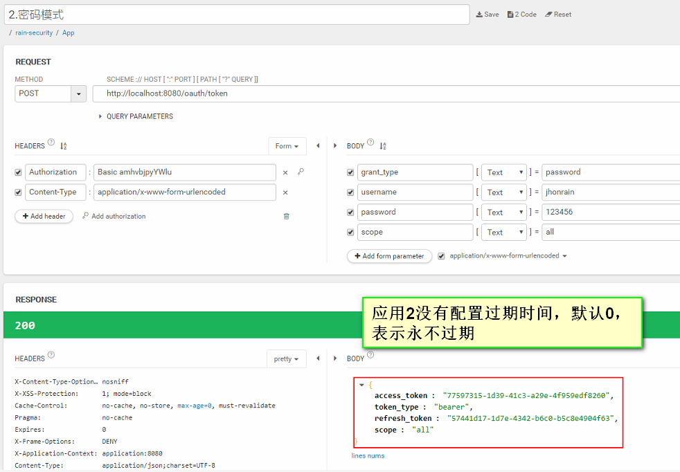

* 代码实现：
    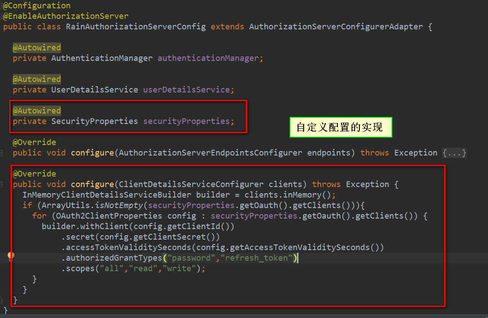

    ```java
    package com.jhon.rain.security.app;
    
    import com.jhon.rain.security.core.properties.SecurityProperties;
    import com.jhon.rain.security.core.properties.oauth2.OAuth2ClientProperties;
    import org.apache.commons.lang.ArrayUtils;
    import org.springframework.beans.factory.annotation.Autowired;
    import org.springframework.context.annotation.Configuration;
    import org.springframework.security.authentication.AuthenticationManager;
    import org.springframework.security.core.userdetails.UserDetailsService;
    import org.springframework.security.oauth2.config.annotation.builders.InMemoryClientDetailsServiceBuilder;
    import org.springframework.security.oauth2.config.annotation.configurers.ClientDetailsServiceConfigurer;
    import org.springframework.security.oauth2.config.annotation.web.configuration.AuthorizationServerConfigurerAdapter;
    import org.springframework.security.oauth2.config.annotation.web.configuration.EnableAuthorizationServer;
    import org.springframework.security.oauth2.config.annotation.web.configurers.AuthorizationServerEndpointsConfigurer;
    
    /**
     * <p>功能描述</br> 认证服务器配置 </p>
     *
     * @author jiangy19
     * @version v1.0
     * @FileName RainAuthorizationServerConfig
     * @date 2017/10/28 13:41
     */
    @Configuration
    @EnableAuthorizationServer
    public class RainAuthorizationServerConfig extends AuthorizationServerConfigurerAdapter {
    
        @Autowired
        private AuthenticationManager authenticationManager;
    
        @Autowired
        private UserDetailsService userDetailsService;
    
        @Autowired
        private SecurityProperties securityProperties;
    
        @Override
        public void configure(AuthorizationServerEndpointsConfigurer endpoints) throws Exception {
            endpoints.authenticationManager(authenticationManager)
                            .userDetailsService(userDetailsService);
        }
    
        @Override
        public void configure(ClientDetailsServiceConfigurer clients) throws Exception {
            InMemoryClientDetailsServiceBuilder builder = clients.inMemory();
            if (ArrayUtils.isNotEmpty(securityProperties.getOauth().getClients())){
                for (OAuth2ClientProperties config : securityProperties.getOauth().getClients()) {
                    builder.withClient(config.getClientId())
                            .secret(config.getClientSecret())
                            .accessTokenValiditySeconds(config.getAccessTokenValiditySeconds())
                            .authorizedGrantTypes("password","refresh_token")
                            .scopes("all","read","write");
                }
            }
        }
    }
    ```

* 问题：
    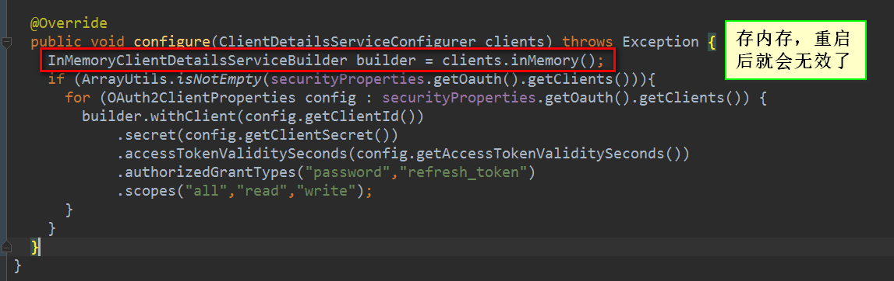

* 解决办法：持久化token
    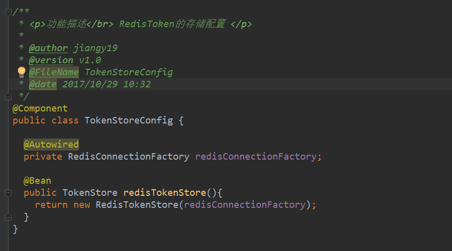

    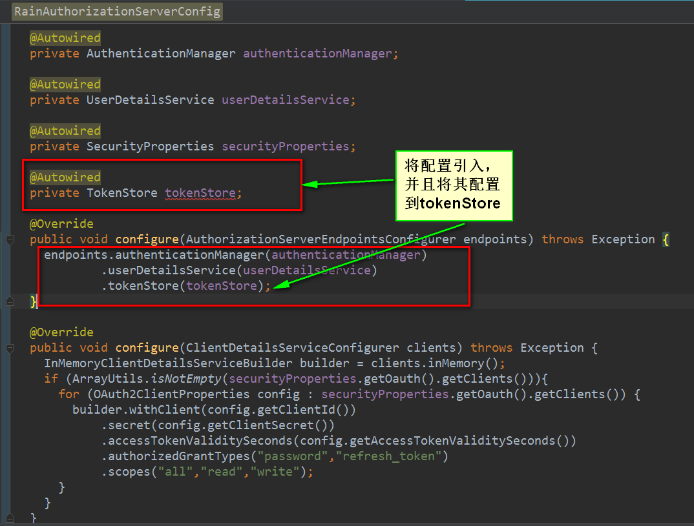

* Redis中查看：
    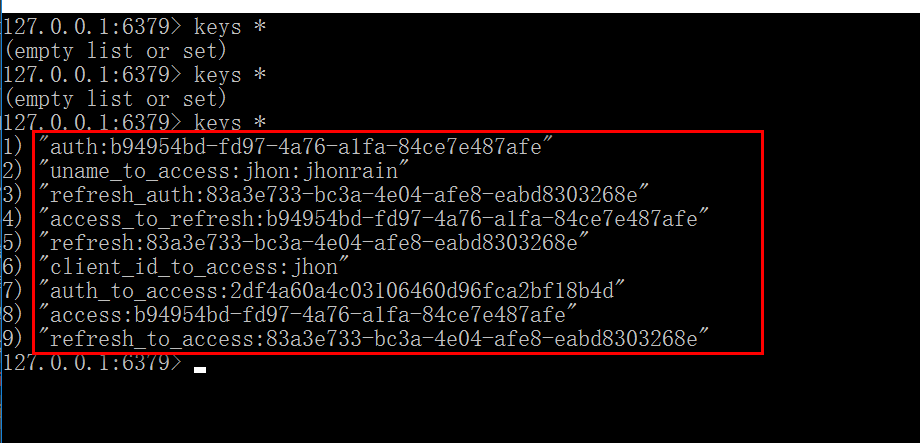

这样就解决了，服务重启之后Token失效的问题了。

