#### SpringSecurityOAuth重构短信验证码登录

* 验证码配置打开
    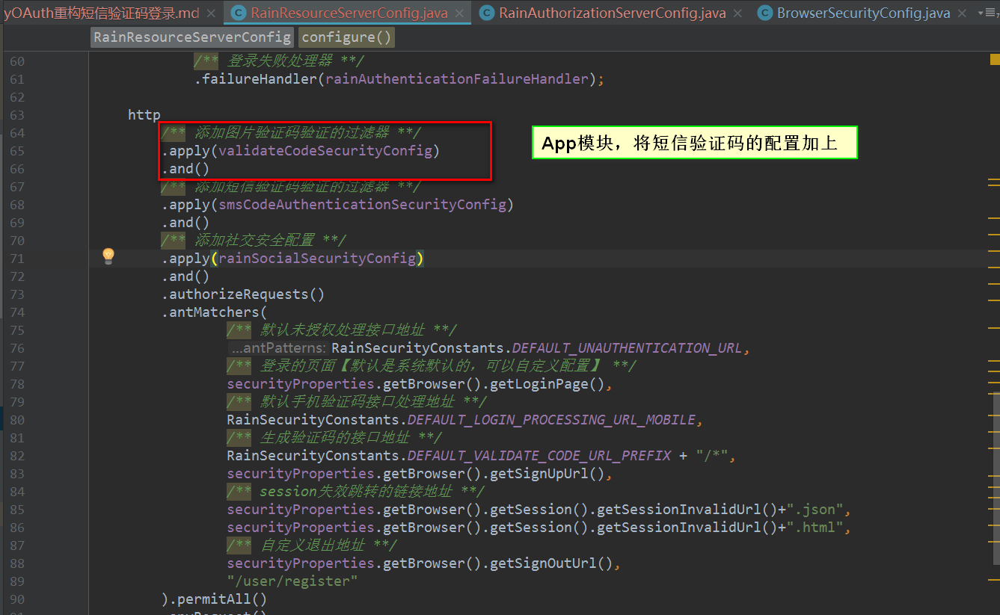

* PostMan发送验证码
    

    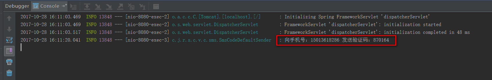

* PostMan短信验证码登录
    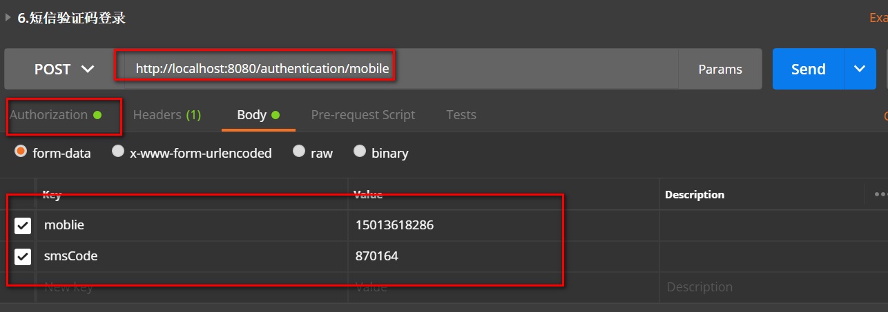

    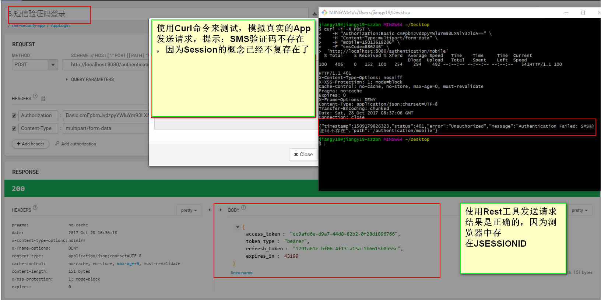

* 重构代码逻辑
　　基于上面的错误场景，分析可得在App端是不能够使用Session来存储验证码的，这时候我们就可以多传递一个参数（deviceId:设备Id）
在生成验证的时候，将deviceId和验证码存放到外部的存储设备中，校验的时候，接口中需要将deviceId参数带上，
后台验证的逻辑中，通过deviceId查询验证码和接口中的验证码进行匹対即可。
    
    * 两种方式的比较：
    

    * Session存放ValidateCode Strategy
    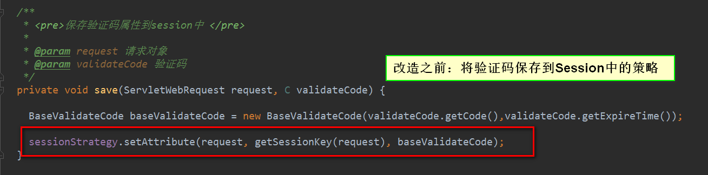

    * 改造之后的验证码的处理方式
    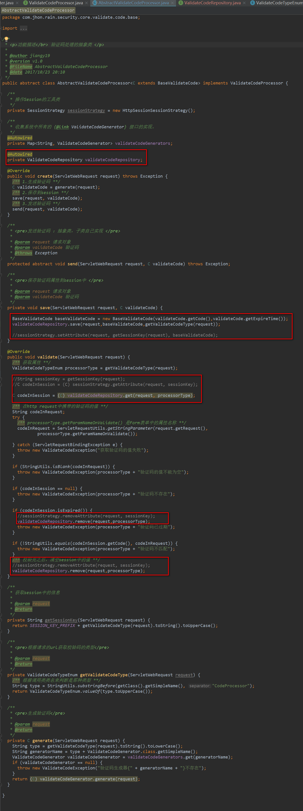

    * App端验证码的生成&获取&移除实现重构

    ```java
    package com.jhon.rain.security.app.repository.impl;
    
    import com.jhon.rain.security.core.enums.ValidateCodeTypeEnum;
    import com.jhon.rain.security.core.validate.code.base.BaseValidateCode;
    import com.jhon.rain.security.core.validate.code.exception.ValidateCodeException;
    import com.jhon.rain.security.core.validate.code.repository.ValidateCodeRepository;
    import org.apache.commons.lang.StringUtils;
    import org.springframework.beans.factory.annotation.Autowired;
    import org.springframework.data.redis.core.RedisTemplate;
    import org.springframework.stereotype.Component;
    import org.springframework.web.context.request.ServletWebRequest;
    
    import java.util.concurrent.TimeUnit;
    
    /**
     * <p>功能描述</br> App验证码的处理逻辑 </p>
     *
     * @author jiangy19
     * @version v1.0
     * @FileName RedisValidateCodeRepository
     * @date 2017/10/28 17:14
     */
    @Component
    public class RedisValidateCodeRepository implements ValidateCodeRepository {
    
        @Autowired
        private RedisTemplate<Object, Object> redisTemplate;
        private String deviceId;
    
        @Override
        public void save(ServletWebRequest request, BaseValidateCode code, ValidateCodeTypeEnum validateCodeType) {
            redisTemplate.opsForValue().set(buildKey(request, validateCodeType), code, 30, TimeUnit.MINUTES);
        }
    
    
        @Override
        public BaseValidateCode get(ServletWebRequest request, ValidateCodeTypeEnum validateCodeType) {
            Object value = redisTemplate.opsForValue().get(buildKey(request, validateCodeType));
            if (value == null) {
                return null;
            }
            return (BaseValidateCode) value;
        }
    
        @Override
        public void remove(ServletWebRequest request, ValidateCodeTypeEnum validateCodeType) {
            redisTemplate.delete(buildKey(request, validateCodeType));
        }
    
        /**
         * <pre>生成key的策略</pre>
         *
         * @param request
         * @param validateCodeType 验证码类型
         * @return
         */
        private Object buildKey(ServletWebRequest request, ValidateCodeTypeEnum validateCodeType) {
            String deviceId = request.getHeader("deviceId");
            if (StringUtils.isBlank(deviceId)) {
                throw new ValidateCodeException("请在请求头中携带deviceId参数");
            }
            return "code:" + validateCodeType.toString().toLowerCase() + ":" + deviceId;
        }
    }
    ```
    * 浏览器验证码的生成&获取&移除实现重构
    
    ```java
    package com.jhon.rain.security.browser.repository.impl;
    
    import com.jhon.rain.security.core.enums.ValidateCodeTypeEnum;
    import com.jhon.rain.security.core.validate.code.base.BaseValidateCode;
    import com.jhon.rain.security.core.validate.code.repository.ValidateCodeRepository;
    import org.springframework.social.connect.web.HttpSessionSessionStrategy;
    import org.springframework.social.connect.web.SessionStrategy;
    import org.springframework.stereotype.Component;
    import org.springframework.web.context.request.ServletWebRequest;
    
    /**
     * <p>功能描述</br> 浏览器验证码的处理 </p>
     *
     * @author jiangy19
     * @version v1.0
     * @FileName SessionValidateCodeRepository
     * @date 2017/10/28 17:05
     */
    @Component
    public class SessionValidateCodeRepository implements ValidateCodeRepository {
    
        /**
         * 验证码放入session时的前缀
         */
        String SESSION_KEY_PREFIX = "SESSION_KEY_FOR_CODE_";
    
        /**
         * 操作Session的工具类
         */
        private SessionStrategy sessionStrategy = new HttpSessionSessionStrategy();
    
        @Override
        public void save(ServletWebRequest request, BaseValidateCode code, ValidateCodeTypeEnum validateCodeType) {
            sessionStrategy.setAttribute(request,getSessionKey(request,validateCodeType),code);
        }
    
        @Override
        public BaseValidateCode get(ServletWebRequest request, ValidateCodeTypeEnum validateCodeType) {
            return (BaseValidateCode)sessionStrategy.getAttribute(request,getSessionKey(request,validateCodeType));
        }
    
        @Override
        public void remove(ServletWebRequest request, ValidateCodeTypeEnum validateCodeType) {
            sessionStrategy.removeAttribute(request, getSessionKey(request,validateCodeType));
        }
    
        /**
         * 获取session中的信息
         *
         * @param request
         * @return
         */
        private String getSessionKey(ServletWebRequest request,ValidateCodeTypeEnum validateCodeType) {
            return SESSION_KEY_PREFIX + validateCodeType.toString().toUpperCase();
        }
    }
    ```
    
* 测试重构的结果：    
    * 发送短信验证码缺少deviceId参数
    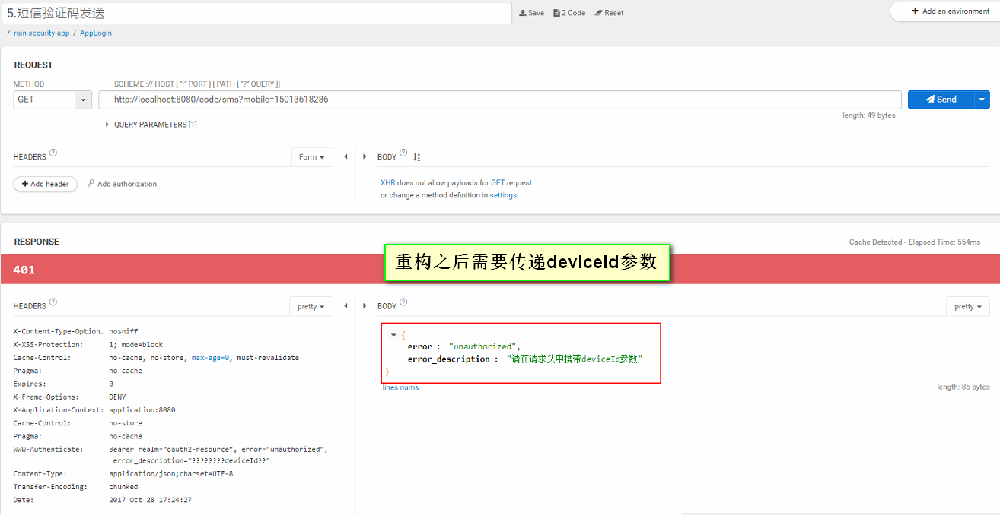

    * 发送短信验证码加上deviceId参数
    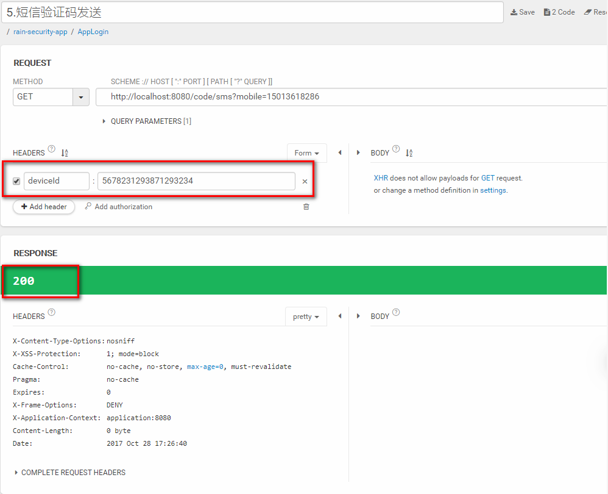

    * Rest工具模拟短信登录缺少deviceId参数
    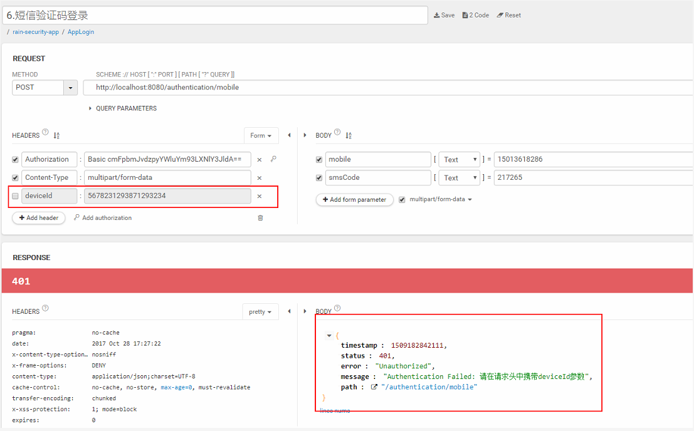

    * Rest工具模拟短信登录添加deviceId参数
    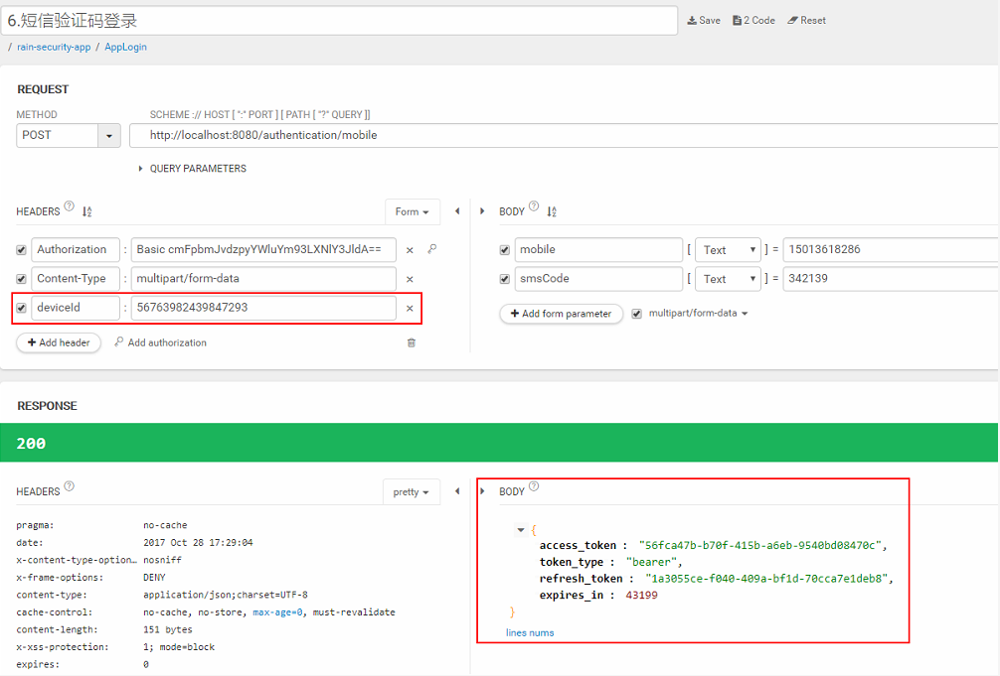

    * 使用Curl命令，模拟App端发送短信登录请求：
    

    * 比较Redis中的值，在登录之前和登录成功之后的情况
    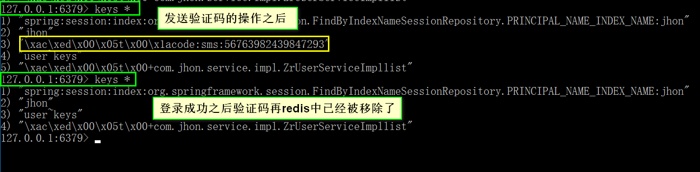

