#### SpringSecurity个性化用户认证流程

##### Part 1：个性化用户认证流程

* 自定义登录页面
    * 配置自定义登录页面：修改BrowserSecurityConfig
    ```java
    package com.jhon.rain.security;
    
    import org.springframework.context.annotation.Bean;
    import org.springframework.context.annotation.Configuration;
    import org.springframework.security.config.annotation.web.builders.HttpSecurity;
    import org.springframework.security.config.annotation.web.configuration.WebSecurityConfigurerAdapter;
    import org.springframework.security.crypto.bcrypt.BCryptPasswordEncoder;
    import org.springframework.security.crypto.password.PasswordEncoder;
    
    /**
     * <p>功能描述</br> PC端安全配置 </p>
     *
     * @author jiangy19
     * @version v1.0
     * @FileName BrowserSecurityConfig
     * @date 2017/10/18 19:44
     */
    @Configuration
    public class BrowserSecurityConfig extends WebSecurityConfigurerAdapter {
    
    	@Bean
    	public PasswordEncoder passwordEncoder(){
    		return new BCryptPasswordEncoder();
    	}
    
    	@Override
    	protected void configure(HttpSecurity http) throws Exception {
    		http.formLogin()
    						.loginPage("/rain-signIn.html")
    						.and()
    						.authorizeRequests()
    						.antMatchers("/rain-signIn.html").permitAll()
    						.anyRequest()
    						.authenticated();
    	}
    }

    ```
    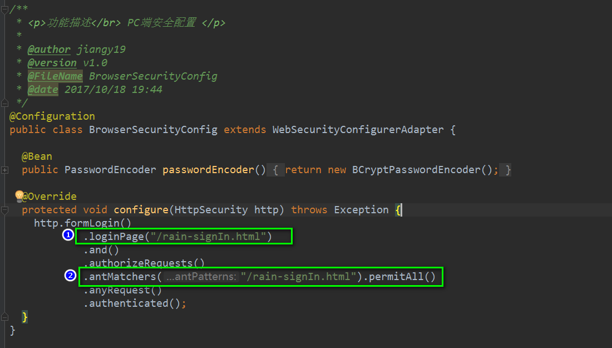
    * 编写自定义页面：rain-signIn.html
    ```html
    <!DOCTYPE html>
    <html lang="en">
    <head>
        <meta charset="UTF-8">
        <title>登录</title>
    </head>
    <body>
        <h2>标准登陆页面</h2>
    </body>
    </html>
    ```
    * 测试结果
    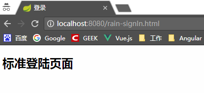
    
    * 完善登录页面
        * 页面信息
    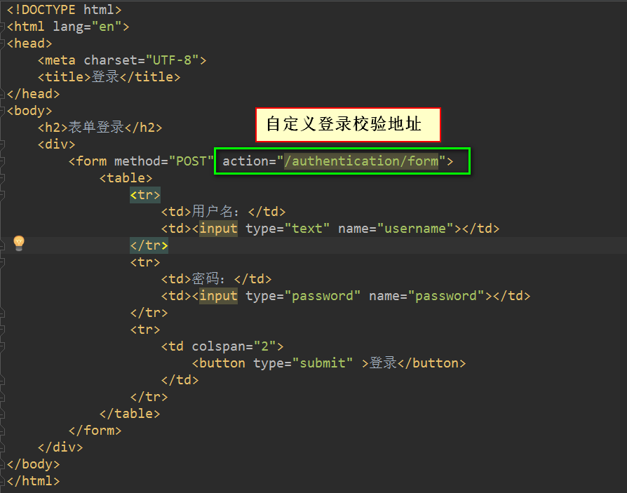
        * 代码
        ```html
        <!DOCTYPE html>
        <html lang="en">
        <head>
            <meta charset="UTF-8">
            <title>登录</title>
        </head>
        <body>
            <h2>表单登录</h2>
            <div>
                <form method="POST" action="/authentication/form">
                    <table>
                        <tr>
                            <td>用户名：</td>
                            <td><input type="text" name="username"></td>
                        </tr>
                        <tr>
                            <td>密码：</td>
                            <td><input type="password" name="password"></td>
                        </tr>
                        <tr>
                            <td colspan="2">
                                <button type="submit" >登录</button>
                            </td>
                        </tr>
                    </table>
                </form>
            </div>
        </body>
        </html>
        ```
        * 修改配置类
        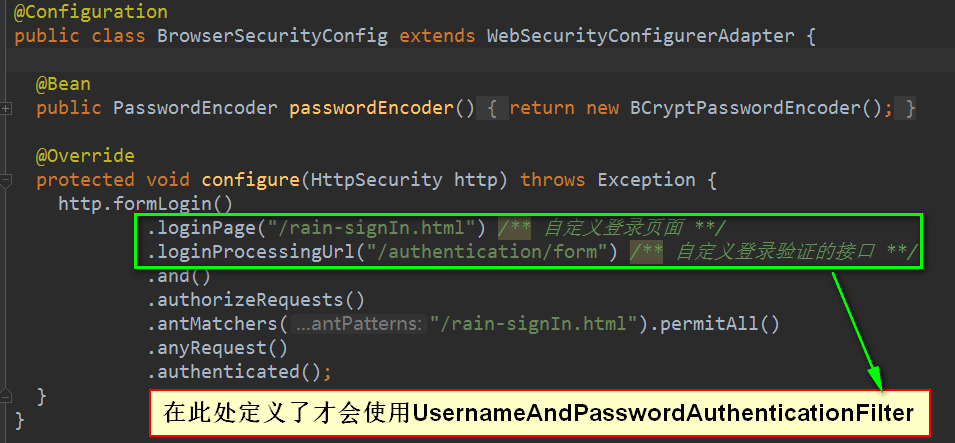
        
        * 启动测试结果，输入用户名和密码后，出现下面的错误页面
        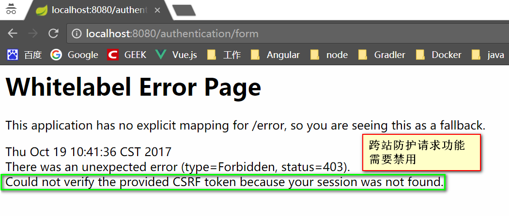
        
        * 修改配置类，将CSRF功能先禁用掉
        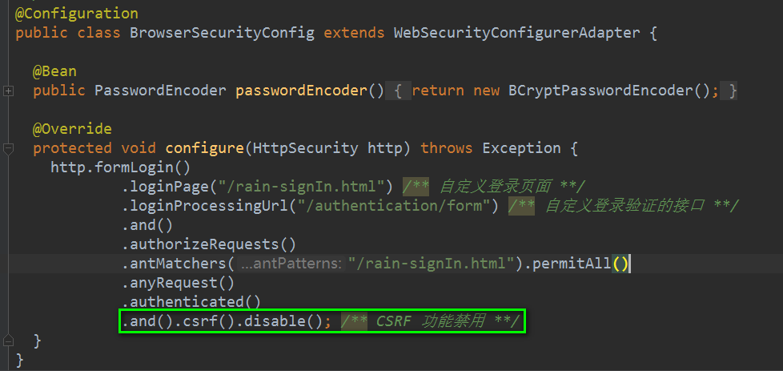
        ```java
        package com.jhon.rain.security;
        
        import org.springframework.context.annotation.Bean;
        import org.springframework.context.annotation.Configuration;
        import org.springframework.security.config.annotation.web.builders.HttpSecurity;
        import org.springframework.security.config.annotation.web.configuration.WebSecurityConfigurerAdapter;
        import org.springframework.security.crypto.bcrypt.BCryptPasswordEncoder;
        import org.springframework.security.crypto.password.PasswordEncoder;
        
        /**
         * <p>功能描述</br> PC端安全配置 </p>
         *
         * @author jiangy19
         * @version v1.0
         * @FileName BrowserSecurityConfig
         * @date 2017/10/18 19:44
         */
        @Configuration
        public class BrowserSecurityConfig extends WebSecurityConfigurerAdapter {
        
        	@Bean
        	public PasswordEncoder passwordEncoder(){
        		return new BCryptPasswordEncoder();
        	}
        
        	@Override
        	protected void configure(HttpSecurity http) throws Exception {
        		http.formLogin()
        						.loginPage("/rain-signIn.html") /** 自定义登录页面 **/
        						.loginProcessingUrl("/authentication/form") /** 自定义登录验证的接口 **/
        						.and()
        						.authorizeRequests()
        						.antMatchers("/rain-signIn.html").permitAll()
        						.anyRequest()
        						.authenticated()
        						.and().csrf().disable(); /** CSRF 功能禁用 **/
        	}
        }
        ```
* 代码重构 -- 方便代码重用，配置类的完善
    * 重构授权流程的校验，流程图如下：
    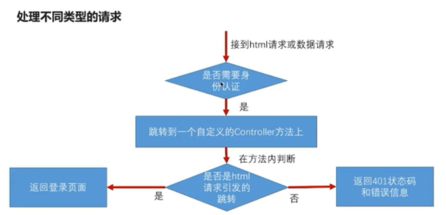
    * 项目结构：
    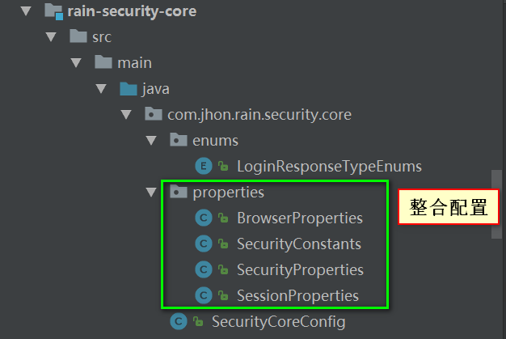
    
    * BrowserProperties.java
    ```java
    package com.jhon.rain.security.core.properties;
    
    import com.jhon.rain.security.core.enums.LoginResponseTypeEnum;
    import lombok.Data;
    
    /**
     * <p>功能描述</br> 浏览器安全属性配置</p>
     *
     * @author jiangy19
     * @version v1.0
     * @FileName BrowserProperties
     * @date 2017/10/19 14:14
     */
    @Data
    public class BrowserProperties {
    
    	private SessionProperties session = new SessionProperties();
    
    	private String signUpUrl = "/rain-signUp.html";
    
    	/** 默认为未授权的url **/
    	private String loginPage = SecurityConstants.DEFAULT_UNAUTHENTICATION_URL;
    
    	private LoginResponseTypeEnums loginType = LoginResponseTypeEnums.JSON;
    
    	private int rememberMeSeconds = 3600;
    }
    ```
    * SecurityConstants.java
    ```java
    package com.jhon.rain.security.core.properties;
    
    /**
     * <p>功能描述</br> 安全配置的常量设置 </p>
     *
     * @author jiangy19
     * @version v1.0
     * @FileName RainSecurityConstants
     * @date 2017/10/19 13:36
     */
    public class SecurityConstants {
    
    	/**
    	 * 当请求需要身份认证的时候，默认跳转的url
    	 */
    	public static final String DEFAULT_UNAUTHENTICATION_URL = "/authentication/require";
    
    	/**
    	 * 默认用户名密码登录请求的url
    	 */
    	public static final String DEFAULT_LOGIN_PROCESSING_URL_FORM = "/authentication/form";
    
    	/**
    	 * 默认手机验证码登录请求url
    	 */
    	public static final String DEFAULT_LOGIN_PROCESSING_URL_MOBILE = "/authentication/mobile";
    
    	/**
    	 * 默认登录页面
    	 */
    	public static final String DEFAULT_LOGIN_PAGE_URL = "/rain-signIn.html";
    
    	/**
    	 * Session 失效默认跳转页面
    	 */
    	public static final String DEFAULT_SESSION_INVALID_URL = "/session/invalid";
    }
    ```
    * SecurityProperties.java
    ```java
    package com.jhon.rain.security.core.properties;
    
    import lombok.Data;
    import org.springframework.boot.context.properties.ConfigurationProperties;
    
    /**
     * <p>功能描述</br> 配置文件信息 </p>
     *
     * @author jiangy19
     * @version v1.0
     * @FileName SecurityProperties
     * @date 2017/10/19 11:23
     */
    @ConfigurationProperties(prefix = "rainbow.security")
    @Data
    public class SecurityProperties {
    
    	/**
    	 * 浏览器配置属性
    	 **/
    	private BrowserProperties browser = new BrowserProperties();
    
    
    }
    ```
    * SessionProperties.java
    ```java
    package com.jhon.rain.security.core.properties;
    
    import lombok.Data;
    
    /**
     * <p>功能描述</br> Session相关的属性 </p>
     *
     * @author jiangy19
     * @version v1.0
     * @FileName SessionProperties
     * @date 2017/10/19 14:22
     */
    @Data
    public class SessionProperties {
    
    	/**
    	 * 同一个用户在系统中最大的Session数，默认是1
    	 */
    	private int maximumSessions = 1;
    
    	/**
    	 * 达到最大session时，是否阻止新的登录请求，默认是false,不阻止，信息的登陆会将旧的登录失效
    	 */
    	private boolean maxSessionPreventsLogin;
    
    	/**
    	 * session失效时跳转的地址
    	 */
    	private String sessionInvalidUrl = SecurityConstants.DEFAULT_SESSION_INVALID_URL;
    }
    ```
    * SecurityCoreConfig.java
    ```java
    package com.jhon.rain.security.core;
    
    import com.jhon.rain.security.core.properties.SecurityProperties;
    import org.springframework.boot.context.properties.EnableConfigurationProperties;
    import org.springframework.context.annotation.Configuration;
    
    /**
     * <p>功能描述</br> 使用注解使得核心配置生效 </p>
     *
     * @author jiangy19
     * @version v1.0
     * @FileName SecurityCoreConfig
     * @date 2017/10/19 11:22
     */
    @Configuration
    @EnableConfigurationProperties(SecurityProperties.class)
    public class SecurityCoreConfig {
    }
    ```
    * 授权认证的核心类[BrowserSecurityConfig.java]，将常量配置到统一的类中
    ```java
    package com.jhon.rain.security.browser;
    
    import com.jhon.rain.security.core.constants.RainSecurityConstants;
    import com.jhon.rain.security.core.properties.SecurityProperties;
    import org.springframework.beans.factory.annotation.Autowired;
    import org.springframework.context.annotation.Bean;
    import org.springframework.context.annotation.Configuration;
    import org.springframework.security.config.annotation.web.builders.HttpSecurity;
    import org.springframework.security.config.annotation.web.configuration.WebSecurityConfigurerAdapter;
    import org.springframework.security.crypto.bcrypt.BCryptPasswordEncoder;
    import org.springframework.security.crypto.password.PasswordEncoder;
    
    /**
     * <p>功能描述</br> PC端安全配置 </p>
     *
     * @author jiangy19
     * @version v1.0
     * @FileName BrowserSecurityConfig
     * @date 2017/10/18 19:44
     */
    @Configuration
    public class BrowserSecurityConfig extends WebSecurityConfigurerAdapter {
    
    	@Autowired
    	private SecurityProperties securityProperties;
    
    	@Bean
    	public PasswordEncoder passwordEncoder(){
    		return new BCryptPasswordEncoder();
    	}
    
    	@Override
    	protected void configure(HttpSecurity http) throws Exception {
    	  http.formLogin()
                .loginPage(SecurityConstants.DEFAULT_UNAUTHENTICATION_URL) /** 自定义登录请求地址**/
                .loginProcessingUrl(SecurityConstants.DEFAULT_LOGIN_PROCESSING_URL_FORM) /** 自定义登录验证的接口 **/
                .and()
                .authorizeRequests()
                    .antMatchers(
                            SecurityConstants.DEFAULT_UNAUTHENTICATION_URL,
                            securityProperties.getBrowser().getLoginPage()
                    ).permitAll()
                .anyRequest()
                .authenticated()
                .and()
                    .csrf().disable(); /** CSRF 功能禁用 **/
    	}
    }
    ```
    * 运行效果：
        * 使用rest接口请求：localhost:8080/rest
            * 后台日志信息
            
            * 浏览器页面信息
            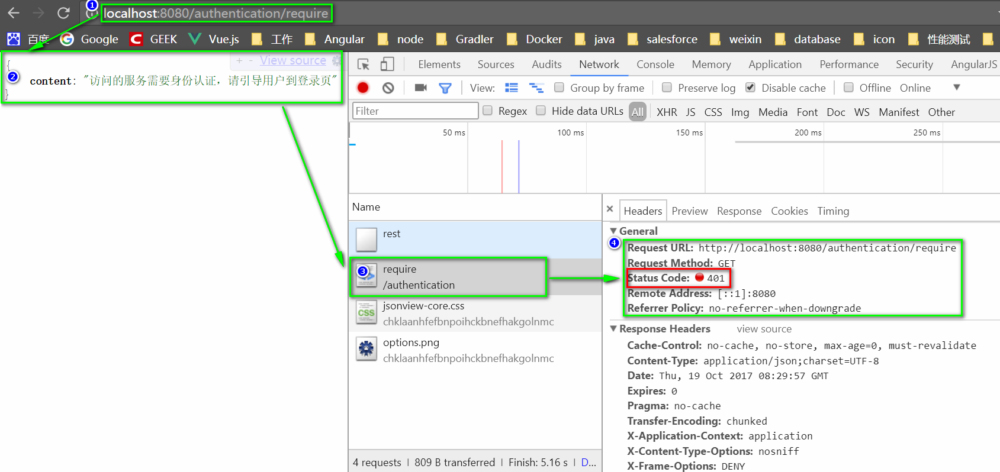
        * 使用访问html的方式：localhost:8080/index.html
            * 后台日志信息
            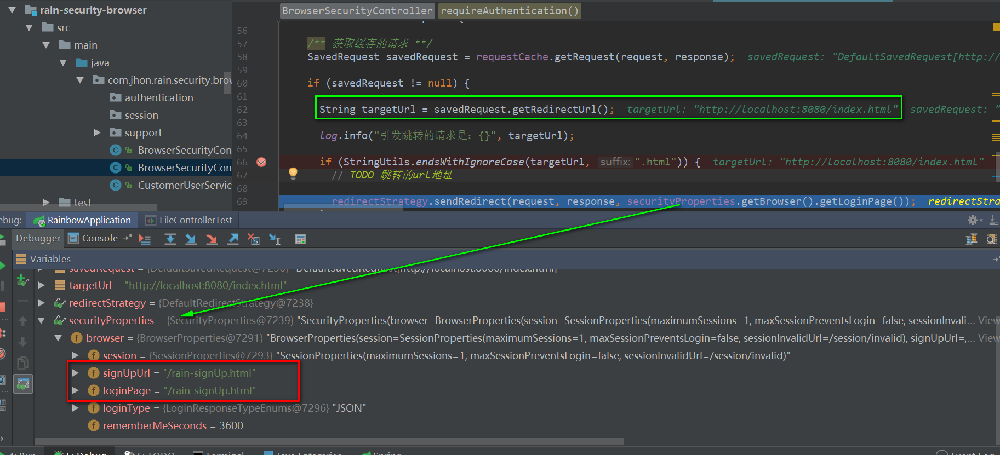
            * 浏览器页面信息
            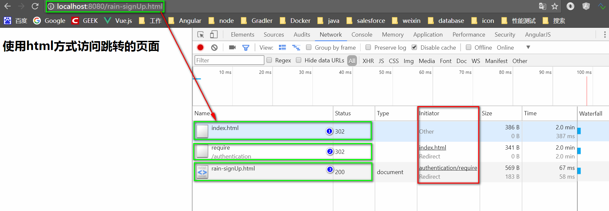
            
            
* 自定义登录成功处理
    * 编写一个自定义的成功处理器RainAuthenticationSuccessHandler
    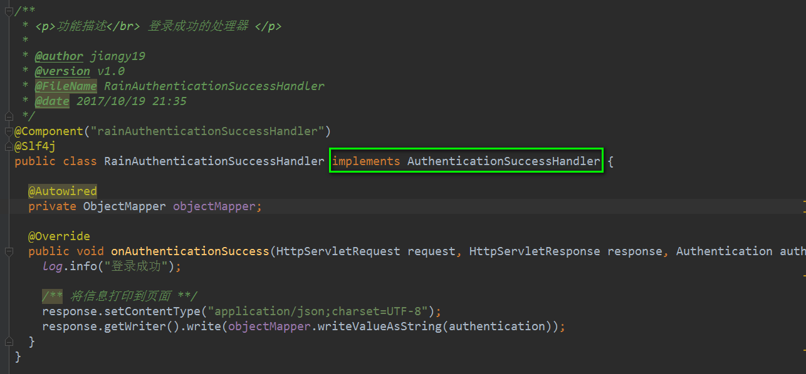
    * 代码如下：
    
    ```java
    package com.jhon.rain.security.browser.authentication;
    
    import com.fasterxml.jackson.databind.ObjectMapper;
    import lombok.extern.slf4j.Slf4j;
    import org.springframework.beans.factory.annotation.Autowired;
    import org.springframework.security.core.Authentication;
    import org.springframework.security.web.authentication.AuthenticationSuccessHandler;
    import org.springframework.stereotype.Component;
    
    import javax.servlet.ServletException;
    import javax.servlet.http.HttpServletRequest;
    import javax.servlet.http.HttpServletResponse;
    import java.io.IOException;
    
    /**
     * <p>功能描述</br> 登录成功的处理器 </p>
     *
     * @author jiangy19
     * @version v1.0
     * @FileName RainAuthenticationSuccessHandler
     * @date 2017/10/19 21:35
     */
    @Component("rainAuthenticationSuccessHandler")
    @Slf4j
    public class RainAuthenticationSuccessHandler implements AuthenticationSuccessHandler {
    
    	@Autowired
    	private ObjectMapper objectMapper;
    
    	@Override
    	public void onAuthenticationSuccess(HttpServletRequest request, HttpServletResponse response, Authentication authentication) throws IOException, ServletException {
    		log.info("登录成功");
    
    		/** 将信息打印到页面 **/
    		response.setContentType("application/json;charset=UTF-8");
    		response.getWriter().write(objectMapper.writeValueAsString(authentication));
    	}
    }

    ```
    * 修改配置类BrowserSecurityConfig
    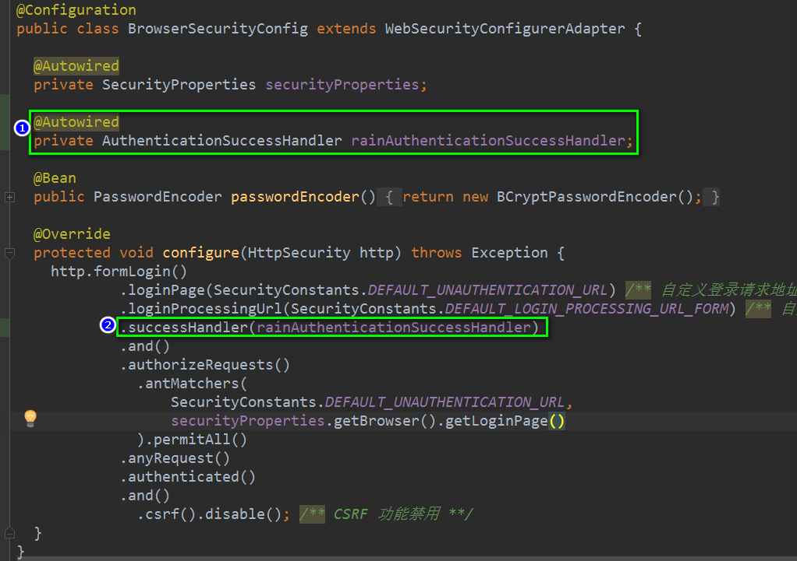
    * 代码如下：
    ```java
    package com.jhon.rain.security.browser;
    
    import com.jhon.rain.security.core.constants.RainSecurityConstants;
    import com.jhon.rain.security.core.properties.SecurityProperties;
    import org.springframework.beans.factory.annotation.Autowired;
    import org.springframework.context.annotation.Bean;
    import org.springframework.context.annotation.Configuration;
    import org.springframework.security.config.annotation.web.builders.HttpSecurity;
    import org.springframework.security.config.annotation.web.configuration.WebSecurityConfigurerAdapter;
    import org.springframework.security.crypto.bcrypt.BCryptPasswordEncoder;
    import org.springframework.security.crypto.password.PasswordEncoder;
    import org.springframework.security.web.authentication.AuthenticationSuccessHandler;
    
    /**
     * <p>功能描述</br> PC端安全配置 </p>
     *
     * @author jiangy19
     * @version v1.0
     * @FileName BrowserSecurityConfig
     * @date 2017/10/18 19:44
     */
    @Configuration
    public class BrowserSecurityConfig extends WebSecurityConfigurerAdapter {
    
    	@Autowired
    	private SecurityProperties securityProperties;
    
    	@Autowired
    	private AuthenticationSuccessHandler rainAuthenticationSuccessHandler;
    
    	@Bean
    	public PasswordEncoder passwordEncoder(){
    		return new BCryptPasswordEncoder();
    	}
    
    	@Override
    	protected void configure(HttpSecurity http) throws Exception {
    	  http.formLogin()
                .loginPage(SecurityConstants.DEFAULT_UNAUTHENTICATION_URL) /** 自定义登录请求地址**/
                .loginProcessingUrl(SecurityConstants.DEFAULT_LOGIN_PROCESSING_URL_FORM) /** 自定义登录验证的接口 **/
                .successHandler(rainAuthenticationSuccessHandler)
                .and()
                .authorizeRequests()
                    .antMatchers(
                            SecurityConstants.DEFAULT_UNAUTHENTICATION_URL,
                            securityProperties.getBrowser().getLoginPage()
                    ).permitAll()
                .anyRequest()
                .authenticated()
                .and()
                    .csrf().disable(); /** CSRF 功能禁用 **/
    	}
    }

    ```
    
    * 登录成功效果
    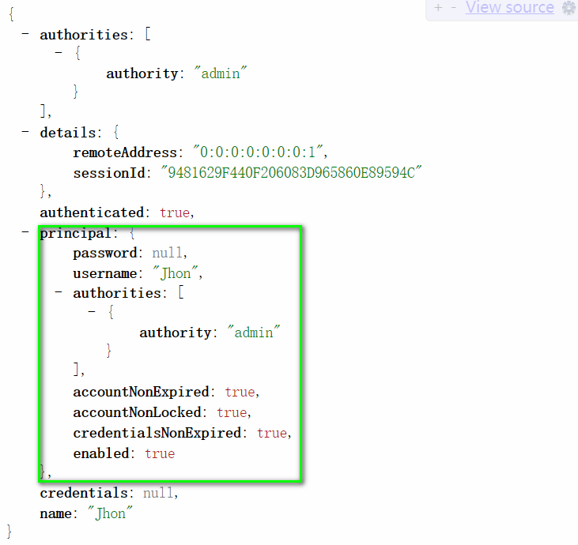

* 自定义登录失败处理[和上面的类似]
    * 编写一个登录失败的处理器RainAuthenticationFailerHandler
    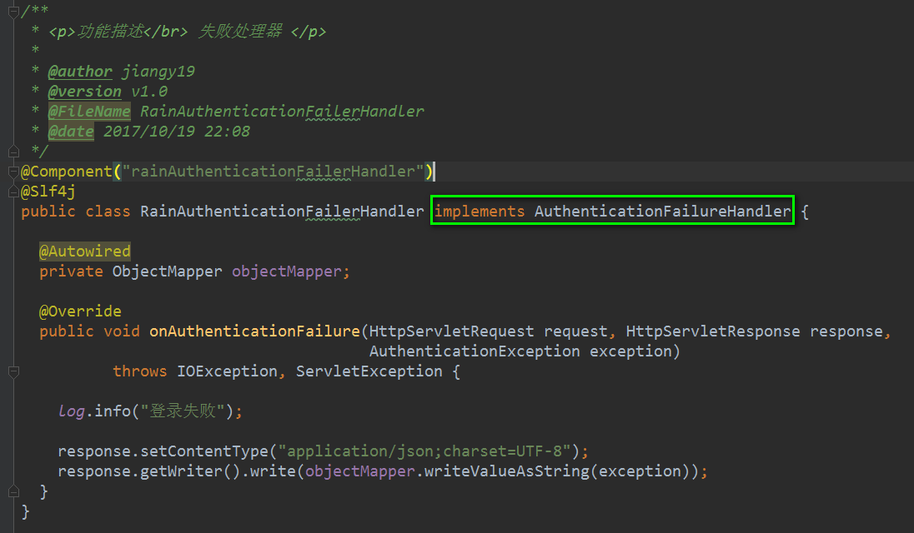
    * 代码如下：
    ```java
    package com.jhon.rain.security.browser.authentication;
    
    import com.fasterxml.jackson.databind.ObjectMapper;
    import lombok.extern.slf4j.Slf4j;
    import org.springframework.http.HttpStatus;
    import org.springframework.beans.factory.annotation.Autowired;
    import org.springframework.security.core.AuthenticationException;
    import org.springframework.security.web.authentication.AuthenticationFailureHandler;
    import org.springframework.stereotype.Component;
    
    import javax.servlet.ServletException;
    import javax.servlet.http.HttpServletRequest;
    import javax.servlet.http.HttpServletResponse;
    import java.io.IOException;
    
    /**
     * <p>功能描述</br> 失败处理器 </p>
     *
     * @author jiangy19
     * @version v1.0
     * @FileName RainAuthenticationFailerHandler
     * @date 2017/10/19 22:08
     */
    @Component("rainAuthenticationFailerHandler")
    @Slf4j
    public class RainAuthenticationFailerHandler implements AuthenticationFailureHandler {
    
    	@Autowired
    	private ObjectMapper objectMapper;
    
    	@Override
    	public void onAuthenticationFailure(HttpServletRequest request, HttpServletResponse response,
    	                                    AuthenticationException exception)
    					throws IOException, ServletException {
    
    		log.info("登录失败");
    
  		    response.setStatus(HttpStatus.INTERNAL_SERVER_ERROR.value());
    		response.setContentType("application/json;charset=UTF-8");
    		response.getWriter().write(objectMapper.writeValueAsString(exception.getMessage()));
    	}
    }
    ```
    
    * 修改配置类BrowserSecurityConfig
    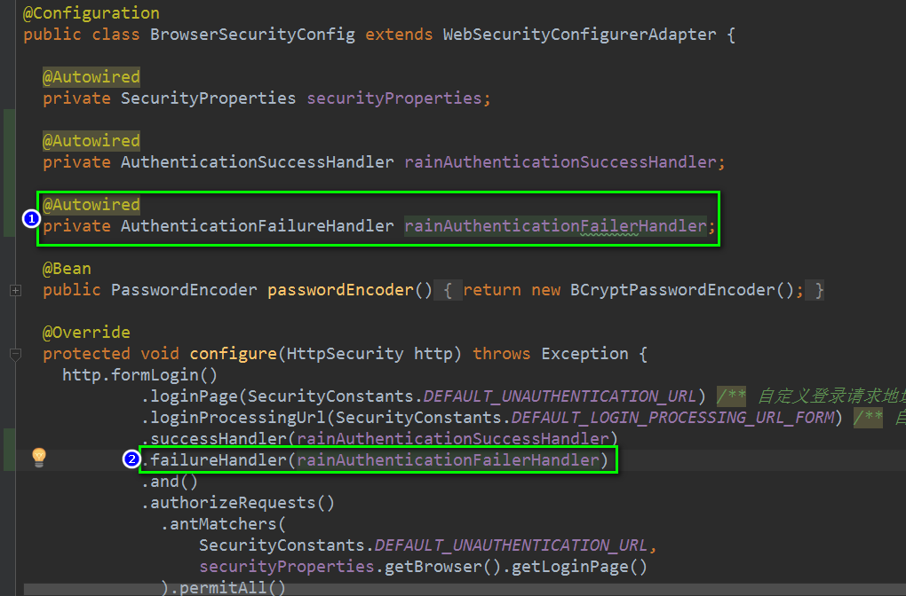
    * 代码如下：
    ```java
    package com.jhon.rain.security.browser;
    
    import com.jhon.rain.security.core.constants.RainSecurityConstants;
    import com.jhon.rain.security.core.properties.SecurityProperties;
    import org.springframework.beans.factory.annotation.Autowired;
    import org.springframework.context.annotation.Bean;
    import org.springframework.context.annotation.Configuration;
    import org.springframework.security.config.annotation.web.builders.HttpSecurity;
    import org.springframework.security.config.annotation.web.configuration.WebSecurityConfigurerAdapter;
    import org.springframework.security.crypto.bcrypt.BCryptPasswordEncoder;
    import org.springframework.security.crypto.password.PasswordEncoder;
    import org.springframework.security.web.authentication.AuthenticationFailureHandler;
    import org.springframework.security.web.authentication.AuthenticationSuccessHandler;
    
    /**
     * <p>功能描述</br> PC端安全配置 </p>
     *
     * @author jiangy19
     * @version v1.0
     * @FileName BrowserSecurityConfig
     * @date 2017/10/18 19:44
     */
    @Configuration
    public class BrowserSecurityConfig extends WebSecurityConfigurerAdapter {
    
    	@Autowired
    	private SecurityProperties securityProperties;
    
    	@Autowired
    	private AuthenticationSuccessHandler rainAuthenticationSuccessHandler;
    
    	@Autowired
    	private AuthenticationFailureHandler rainAuthenticationFailerHandler;
    
    	@Bean
    	public PasswordEncoder passwordEncoder(){
    		return new BCryptPasswordEncoder();
    	}
    
    	@Override
    	protected void configure(HttpSecurity http) throws Exception {
    	  http.formLogin()
                .loginPage(SecurityConstants.DEFAULT_UNAUTHENTICATION_URL) /** 自定义登录请求地址**/
                .loginProcessingUrl(SecurityConstants.DEFAULT_LOGIN_PROCESSING_URL_FORM) /** 自定义登录验证的接口 **/
                .successHandler(rainAuthenticationSuccessHandler)
                .failureHandler(rainAuthenticationFailerHandler)
                .and()
                .authorizeRequests()
                    .antMatchers(
                            SecurityConstants.DEFAULT_UNAUTHENTICATION_URL,
                            securityProperties.getBrowser().getLoginPage()
                    ).permitAll()
                .anyRequest()
                .authenticated()
                .and()
                    .csrf().disable(); /** CSRF 功能禁用 **/
    	}
    }
    ```
    * 登录结果的处理
    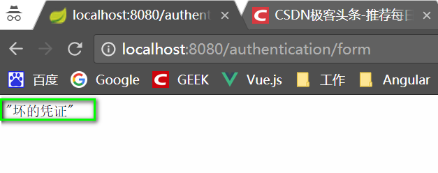
    
* 代码重构：成功和失败的处理不一定全部都是JSON类型，这个需要区分
    * 登录成功处理器
    
    ```java
    package com.jhon.rain.security.browser.authentication;
    
    import com.fasterxml.jackson.databind.ObjectMapper;
    import com.jhon.rain.security.core.enums.LoginResponseTypeEnum;
    import com.jhon.rain.security.core.properties.SecurityProperties;
    import lombok.extern.slf4j.Slf4j;
    import org.springframework.beans.factory.annotation.Autowired;
    import org.springframework.security.core.Authentication;
    import org.springframework.security.web.authentication.SavedRequestAwareAuthenticationSuccessHandler;
    import org.springframework.stereotype.Component;
    
    import javax.servlet.ServletException;
    import javax.servlet.http.HttpServletRequest;
    import javax.servlet.http.HttpServletResponse;
    import java.io.IOException;
    
    /**
     * <p>功能描述</br> 登录成功的处理器 </p>
     *
     * @author jiangy19
     * @version v1.0
     * @FileName RainAuthenticationSuccessHandler
     * @date 2017/10/19 21:35
     */
    @Component("rainAuthenticationSuccessHandler")
    @Slf4j
    public class RainAuthenticationSuccessHandler extends SavedRequestAwareAuthenticationSuccessHandler {
    
    	@Autowired
    	private ObjectMapper objectMapper;
    
    	@Autowired
    	private SecurityProperties securityProperties;
    
    	@Override
    	public void onAuthenticationSuccess(HttpServletRequest request, HttpServletResponse response,
    	                                    Authentication authentication)
    					throws IOException, ServletException {
    		
    		log.info("登录成功");
    
    		if (LoginResponseTypeEnums.JSON.equals(securityProperties.getBrowser().getLoginType())) {
    			/** 将信息打印到页面 **/
    			response.setContentType("application/json;charset=UTF-8");
    			response.getWriter().write(objectMapper.writeValueAsString(authentication));
    		} else {
    			super.onAuthenticationSuccess(request, response, authentication);
    		}
    	}
    }
    ```
    * 登录失败处理器
    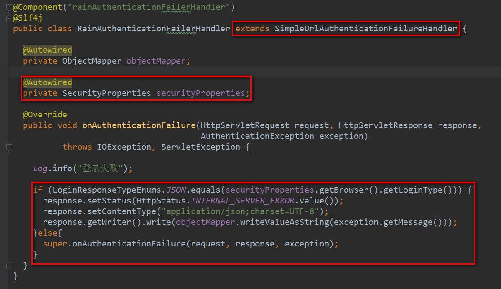
    ```java
    package com.jhon.rain.security.browser.authentication;
    
    import com.fasterxml.jackson.databind.ObjectMapper;
    import com.jhon.rain.security.browser.support.SimpleResponse;
    import com.jhon.rain.security.core.enums.LoginResponseTypeEnum;
    import com.jhon.rain.security.core.properties.SecurityProperties;
    import lombok.extern.slf4j.Slf4j;
    import org.springframework.beans.factory.annotation.Autowired;
    import org.springframework.http.HttpStatus;
    import org.springframework.security.core.AuthenticationException;
    import org.springframework.security.web.authentication.AuthenticationFailureHandler;
    import org.springframework.security.web.authentication.SimpleUrlAuthenticationFailureHandler;
    import org.springframework.stereotype.Component;
    
    import javax.servlet.ServletException;
    import javax.servlet.http.HttpServletRequest;
    import javax.servlet.http.HttpServletResponse;
    import java.io.IOException;
    
    /**
     * <p>功能描述</br> 失败处理器 </p>
     *
     * @author jiangy19
     * @version v1.0
     * @FileName RainAuthenticationFailerHandler
     * @date 2017/10/19 22:08
     */
    @Component("rainAuthenticationFailerHandler")
    @Slf4j
    public class RainAuthenticationFailerHandler extends SimpleUrlAuthenticationFailureHandler {
    
    	@Autowired
    	private ObjectMapper objectMapper;
    
    	@Autowired
    	private SecurityProperties securityProperties;
    
    	@Override
    	public void onAuthenticationFailure(HttpServletRequest request, HttpServletResponse response,
    	                                    AuthenticationException exception)
    					throws IOException, ServletException {
    
    		log.info("登录失败");
    
    		if (LoginResponseTypeEnums.JSON.equals(securityProperties.getBrowser().getLoginType())) {
    			response.setStatus(HttpStatus.INTERNAL_SERVER_ERROR.value());
    			response.setContentType("application/json;charset=UTF-8");
    			response.getWriter().write(objectMapper.writeValueAsString(exception.getMessage()));
    		}else{
    			super.onAuthenticationFailure(request, response, exception);
    		}
    	}
    }
    ```