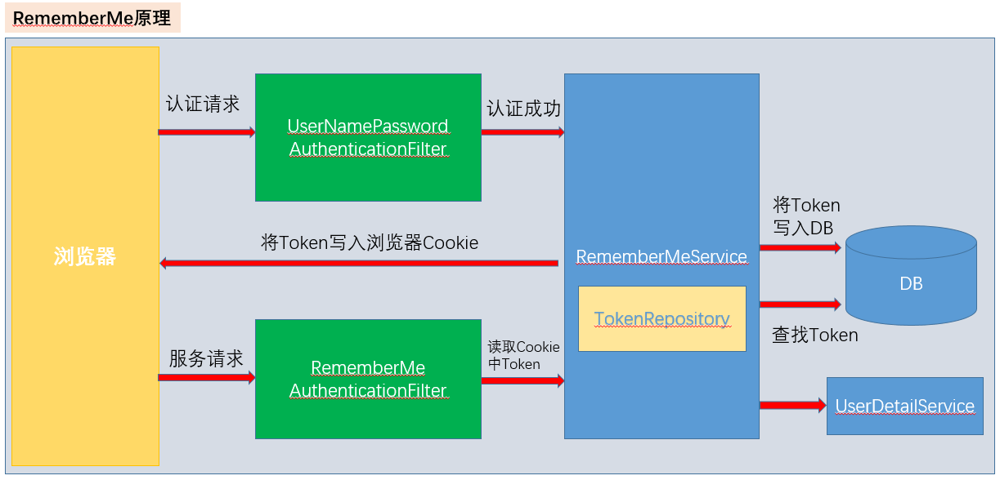
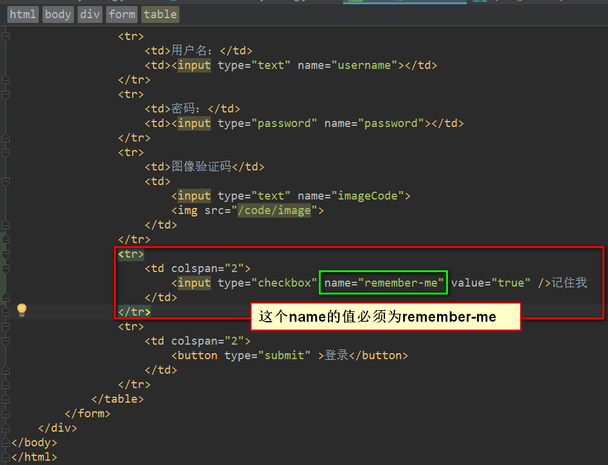
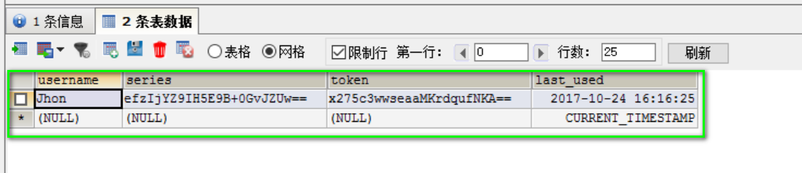
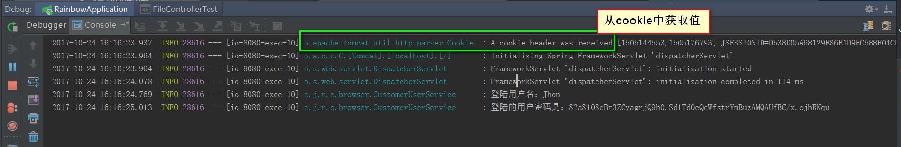
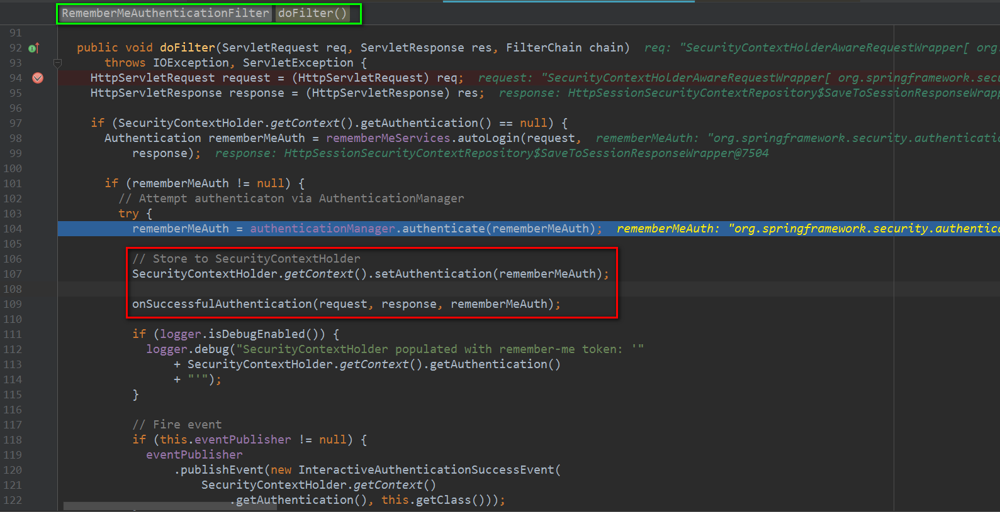

#### Spring Security中Remember Me功能的实现
##### Remember Me 原理

##### 修改登录页面
```html
<!DOCTYPE html>
<html lang="en">
<head>
    <meta charset="UTF-8">
    <title>登录</title>
</head>
<body>
    <h2>表单登录</h2>
    <div>
        <form method="POST" action="/authentication/form">
            <table>
                <tr>
                    <td>用户名：</td>
                    <td><input type="text" name="username"></td>
                </tr>
                <tr>
                    <td>密码：</td>
                    <td><input type="password" name="password"></td>
                </tr>
                <tr>
                    <td>图像验证码</td>
                    <td>
                        <input type="text" name="imageCode">
                        
                    </td>
                </tr>
                <tr>
                    <td colspan="2">
                        <input type="checkbox" name="remember-me" value="true" />记住我
                    </td>
                </tr>
                <tr>
                    <td colspan="2">
                        <button type="submit" >登录</button>
                    </td>
                </tr>
            </table>
        </form>
    </div>
</body>
</html>
```


```java
package com.jhon.rain.security.browser;

import com.jhon.rain.security.core.authentication.BaseChannelSecurityConfig;
import com.jhon.rain.security.core.constants.RainSecurityConstants;
import com.jhon.rain.security.core.properties.SecurityProperties;
import com.jhon.rain.security.core.validate.code.config.ValidateCodeSecurityConfig;
import org.springframework.beans.factory.annotation.Autowired;
import org.springframework.context.annotation.Bean;
import org.springframework.context.annotation.Configuration;
import org.springframework.security.config.annotation.web.builders.HttpSecurity;
import org.springframework.security.core.userdetails.UserDetailsService;
import org.springframework.security.crypto.bcrypt.BCryptPasswordEncoder;
import org.springframework.security.crypto.password.PasswordEncoder;
import org.springframework.security.web.authentication.rememberme.JdbcTokenRepositoryImpl;
import org.springframework.security.web.authentication.rememberme.PersistentTokenRepository;

import javax.sql.DataSource;

/**
 * <p>功能描述</br> PC端安全配置 </p>
 *
 * @author jiangy19
 * @version v1.0
 * @FileName BrowserSecurityConfig
 * @date 2017/10/18 19:44
 */
@Configuration
public class BrowserSecurityConfig extends BaseChannelSecurityConfig {

	@Autowired
	private SecurityProperties securityProperties;

	@Autowired
	private DataSource dataSource;

	@Autowired
	private UserDetailsService userDetailsService;

	@Autowired
	private ValidateCodeSecurityConfig validateCodeSecurityConfig;

	@Override
	protected void configure(HttpSecurity http) throws Exception {
		/** 基础的配置
		 * 1.自定义登录请求地址
		 * 2.自定义登录验证的接口
		 * 3.登录成功和失败的处理
		 * **/
            applyPasswordAuthenticationConfig(http);
            http
                /** 添加验证码验证的过滤器 **/
                .apply(validateCodeSecurityConfig)
                .and()
                    .rememberMe()
                    .tokenRepository(persistentTokenRepository())
                    .tokenValiditySeconds(securityProperties.getBrowser().getRememberMeSeconds())
                    .userDetailsService(userDetailsService)
                .and()
                    .authorizeRequests()
                    .antMatchers(
                            /** 默认未授权处理接口地址 **/
                            RainSecurityConstants.DEFAULT_UNAUTHENTICATION_URL,
                            /** 登录的页面 **/
                            securityProperties.getBrowser().getLoginPage(),
                            /** 生成二维码的接口地址 **/
                            RainSecurityConstants.DEFAULT_VALIDATE_CODE_URL_PREFIX + "/*"
                    ).permitAll()
                    .anyRequest()
                    .authenticated()
                .and()
                .csrf().disable(); /** CSRF 功能禁用 **/
	}

	@Bean
	public PasswordEncoder passwordEncoder() {
		return new BCryptPasswordEncoder();
	}

	@Bean
	public PersistentTokenRepository persistentTokenRepository(){
		JdbcTokenRepositoryImpl tokenRepository = new JdbcTokenRepositoryImpl();
		tokenRepository.setDataSource(dataSource);
		/** 项目启动的时候创建表 **/
		//tokenRepository.setCreateTableOnStartup(true);
		return tokenRepository;
	}
}
```


##### 查看数据库中的数据


##### 关闭服务器后重启再次访问的效果


##### RememberMeAuthenticationFilter 源码



