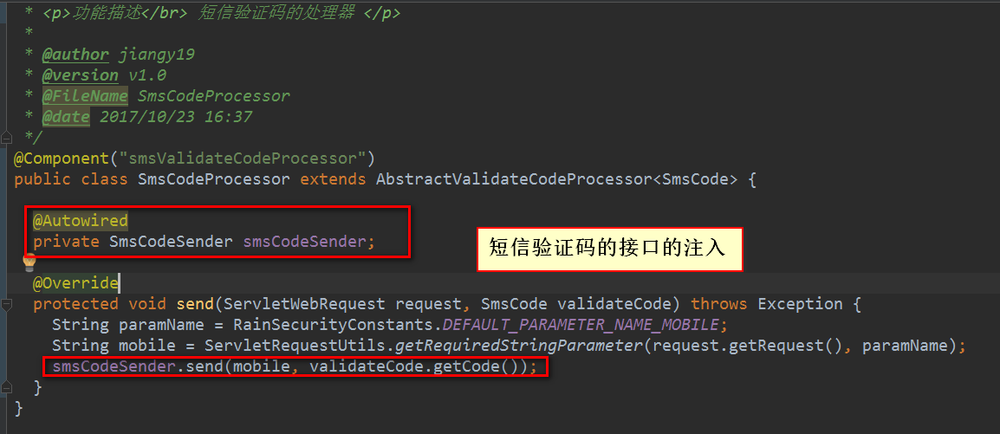
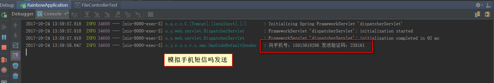

#### SpringSecurity基于App获取短信验证码的实现
##### 1.验证码发送接口
```java
package com.jhon.rain.security.core.validate.code.sms;

/**
 * <p>功能描述</br> 短信发送接口 </p>
 *
 * @author jiangy19
 * @version v1.0
 * @FileName SmsCodeSender
 * @date 2017/10/23 16:50
 */
public interface SmsCodeSender {

	/**
	 * <pre>发送短信验证码</pre>
	 * @param mobile 手机号
	 * @param code 验证码
	 */
	void send(String mobile, String code);
}
```
##### 2.验证码发送的默认实现
```java
package com.jhon.rain.security.core.validate.code.sms;

import lombok.extern.slf4j.Slf4j;

/**
 * <p>功能描述</br> 默认发送短信的接口 </p>
 *
 * @author jiangy19
 * @version v1.0
 * @FileName SmsCodeDefaultSender
 * @date 2017/10/23 16:52
 */
@Slf4j
public class SmsCodeDefaultSender implements SmsCodeSender {

	@Override
	public void send(String mobile, String code) {
		log.info("向手机号：{} 发送验证码：{}", mobile, code);
	}
}
```

##### 3.验证码的处理
```java
package com.jhon.rain.security.core.validate.code.sms;

import com.jhon.rain.security.core.constants.RainSecurityConstants;
import com.jhon.rain.security.core.validate.code.base.AbstractValidateCodeProcessor;
import org.springframework.beans.factory.annotation.Autowired;
import org.springframework.stereotype.Component;
import org.springframework.web.bind.ServletRequestUtils;
import org.springframework.web.context.request.ServletWebRequest;

/**
 * <p>功能描述</br> 短信验证码的处理器 </p>
 *
 * @author jiangy19
 * @version v1.0
 * @FileName SmsCodeProcessor
 * @date 2017/10/23 16:37
 */
@Component("smsValidateCodeProcessor")
public class SmsCodeProcessor extends AbstractValidateCodeProcessor<SmsCode> {

	@Autowired
	private SmsCodeSender smsCodeSender;

	@Override
	protected void send(ServletWebRequest request, SmsCode validateCode) throws Exception {
		String paramName = RainSecurityConstants.DEFAULT_PARAMETER_NAME_MOBILE;
		String mobile = ServletRequestUtils.getRequiredStringParameter(request.getRequest(), paramName);
		smsCodeSender.send(mobile, validateCode.getCode());
	}
}
```
##### 4.短信验证码处理的实现类


##### 5.PostMan模拟接口调用


##### 6.服务器端短信验证码发送日志

