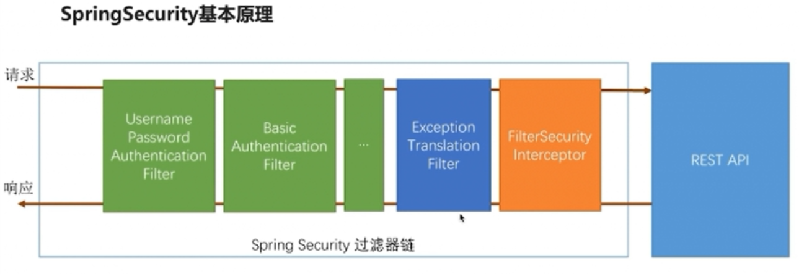

#### Spring Security 基于Form表单的认证
##### 1.Spring Security的核心功能
* 认证（Authentication）: 认证是谁 -- Who Are You

* 授权（Authorization）: 拥有的权限 -- What You Can Do

* 攻击防护(防止伪造身份)

##### 2.Spring Security 的基本原理

##### 3.Spring Security 基于用户名+密码实现认证