#### Spring Security 基于图片验证码的实现

* 1.生成图形验证码的接口
    * 1.1 根据随机数生成图片
    
    ```java
    ServletWebRequest webRequest = new ServletWebRequest(request);
    ImageCode imageCode = createImageCode(webRequest);  
    ```
    * 1.2 将随机数存到Session中
    ```java
    sessionStrategy.setAttribute(webRequest,SESSION_KEY,imageCode);
    ```
    * 1.3 再将生成的图片写到接口的响应中
    ```java
    ImageIO.write(imageCode.getImage(),"JPEG",response.getOutputStream());
    ```
    
    * 1.4 修改登录页面，添加验证码
    ```html
    <!DOCTYPE html>
    <html lang="en">
    <head>
        <meta charset="UTF-8">
        <title>登录</title>
    </head>
    <body>
        <h2>表单登录</h2>
        <div>
            <form method="POST" action="/authentication/form">
                <table>
                    <tr>
                        <td>用户名：</td>
                        <td><input type="text" name="username"></td>
                    </tr>
                    <tr>
                        <td>密码：</td>
                        <td><input type="password" name="password"></td>
                    </tr>
                    <tr>
                        <td>图像验证码</td>
                        <td>
                            <input type="text" name="imageCode">
                            
                        </td>
                    </tr>
                    <tr>
                        <td colspan="2">
                            <button type="submit" >登录</button>
                        </td>
                    </tr>
                </table>
            </form>
        </div>
    </body>
    </html>
    ```
    
    * 1.5 将生成验证码图片的接口配置忽略安全认证
    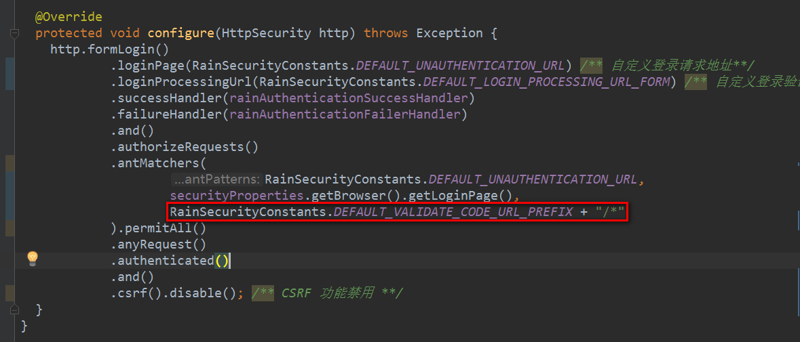
    
    * 1.6 查看结果
    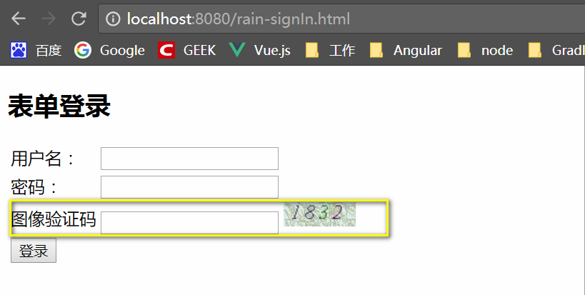
        
* 2.认证流程中加入图形验证码校验
    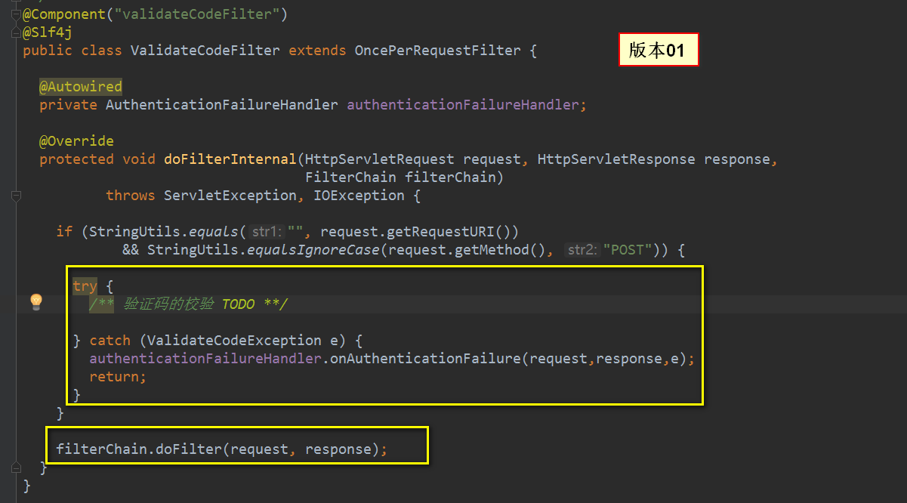
    * 2.1 UsernamePasswordAuthenticationFilter 之前添加一个自定义的过滤器ValidateCodeFilter
    * 2.2 ValidateCodeFilter 获取Session中的逻辑
        * Session中放入验证码信息的逻辑
        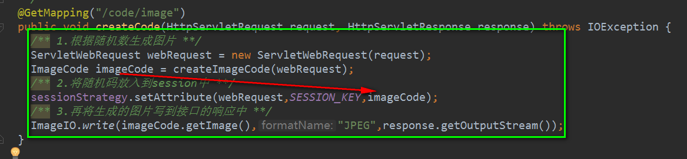
        * 在Filter中通过Session获取验证码的逻辑
        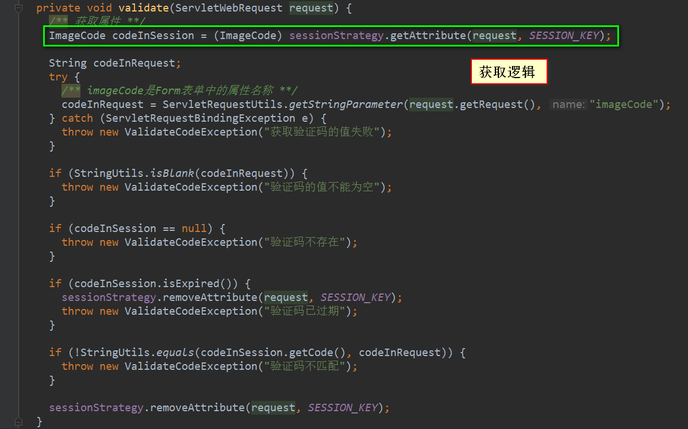
    * 2.3 测试代码
    
    ```java
    package com.jhon.rain.security.core.validate.code.filter;
    
    import com.jhon.rain.security.core.constants.RainSecurityConstants;
    import com.jhon.rain.security.core.validate.code.exception.ValidateCodeException;
    import com.jhon.rain.security.core.validate.code.image.ImageCode;
    import lombok.extern.slf4j.Slf4j;
    import org.apache.commons.lang.StringUtils;
    import org.springframework.security.web.authentication.AuthenticationFailureHandler;
    import org.springframework.social.connect.web.HttpSessionSessionStrategy;
    import org.springframework.social.connect.web.SessionStrategy;
    import org.springframework.stereotype.Component;
    import org.springframework.web.bind.ServletRequestBindingException;
    import org.springframework.web.bind.ServletRequestUtils;
    import org.springframework.web.context.request.ServletWebRequest;
    import org.springframework.web.filter.OncePerRequestFilter;
    
    import javax.servlet.FilterChain;
    import javax.servlet.ServletException;
    import javax.servlet.http.HttpServletRequest;
    import javax.servlet.http.HttpServletResponse;
    import java.io.IOException;
    
    /**
     * <p>功能描述</br> 验证码的校验的过滤器 </p>
     *
     * @author jiangy19
     * @version v1.0
     * @FileName ValidateCodeFilter
     * @date 2017/10/20 11:24
     */
    @Component("validateCodeFilter")
    @Slf4j
    public class ValidateCodeFilter extends OncePerRequestFilter {
    
    	private static final String SESSION_KEY = "SESSION_KEY_IMAGE_CODE";
    
    	private AuthenticationFailureHandler authenticationFailureHandler;
    
    	private SessionStrategy sessionStrategy = new HttpSessionSessionStrategy();
    
    	@Override
    	protected void doFilterInternal(HttpServletRequest request, HttpServletResponse response,
    	                                FilterChain filterChain)
    					throws ServletException, IOException {
    
    		if (StringUtils.equals(RainSecurityConstants.DEFAULT_LOGIN_PROCESSING_URL_FORM, request.getRequestURI())
    						&& StringUtils.equalsIgnoreCase(request.getMethod(), "POST")) {
    
    			try {
    				/** 验证码的校验 TODO **/
    				validate(new ServletWebRequest(request));
    			} catch (ValidateCodeException e) {
    				authenticationFailureHandler.onAuthenticationFailure(request, response, e);
    				return;
    			}
    		}
    
    		filterChain.doFilter(request, response);
    	}
    
    	/**
    	 * 验证码的校验
    	 *
    	 * @param request
    	 */
    	private void validate(ServletWebRequest request) {
    		/** 获取属性 **/
    		ImageCode codeInSession = (ImageCode) sessionStrategy.getAttribute(request, SESSION_KEY);
    
    		String codeInRequest;
    		try {
    			/** imageCode是Form表单中的属性名称 **/
    			codeInRequest = ServletRequestUtils.getStringParameter(request.getRequest(), "imageCode");
    		} catch (ServletRequestBindingException e) {
    			throw new ValidateCodeException("获取验证码的值失败");
    		}
    
    		if (StringUtils.isBlank(codeInRequest)) {
    			throw new ValidateCodeException("验证码的值不能为空");
    		}
    
    		if (codeInSession == null) {
    			throw new ValidateCodeException("验证码不存在");
    		}
    
    		if (codeInSession.isExpired()) {
    			sessionStrategy.removeAttribute(request, SESSION_KEY);
    			throw new ValidateCodeException("验证码已过期");
    		}
    
    		if (!StringUtils.equals(codeInSession.getCode(), codeInRequest)) {
    			throw new ValidateCodeException("验证码不匹配");
    		}
    
    		sessionStrategy.removeAttribute(request, SESSION_KEY);
    	}
    
    	public AuthenticationFailureHandler getAuthenticationFailureHandler() {
    		return authenticationFailureHandler;
    	}
    
    	public void setAuthenticationFailureHandler(AuthenticationFailureHandler authenticationFailureHandler) {
    		this.authenticationFailureHandler = authenticationFailureHandler;
    	}
    }
    ```
    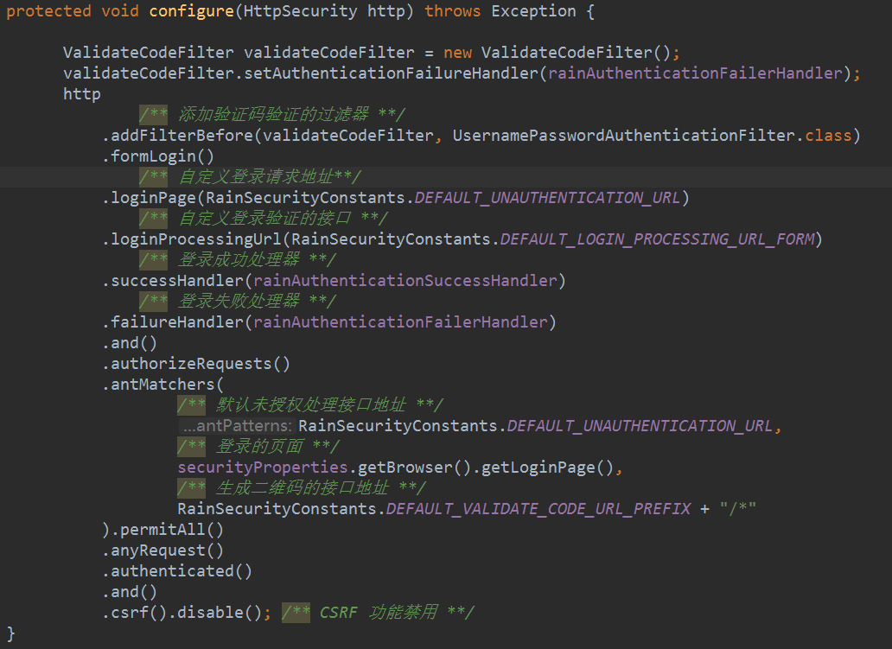
    * 2.4 测试结果
        * 异常情况
        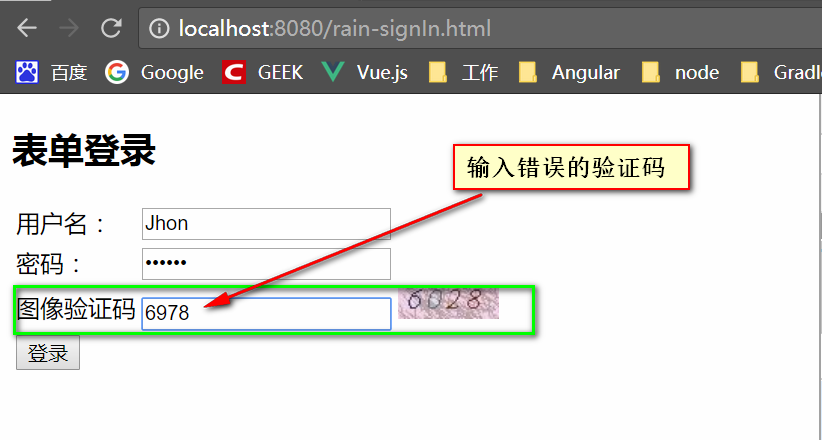
    
        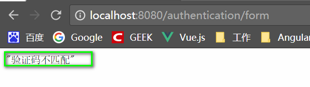
        
        * 正常情况
        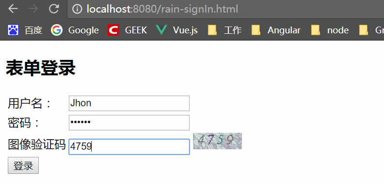
    
        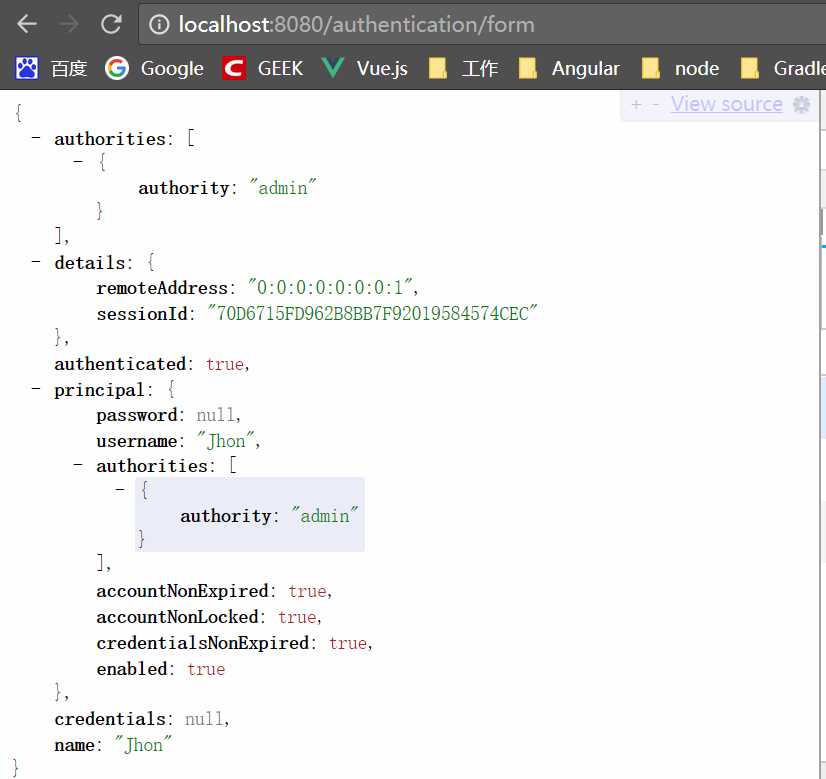
        
    * 2.5 注意事项
    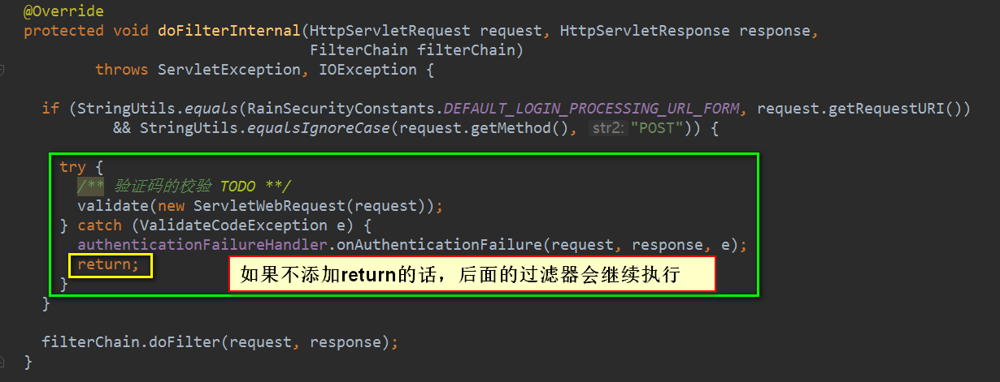

* 3.重构代码(略)
