#### Spring Security短信验证码登录
##### 短信验证码的整体流程
* 开发短信验证码接口
* 校验短信验证码并登录
* 重构代码

##### 1.短信验证码接口
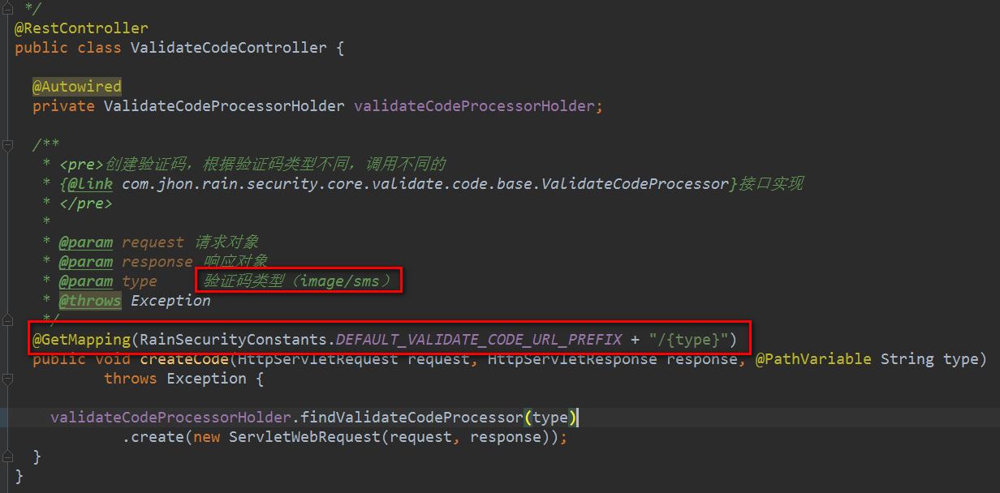

```java
package com.jhon.rain.security.core.validate.code;

import com.jhon.rain.security.core.constants.RainSecurityConstants;
import com.jhon.rain.security.core.validate.code.base.ValidateCodeProcessorHolder;
import org.springframework.beans.factory.annotation.Autowired;
import org.springframework.web.bind.annotation.GetMapping;
import org.springframework.web.bind.annotation.PathVariable;
import org.springframework.web.bind.annotation.RestController;
import org.springframework.web.context.request.ServletWebRequest;

import javax.servlet.http.HttpServletRequest;
import javax.servlet.http.HttpServletResponse;

/**
 * <p>功能描述</br> 验证码的控制器 </p>
 *
 * @author jiangy19
 * @version v1.0
 * @FileName ValidateCodeController
 * @date 2017/10/20 10:12
 */
@RestController
public class ValidateCodeController {

	@Autowired
	private ValidateCodeProcessorHolder validateCodeProcessorHolder;

	/**
	 * <pre>创建验证码，根据验证码类型不同，调用不同的
	 * {@link com.jhon.rain.security.core.validate.code.base.ValidateCodeProcessor}接口实现
	 * </pre>
	 *
	 * @param request 请求对象
	 * @param response 响应对象
	 * @param type     验证码类型（image/sms）
	 * @throws Exception
	 */
	@GetMapping(RainSecurityConstants.DEFAULT_VALIDATE_CODE_URL_PREFIX + "/{type}")
	public void createCode(HttpServletRequest request, HttpServletResponse response, @PathVariable String type)
					throws Exception {

		validateCodeProcessorHolder.findValidateCodeProcessor(type)
						.create(new ServletWebRequest(request, response));
	}
}
```

##### 2.校验短信验证码并登录
* 登录页面的配置
    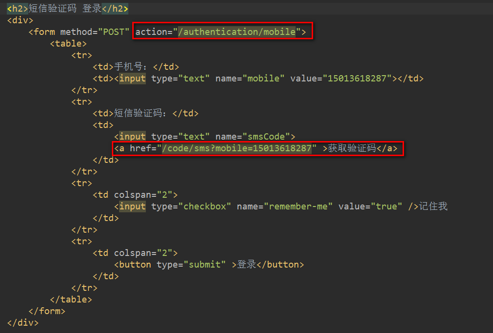
    ```java
    <h2>短信验证码 登录</h2>
    <div>
        <form method="POST" action="/authentication/mobile">
            <table>
                <tr>
                    <td>手机号：</td>
                    <td><input type="text" name="mobile" value="15013618287"></td>
                </tr>
                <tr>
                    <td>短信验证码：</td>
                    <td>
                        <input type="text" name="smsCode">
                        <a href="/code/sms?mobile=15013618287" >获取验证码</a>
                    </td>
                </tr>
                <tr>
                    <td colspan="2">
                        <button type="submit" >登录</button>
                    </td>
                </tr>
            </table>
        </form>
    </div>
    ```
* 页面效果图
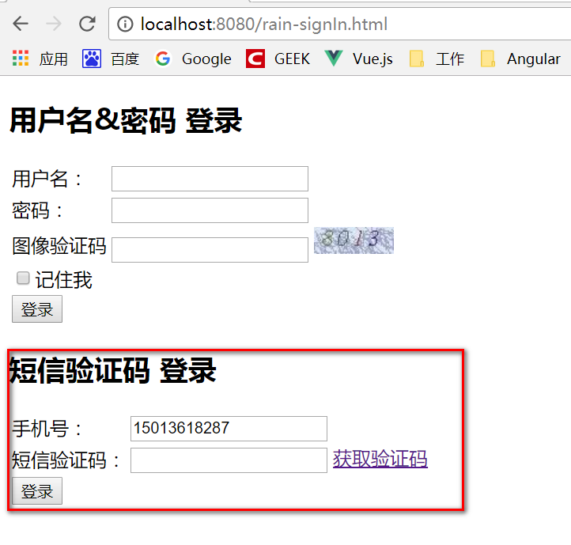


* 后台验证逻辑的实现[仿照UsernamePasswordAuthentication那一套实现]
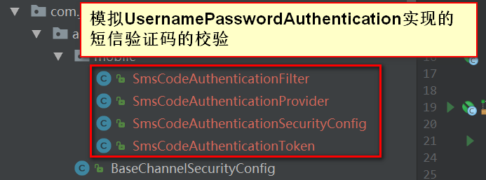
    * [1].SmsCodeAuthenticationToken
    ```java
    package com.jhon.rain.security.core.authentication.mobile;
    
    import org.springframework.security.authentication.AbstractAuthenticationToken;
    import org.springframework.security.core.GrantedAuthority;
    import org.springframework.security.core.SpringSecurityCoreVersion;
    
    import java.util.Collection;
    
    /**
     * <p>功能描述</br> 短信验证码认证的Token实现
     * [模拟{@link  org.springframework.security.authentication.UsernamePasswordAuthenticationToken}的实现]
     * </p>
     *
     * @author jiangy19
     * @version v1.0
     * @FileName SmsCodeAuthenticationToken
     * @date 2017/10/24 21:47
     */
    public class SmsCodeAuthenticationToken extends AbstractAuthenticationToken {
    
    	private static final long serialVersionUID = SpringSecurityCoreVersion.SERIAL_VERSION_UID;
    
    	// ~ Instance fields
    	// ================================================================================================
    
    	private final Object principal;
    
    	// ~ Constructors
    	// ===================================================================================================
    
    	/**
    	 * This constructor can be safely used by any code that wishes to create a
    	 * <code>SmsCodeAuthenticationToken</code>, as the {@link #isAuthenticated()}
    	 * will return <code>false</code>.
    	 *
    	 */
    	public SmsCodeAuthenticationToken(String mobile) {
    		super(null);
    		this.principal = mobile;
    		setAuthenticated(false);
    	}
    
    	/**
    	 * This constructor should only be used by <code>AuthenticationManager</code> or
    	 * <code>AuthenticationProvider</code> implementations that are satisfied with
    	 * producing a trusted (i.e. {@link #isAuthenticated()} = <code>true</code>)
    	 * authentication token.
    	 *
    	 * @param mobile
    	 * @param authorities
    	 */
    	public SmsCodeAuthenticationToken(Object mobile, Collection<? extends GrantedAuthority> authorities) {
    		super(authorities);
    		this.principal = mobile;
    		super.setAuthenticated(true); // must use super, as we override
    	}
    
    	// ~ Methods
    	// ========================================================================================================
    
    	public Object getCredentials() {
    		return null;
    	}
    
    	public Object getPrincipal() {
    		return this.principal;
    	}
    
    	public void setAuthenticated(boolean isAuthenticated) throws IllegalArgumentException {
    		if (isAuthenticated) {
    			throw new IllegalArgumentException(
    							"Cannot set this token to trusted - use constructor which takes a GrantedAuthority list instead");
    		}
    
    		super.setAuthenticated(false);
    	}
    
    	@Override
    	public void eraseCredentials() {
    		super.eraseCredentials();
    	}
    }
    ```
    * [2].SmsCodeAuthenticationFilter
    ```java
    package com.jhon.rain.security.core.authentication.mobile;
    
    import com.jhon.rain.security.core.constants.RainSecurityConstants;
    import org.springframework.security.authentication.AuthenticationServiceException;
    import org.springframework.security.core.Authentication;
    import org.springframework.security.core.AuthenticationException;
    import org.springframework.security.web.authentication.AbstractAuthenticationProcessingFilter;
    import org.springframework.security.web.util.matcher.AntPathRequestMatcher;
    import org.springframework.util.Assert;
    
    import javax.servlet.http.HttpServletRequest;
    import javax.servlet.http.HttpServletResponse;
    
    /**
     * <p>功能描述</br> 短信验证码的授权过滤器
     * 模拟{@link org.springframework.security.web.authentication.UsernamePasswordAuthenticationFilter}实现
     * </p>
     *
     * @author jiangy19
     * @version v1.0
     * @FileName SmsCodeAuthenticationFilter
     * @date 2017/10/24 21:55
     */
    public class SmsCodeAuthenticationFilter extends AbstractAuthenticationProcessingFilter {
    
    	private String mobileParameter = RainSecurityConstants.DEFAULT_PARAMETER_NAME_MOBILE;
    
    	private boolean postOnly = true;
    
    	public SmsCodeAuthenticationFilter() {
    		super(new AntPathRequestMatcher(RainSecurityConstants.DEFAULT_LOGIN_PROCESSING_URL_MOBILE, "POST"));
    	}
    
    	public Authentication attemptAuthentication(HttpServletRequest request, HttpServletResponse response) throws AuthenticationException {
    		if(this.postOnly && !request.getMethod().equals("POST")) {
    			throw new AuthenticationServiceException("Authentication method not supported: " + request.getMethod());
    		} else {
    			String mobile = this.obtainMobile(request);
    			if(mobile == null) {
    				mobile = "";
    			}
    			mobile = mobile.trim();
    
    			SmsCodeAuthenticationToken authRequest = new SmsCodeAuthenticationToken(mobile);
    			this.setDetails(request, authRequest);
    			return this.getAuthenticationManager().authenticate(authRequest);
    		}
    	}
    
    	protected String obtainMobile(HttpServletRequest request) {
    		return request.getParameter(this.mobileParameter);
    	}
    
    	protected void setDetails(HttpServletRequest request, SmsCodeAuthenticationToken authRequest) {
    		authRequest.setDetails(this.authenticationDetailsSource.buildDetails(request));
    	}
    
    	public void setMobileParameter(String mobileParameter) {
    		Assert.hasText(mobileParameter, "Mobile parameter must not be empty or null");
    		this.mobileParameter = mobileParameter;
    	}
    
    	public void setPostOnly(boolean postOnly) {
    		this.postOnly = postOnly;
    	}
    
    	public final String getMobileParameter() {
    		return this.mobileParameter;
    	}
    
    }
    ```
    * [3].SmsCodeAuthenticationProvider
    ```java
    package com.jhon.rain.security.core.authentication.mobile;
    
    import lombok.Data;
    import org.springframework.security.authentication.AuthenticationProvider;
    import org.springframework.security.authentication.InternalAuthenticationServiceException;
    import org.springframework.security.core.Authentication;
    import org.springframework.security.core.AuthenticationException;
    import org.springframework.security.core.userdetails.UserDetails;
    import org.springframework.security.core.userdetails.UserDetailsService;
    
    /**
     * <p>功能描述</br> 短信验证码的Provider  </p>
     * {@link org.springframework.security.authentication.AuthenticationManager}
     * @author jiangy19
     * @version v1.0
     * @FileName SmsCodeAuthenticationProvider
     * @date 2017/10/24 22:03
     */
    @Data
    public class SmsCodeAuthenticationProvider implements AuthenticationProvider {
    
    	private UserDetailsService userDetailsService;
    
    	@Override
    	public Authentication authenticate(Authentication authentication) throws AuthenticationException {
    		SmsCodeAuthenticationToken smsCodeAuthenticationToken = (SmsCodeAuthenticationToken) authentication;
    		/** 通过手机号获取用户信息 **/
    		UserDetails user = userDetailsService.loadUserByUsername((String)smsCodeAuthenticationToken.getPrincipal());
    		if (user == null){
    			throw new InternalAuthenticationServiceException("无法获取用户信息");
    		}
    		/** 重新组装信息 **/
    		SmsCodeAuthenticationToken authenticationToken = new SmsCodeAuthenticationToken(user,user.getAuthorities());
    		authenticationToken.setDetails(smsCodeAuthenticationToken.getDetails());
    		return authenticationToken;
    	}
    
    	@Override
    	public boolean supports(Class<?> authentication) {
    		return SmsCodeAuthenticationToken.class.isAssignableFrom(authentication);
    	}
    }
    ```
    * [4].SmsCodeAuthenticationSecurityConfig
    ```java
    package com.jhon.rain.security.core.authentication.mobile;
    
    import org.springframework.beans.factory.annotation.Autowired;
    import org.springframework.security.authentication.AuthenticationManager;
    import org.springframework.security.config.annotation.SecurityConfigurerAdapter;
    import org.springframework.security.config.annotation.web.builders.HttpSecurity;
    import org.springframework.security.core.userdetails.UserDetailsService;
    import org.springframework.security.web.DefaultSecurityFilterChain;
    import org.springframework.security.web.authentication.AuthenticationFailureHandler;
    import org.springframework.security.web.authentication.AuthenticationSuccessHandler;
    import org.springframework.security.web.authentication.UsernamePasswordAuthenticationFilter;
    import org.springframework.stereotype.Component;
    
    /**
     * <p>功能描述</br> TODO</p>
     *
     * @author jiangy19
     * @version v1.0
     * @FileName SmsCodeAuthenticationSecurityConfig
     * @date 2017/10/24 22:14
     */
    @Component
    public class SmsCodeAuthenticationSecurityConfig extends SecurityConfigurerAdapter<DefaultSecurityFilterChain, HttpSecurity> {
    
    	@Autowired
    	private AuthenticationSuccessHandler rainAuthenticationSuccessHandler;
    
    	@Autowired
    	private AuthenticationFailureHandler rainAuthenticationFailureHandler;
    
    	@Autowired
    	private UserDetailsService userDetailsService;
    
    	@Override
    	public void configure(HttpSecurity http) throws Exception {
    		SmsCodeAuthenticationFilter smsCodeAuthenticationFilter = new SmsCodeAuthenticationFilter();
    		smsCodeAuthenticationFilter.setAuthenticationManager(http.getSharedObject(AuthenticationManager.class));
    		smsCodeAuthenticationFilter.setAuthenticationSuccessHandler(rainAuthenticationSuccessHandler);
    		smsCodeAuthenticationFilter.setAuthenticationFailureHandler(rainAuthenticationFailureHandler);
    
    		SmsCodeAuthenticationProvider smsCodeAuthenticationProvider = new SmsCodeAuthenticationProvider();
    		smsCodeAuthenticationProvider.setUserDetailsService(userDetailsService);
    
    		http.authenticationProvider(smsCodeAuthenticationProvider)
    						.addFilterAfter(smsCodeAuthenticationFilter, UsernamePasswordAuthenticationFilter.class);
    	}
    }
    ```
    * [5].BrowserSecurityConfig
    ```java
    package com.jhon.rain.security.browser;
    
    import com.jhon.rain.security.core.authentication.BaseChannelSecurityConfig;
    import com.jhon.rain.security.core.authentication.mobile.SmsCodeAuthenticationSecurityConfig;
    import com.jhon.rain.security.core.constants.RainSecurityConstants;
    import com.jhon.rain.security.core.properties.SecurityProperties;
    import com.jhon.rain.security.core.validate.code.config.ValidateCodeSecurityConfig;
    import org.springframework.beans.factory.annotation.Autowired;
    import org.springframework.context.annotation.Bean;
    import org.springframework.context.annotation.Configuration;
    import org.springframework.security.config.annotation.web.builders.HttpSecurity;
    import org.springframework.security.core.userdetails.UserDetailsService;
    import org.springframework.security.crypto.bcrypt.BCryptPasswordEncoder;
    import org.springframework.security.crypto.password.PasswordEncoder;
    import org.springframework.security.web.authentication.rememberme.JdbcTokenRepositoryImpl;
    import org.springframework.security.web.authentication.rememberme.PersistentTokenRepository;
    
    import javax.sql.DataSource;
    
    /**
     * <p>功能描述</br> PC端安全配置 </p>
     *
     * @author jiangy19
     * @version v1.0
     * @FileName BrowserSecurityConfig
     * @date 2017/10/18 19:44
     */
    @Configuration
    public class BrowserSecurityConfig extends BaseChannelSecurityConfig {
    
    	@Autowired
    	private SecurityProperties securityProperties;
    
    	@Autowired
    	private DataSource dataSource;
    
    	@Autowired
    	private UserDetailsService userDetailsService;
    
    	@Autowired
    	private ValidateCodeSecurityConfig validateCodeSecurityConfig;
    
    	@Autowired
    	private SmsCodeAuthenticationSecurityConfig smsCodeAuthenticationSecurityConfig;
    
    	@Override
    	protected void configure(HttpSecurity http) throws Exception {
    		/** 基础的配置
    		 * 1.自定义登录请求地址
    		 * 2.自定义登录验证的接口
    		 * 3.登录成功和失败的处理
    		 * **/
    		applyPasswordAuthenticationConfig(http);
                  http
                    /** 添加图片验证码验证的过滤器 **/
                    .apply(validateCodeSecurityConfig)
                    .and()
                    /** 添加短信验证码验证的过滤器 **/
                    .apply(smsCodeAuthenticationSecurityConfig)
                    .and()
                    .rememberMe()
                    .tokenRepository(persistentTokenRepository())
                    .tokenValiditySeconds(securityProperties.getBrowser().getRememberMeSeconds())
                    .userDetailsService(userDetailsService)
                    .and()
                    .authorizeRequests()
                    .antMatchers(
                            /** 默认未授权处理接口地址 **/
                            RainSecurityConstants.DEFAULT_UNAUTHENTICATION_URL,
                            /** 登录的页面【默认是系统默认的，可以自定义配置】 **/
                            securityProperties.getBrowser().getLoginPage(),
                            /** 默认手机验证码接口处理地址 **/
                            RainSecurityConstants.DEFAULT_LOGIN_PROCESSING_URL_MOBILE,
                            /** 生成验证码的接口地址 **/
                            RainSecurityConstants.DEFAULT_VALIDATE_CODE_URL_PREFIX + "/*"
                    ).permitAll()
                    .anyRequest()
                    .authenticated()
                .and()
                .csrf().disable(); /** CSRF 功能禁用 **/
    	}
    
    	@Bean
    	public PasswordEncoder passwordEncoder() {
    		return new BCryptPasswordEncoder();
    	}
    
    	@Bean
    	public PersistentTokenRepository persistentTokenRepository(){
    		JdbcTokenRepositoryImpl tokenRepository = new JdbcTokenRepositoryImpl();
    		tokenRepository.setDataSource(dataSource);
    		/** 项目启动的时候创建表 **/
    		//tokenRepository.setCreateTableOnStartup(true);
    		return tokenRepository;
    	}
    }
    ```

##### 3.重构代码
1.模板方法设计模式的应用
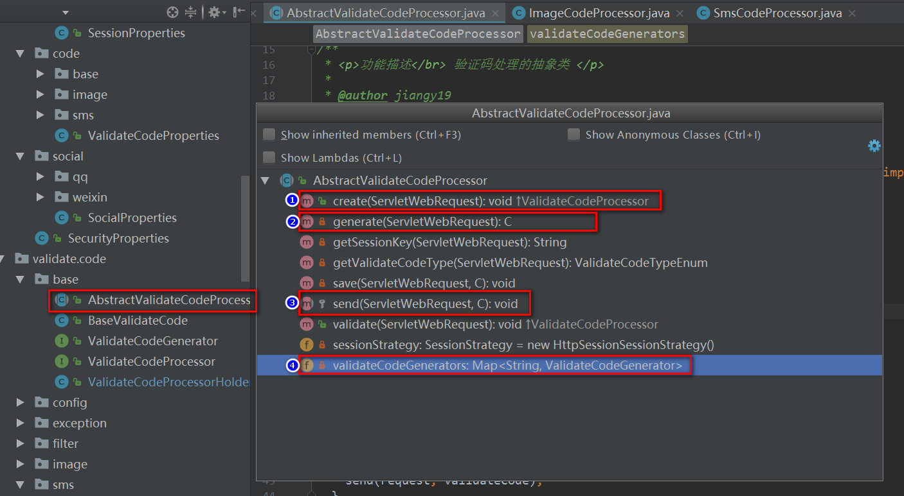

2.Spring开发中的依赖搜索
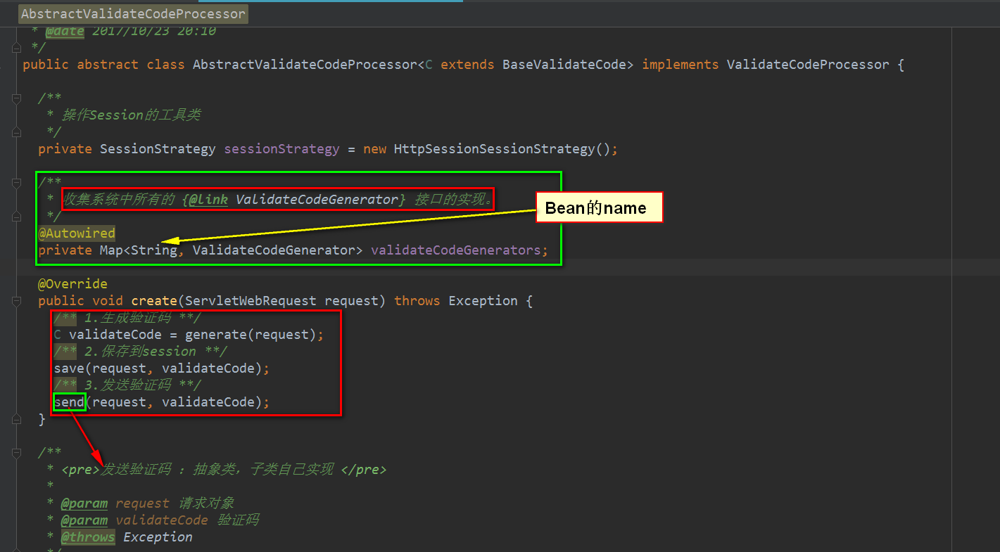

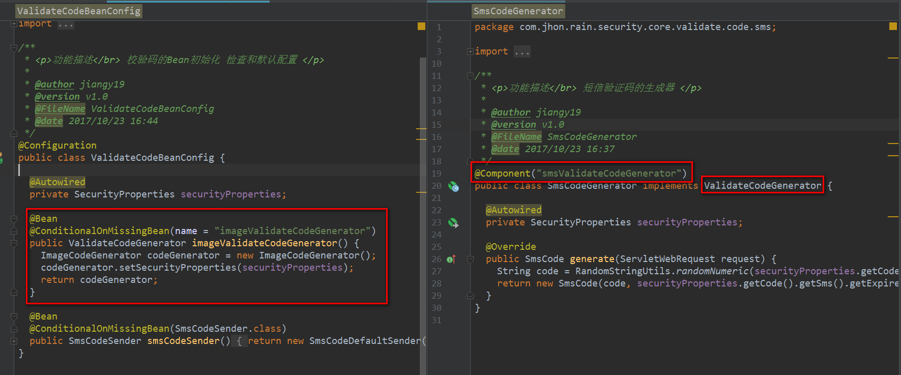

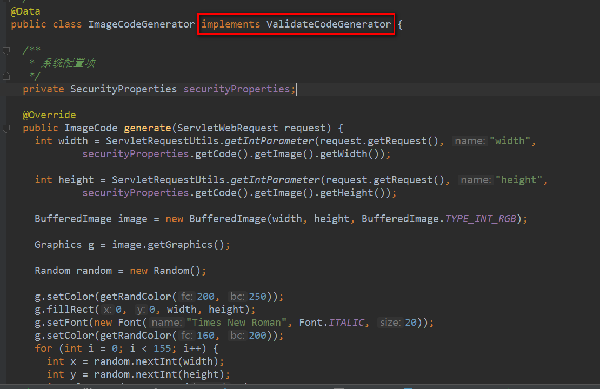

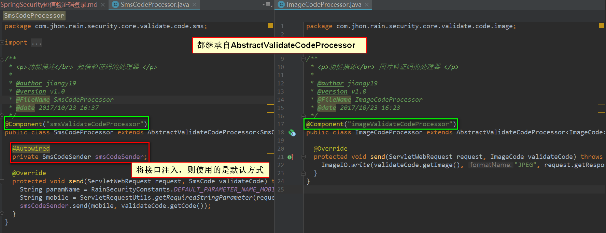

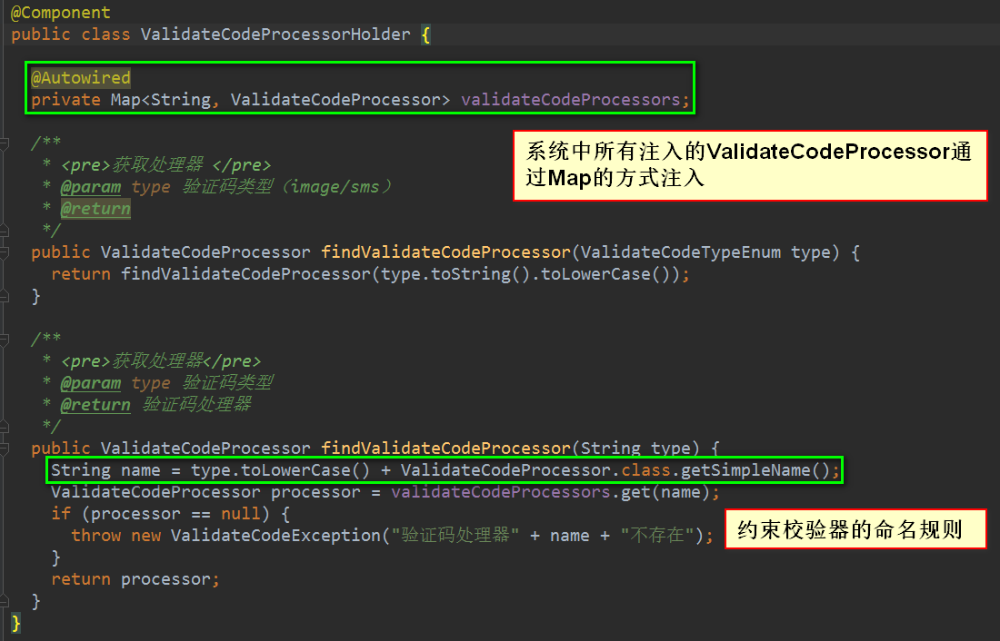

3.验证码的校验逻辑
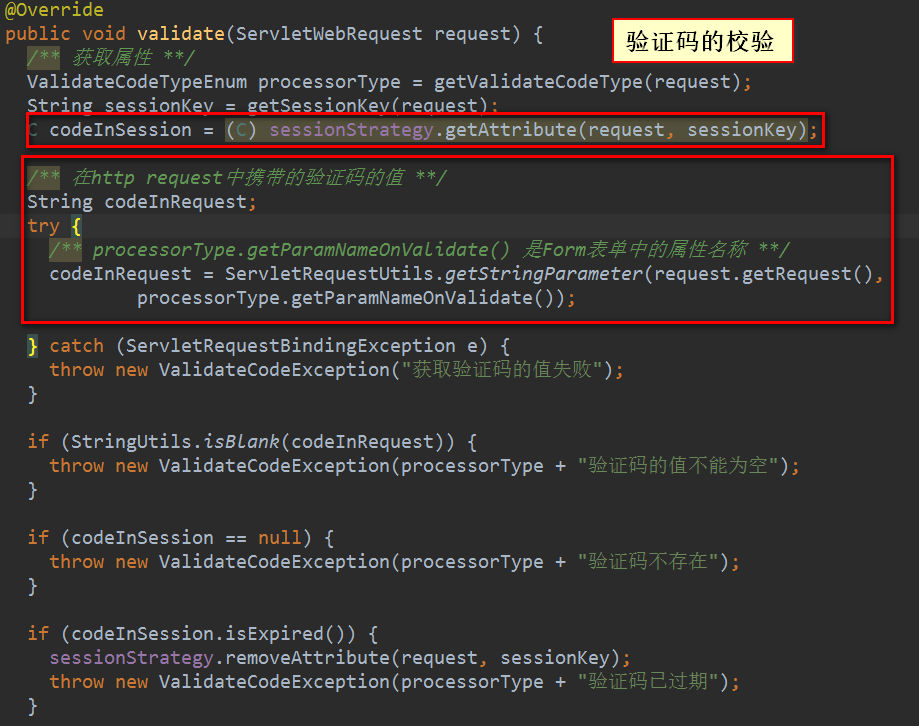

4.生成验证码的代码的抽象合并
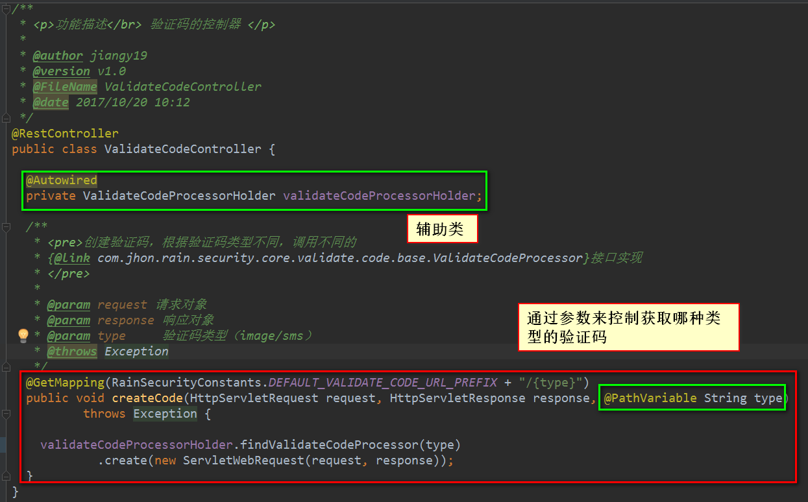

