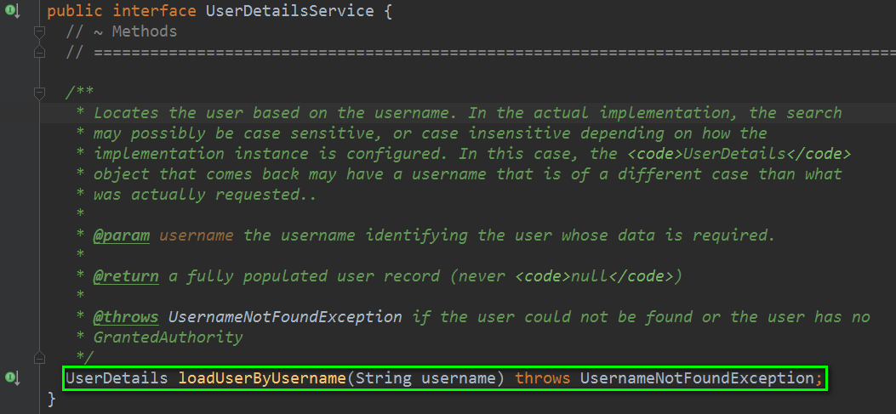
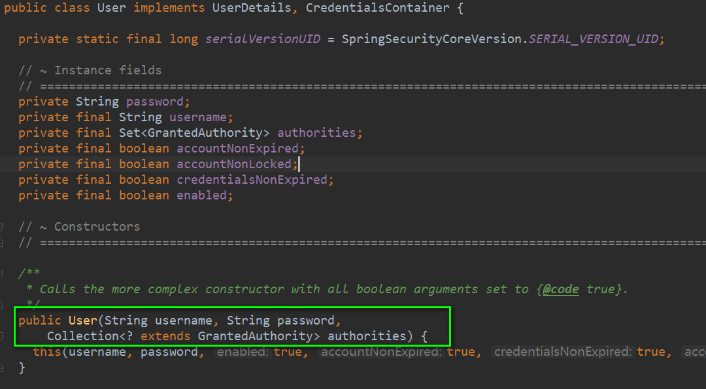
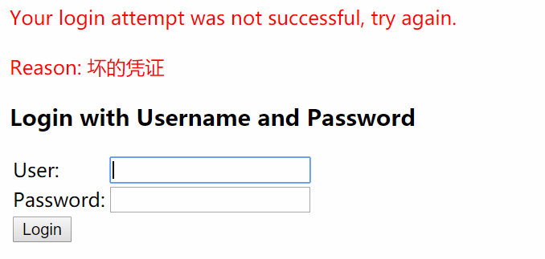
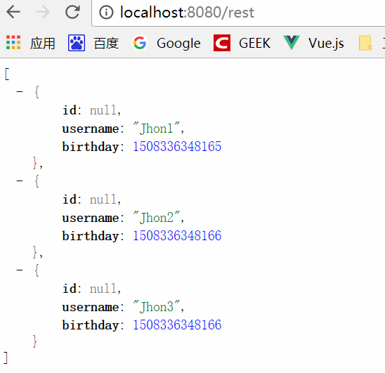
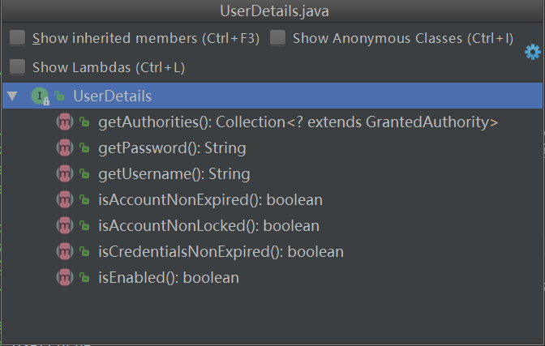
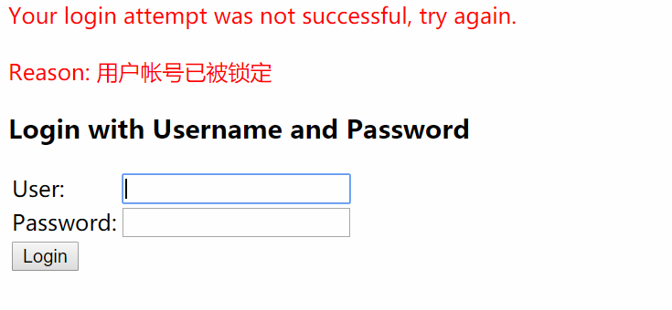
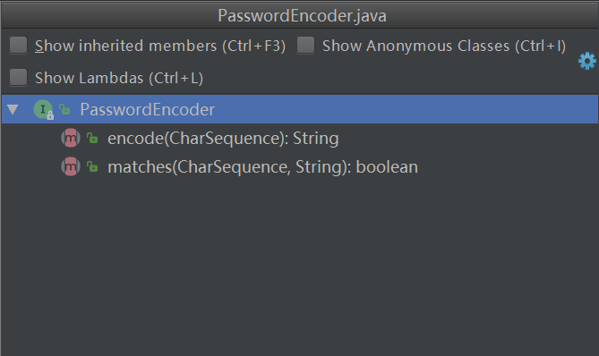
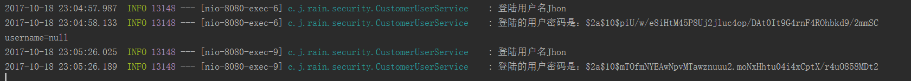

#### 一、Spring Security 获取用户信息

##### 1.UserDetailsService接口


##### 2.自定义用户信息查询
```java
package com.jhon.rain.security;

import lombok.extern.slf4j.Slf4j;
import org.springframework.security.core.authority.AuthorityUtils;
import org.springframework.security.core.userdetails.User;
import org.springframework.security.core.userdetails.UserDetails;
import org.springframework.security.core.userdetails.UserDetailsService;
import org.springframework.security.core.userdetails.UsernameNotFoundException;
import org.springframework.stereotype.Component;

/**
 * <p>功能描述</br> 自定义的用户信息查询接口 </p>
 *
 * @author jiangy19
 * @version v1.0
 * @FileName CustomerUserService
 * @date 2017/10/18 22:06
 */
@Component
@Slf4j
public class CustomerUserService implements UserDetailsService {

	@Override
	public UserDetails loadUserByUsername(String username) throws UsernameNotFoundException {
		/** 根据用户名，查询用户信息 TODO DB Operation **/
		log.info("登陆用户名{}",username);
		return new User(username,"123456", AuthorityUtils.commaSeparatedStringToAuthorityList("admin"));
	}
}
```
其中，User是指Spring Security中的User对象，如下图：


##### 3.测试效果
* 密码错误的情况


* 正常的情况



#### 二、Spring Security 自定义认证逻辑
#####1.UserDetails的源码


```java
/*
 * Copyright 2004, 2005, 2006 Acegi Technology Pty Limited
 *
 * Licensed under the Apache License, Version 2.0 (the "License");
 * you may not use this file except in compliance with the License.
 * You may obtain a copy of the License at
 *
 *      http://www.apache.org/licenses/LICENSE-2.0
 *
 * Unless required by applicable law or agreed to in writing, software
 * distributed under the License is distributed on an "AS IS" BASIS,
 * WITHOUT WARRANTIES OR CONDITIONS OF ANY KIND, either express or implied.
 * See the License for the specific language governing permissions and
 * limitations under the License.
 */

package org.springframework.security.core.userdetails;

import org.springframework.security.core.Authentication;
import org.springframework.security.core.GrantedAuthority;

import java.io.Serializable;
import java.util.Collection;

/**
 * Provides core user information.
 *
 * <p>
 * Implementations are not used directly by Spring Security for security purposes. They
 * simply store user information which is later encapsulated into {@link Authentication}
 * objects. This allows non-security related user information (such as email addresses,
 * telephone numbers etc) to be stored in a convenient location.
 * <p>
 * Concrete implementations must take particular care to ensure the non-null contract
 * detailed for each method is enforced. See
 * {@link org.springframework.security.core.userdetails.User} for a reference
 * implementation (which you might like to extend or use in your code).
 *
 * @see UserDetailsService
 * @see UserCache
 *
 * @author Ben Alex
 */
public interface UserDetails extends Serializable {
	// ~ Methods
	// ========================================================================================================

	/**
	 * Returns the authorities granted to the user. Cannot return <code>null</code>.
	 *
	 * @return the authorities, sorted by natural key (never <code>null</code>)
	 */
	Collection<? extends GrantedAuthority> getAuthorities();

	/**
	 * Returns the password used to authenticate the user.
	 *
	 * @return the password
	 */
	String getPassword();

	/**
	 * Returns the username used to authenticate the user. Cannot return <code>null</code>
	 * .
	 *
	 * @return the username (never <code>null</code>)
	 */
	String getUsername();

	/**
	 * Indicates whether the user's account has expired. An expired account cannot be
	 * authenticated.
	 *
	 * @return <code>true</code> if the user's account is valid (ie non-expired),
	 * <code>false</code> if no longer valid (ie expired)
	 */
	boolean isAccountNonExpired();

	/**
	 * Indicates whether the user is locked or unlocked. A locked user cannot be
	 * authenticated.
	 *
	 * @return <code>true</code> if the user is not locked, <code>false</code> otherwise
	 */
	boolean isAccountNonLocked();

	/**
	 * 密码是否过期 
	 * Indicates whether the user's credentials (password) has expired. Expired
	 * credentials prevent authentication.
	 *
	 * @return <code>true</code> if the user's credentials are valid (ie non-expired),
	 * <code>false</code> if no longer valid (ie expired)
	 */
	boolean isCredentialsNonExpired();

	/**
	 * Indicates whether the user is enabled or disabled. A disabled user cannot be
	 * authenticated.
	 *
	 * @return <code>true</code> if the user is enabled, <code>false</code> otherwise
	 */
	boolean isEnabled();
}
```

##### 模拟用户账号被冻结了
```java
package com.jhon.rain.security;

import lombok.extern.slf4j.Slf4j;
import org.springframework.security.core.authority.AuthorityUtils;
import org.springframework.security.core.userdetails.User;
import org.springframework.security.core.userdetails.UserDetails;
import org.springframework.security.core.userdetails.UserDetailsService;
import org.springframework.security.core.userdetails.UsernameNotFoundException;
import org.springframework.stereotype.Component;

/**
 * <p>功能描述</br> 自定义的用户信息查询接口 </p>
 *
 * @author jiangy19
 * @version v1.0
 * @FileName CustomerUserService
 * @date 2017/10/18 22:06
 */
@Component
@Slf4j
public class CustomerUserService implements UserDetailsService {

	@Override
	public UserDetails loadUserByUsername(String username) throws UsernameNotFoundException {
		/** 根据用户名，查询用户信息 TODO DB Operation **/
		log.info("登陆用户名{}",username);
		/**　判断用户是否冻结　,注意：此处可以使用自定义的User类去实现UserDetails接口，然后实现相应的四个方法的判断逻辑 **/
		return new User(username,"123456", 
						true,true,true,false,
						AuthorityUtils.commaSeparatedStringToAuthorityList("admin"));
	}
}
```

##### 执行结果



#### 三、Spring Security 密码的加密和解密
##### 1.PasswordEncoder接口

源码：
```java
/*
 * Copyright 2011-2016 the original author or authors.
 *
 * Licensed under the Apache License, Version 2.0 (the "License");
 * you may not use this file except in compliance with the License.
 * You may obtain a copy of the License at
 *
 *      http://www.apache.org/licenses/LICENSE-2.0
 *
 * Unless required by applicable law or agreed to in writing, software
 * distributed under the License is distributed on an "AS IS" BASIS,
 * WITHOUT WARRANTIES OR CONDITIONS OF ANY KIND, either express or implied.
 * See the License for the specific language governing permissions and
 * limitations under the License.
 */
package org.springframework.security.crypto.password;

/**
 * Service interface for encoding passwords.
 *
 * The preferred implementation is {@code BCryptPasswordEncoder}.
 *
 * @author Keith Donald
 */
public interface PasswordEncoder {

	/**
	 * Encode the raw password. Generally, a good encoding algorithm applies a SHA-1 or
	 * greater hash combined with an 8-byte or greater randomly generated salt.
	 */
	String encode(CharSequence rawPassword);

	/**
	 * Verify the encoded password obtained from storage matches the submitted raw
	 * password after it too is encoded. Returns true if the passwords match, false if
	 * they do not. The stored password itself is never decoded.
	 *
	 * @param rawPassword the raw password to encode and match 用户输入的密码
	 * @param encodedPassword the encoded password from storage to compare with 存放在db中经过encode的密码
	 * @return true if the raw password, after encoding, matches the encoded password from
	 * storage
	 */
	boolean matches(CharSequence rawPassword, String encodedPassword);

}
```
* encode 方法是将用户的密码插入到数据库前，需要将明文的密码进行encode存放到db
* matches 方法是将用户输入的密码和db中查询出来的密码进行对比

##### 2.代码示例 修改BrowserSecurityConfig代码片段
```java
package com.jhon.rain.security;

import org.springframework.context.annotation.Bean;
import org.springframework.context.annotation.Configuration;
import org.springframework.security.config.annotation.web.builders.HttpSecurity;
import org.springframework.security.config.annotation.web.configuration.WebSecurityConfigurerAdapter;
import org.springframework.security.crypto.bcrypt.BCryptPasswordEncoder;
import org.springframework.security.crypto.password.PasswordEncoder;

/**
 * <p>功能描述</br> PC端安全配置 </p>
 *
 * @author jiangy19
 * @version v1.0
 * @FileName BaseChannelSecurityConfig
 * @date 2017/10/18 19:44
 */
@Configuration
public class BrowserSecurityConfig extends WebSecurityConfigurerAdapter {

	@Bean
	public PasswordEncoder passwordEncoder(){
		return new BCryptPasswordEncoder();
	}

	@Override
	protected void configure(HttpSecurity http) throws Exception {
		http.formLogin()
						.and()
						.authorizeRequests()
						.anyRequest()
						.authenticated();
	}
}
```
```java
package com.jhon.rain.security;

import lombok.extern.slf4j.Slf4j;
import org.springframework.beans.factory.annotation.Autowired;
import org.springframework.security.core.authority.AuthorityUtils;
import org.springframework.security.core.userdetails.User;
import org.springframework.security.core.userdetails.UserDetails;
import org.springframework.security.core.userdetails.UserDetailsService;
import org.springframework.security.core.userdetails.UsernameNotFoundException;
import org.springframework.security.crypto.password.PasswordEncoder;
import org.springframework.stereotype.Component;

/**
 * <p>功能描述</br> 自定义的用户信息查询接口：新增PasswordEncoder </p>
 *
 * @author jiangy19
 * @version v1.0
 * @FileName CustomerUserService
 * @date 2017/10/18 22:06
 */
@Component
@Slf4j
public class CustomerUserService implements UserDetailsService {

	@Autowired
	private PasswordEncoder passwordEncoder;

	@Override
	public UserDetails loadUserByUsername(String username) throws UsernameNotFoundException {
		/** 根据用户名，查询用户信息 TODO DB Operation **/
		log.info("登陆用户名{}",username);
		/**　判断用户是否冻结　,注意：此处可以使用自定义的User类去实现UserDetails接口，然后实现相应的四个方法的判断逻辑 **/
		String enPassword = passwordEncoder.encode("123456");
		log.info("登陆的用户密码是：{}",enPassword);
		return new User(username,enPassword,
						true,true,true,false,
						AuthorityUtils.commaSeparatedStringToAuthorityList("admin"));
	}
}
```
##### 3.结果如下图
