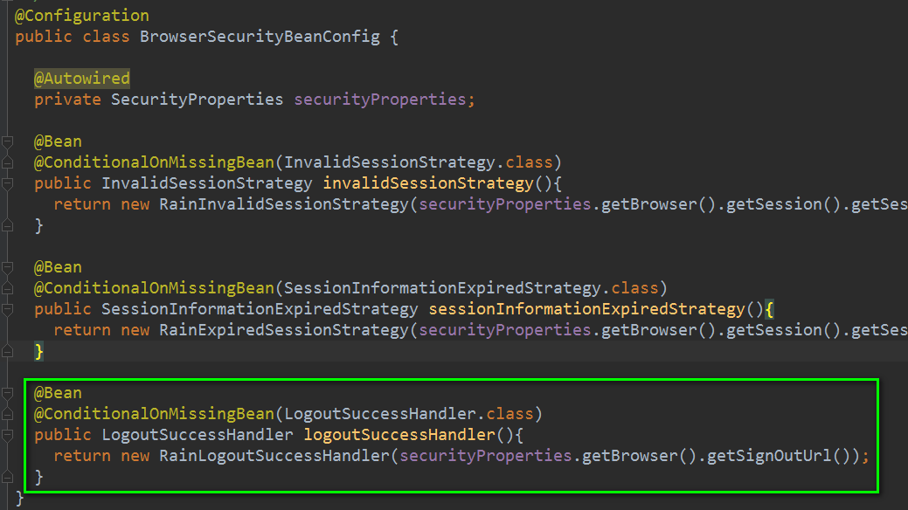
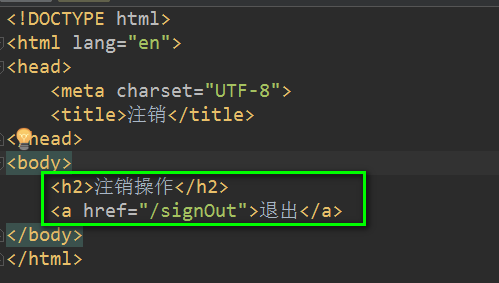
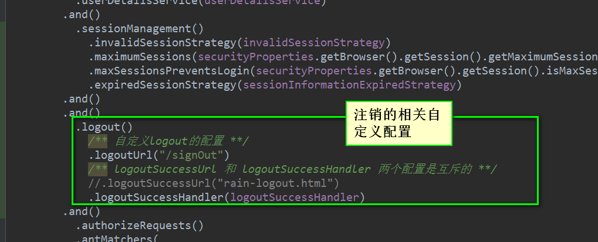
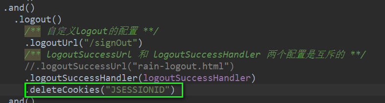

#### SpringSecurity退出登录的处理
##### 如何退出登录
```html
<!DOCTYPE html>
<html lang="en">
<head>
    <meta charset="UTF-8">
    <title>注销</title>
</head>
<body>
    <h2>注销操作</h2>
    <a href="/logout">退出</a>
</body>
</html>
```
##### Spring Security 默认的退出处理逻辑
* 默认注销的接口地址为 /logout

* 使当前session失效

* 清除与当前用户相关的remember-me记录

* 清空当前的SecurityContext

* 重定向到登录页

##### 与退出登录相关的自定义配置
* Bean的配置


* 退出接口的自定义

```html
<!DOCTYPE html>
<html lang="en">
<head>
    <meta charset="UTF-8">
    <title>注销</title>
</head>
<body>
    <h2>注销操作</h2>
    <a href="/signOut">退出</a>
</body>
</html>
```
* Spring Security Logout自定义配置
    

    
```java
package com.jhon.rain.security.browser.logout;

import com.fasterxml.jackson.databind.ObjectMapper;
import com.jhon.rain.security.browser.support.SimpleResponse;
import com.jhon.rain.security.core.properties.SecurityProperties;
import lombok.Data;
import lombok.extern.slf4j.Slf4j;
import org.apache.commons.lang.StringUtils;
import org.springframework.security.core.Authentication;
import org.springframework.security.web.authentication.logout.LogoutSuccessHandler;

import javax.servlet.ServletException;
import javax.servlet.http.HttpServletRequest;
import javax.servlet.http.HttpServletResponse;
import java.io.IOException;

/**
 * <p>功能描述</br> 注销后的处理器 </p>
 *
 * @author jiangy19
 * @version v1.0
 * @FileName RainLogoutSuccessHandler
 * @date 2017/10/26 20:58
 */
@Slf4j
@Data
public class RainLogoutSuccessHandler implements LogoutSuccessHandler {

	private String signOutUrl;

	private ObjectMapper objectMapper = new ObjectMapper();

	public RainLogoutSuccessHandler(String signOutUrl) {
		this.signOutUrl = signOutUrl;
	}

	@Override
	public void onLogoutSuccess(HttpServletRequest request, HttpServletResponse response, Authentication authentication) throws IOException, ServletException {
		log.info("{}，退出成功", authentication.getPrincipal());

		/** **/
		if (StringUtils.isBlank(signOutUrl)) {
			response.setContentType("application/json;charset=utf-8");
			SimpleResponse simpleResponse = new SimpleResponse();
			simpleResponse.setContent("退出成功");
			response.getWriter().write(objectMapper.writeValueAsString(simpleResponse));
		} else {
			response.sendRedirect(signOutUrl);
		}

	}
}
```