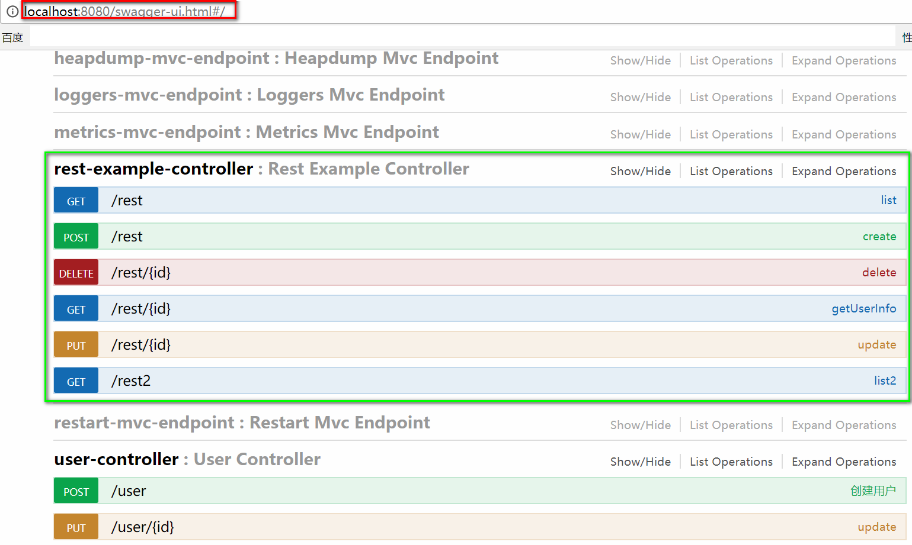

#### SpringBoot使用Swagger生成Restful接口文档 

##### 1.首先在项目中添加swagger的依赖
```xml
    <dependency>
           <groupId>io.springfox</groupId>
           <artifactId>springfox-swagger2</artifactId>
           <version>2.7.0</version>
    </dependency>
    <dependency>
           <groupId>io.springfox</groupId>
           <artifactId>springfox-swagger-ui</artifactId>
           <version>2.7.0</version>
    </dependency> 
```

##### 2.使用注解@EnableSwagger2 开启Swagger功能
```java
package com.jhon.rain;

import org.springframework.boot.SpringApplication;
import org.springframework.boot.autoconfigure.SpringBootApplication;
import org.springframework.web.bind.annotation.GetMapping;
import org.springframework.web.bind.annotation.RestController;
import springfox.documentation.swagger2.annotations.EnableSwagger2;

/**
 * <p>功能描述</br> 启动程序 </p>
 *
 * @author jiangy19
 * @version v1.0
 * @FileName RainbowApplication
 * @date 2017/10/15 15:35
 */
@SpringBootApplication
@RestController
@EnableSwagger2
public class RainbowApplication {

	public static void main(String[] args) {
		SpringApplication.run(RainbowApplication.class, args);
	}

	@GetMapping
	public String hello(){
		return "Hello Spring Security";
	}
}

```


##### 3.使用Swagger注解
* 方法级别：@ApiOperation(value = "用户查询服务")
* 属性级别：@ApiModelProperty(value = "用户年龄起始值")
* 参数级别：@ApiParam("用户id")

##### 4.启动项目，然后访问地址：http:localhost:8080/swagger-ui.html

