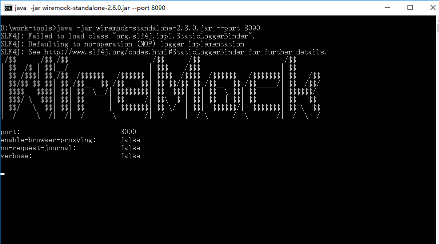
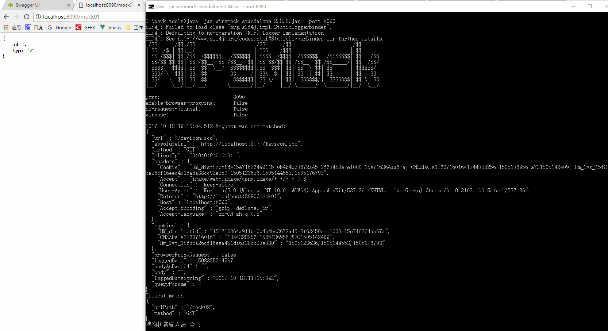

#### WireMock的使用
> 在前后端分离的场景下，使用WireMock是一个提升工作效率的方式。WireMock就是一个独立的服务，方便前端、app端调用模拟接口数据。具体使用请查看 http://wiremock.org/

##### 1.下载WireMock的jar包
* 下载jar包到本地，[点击下载](http://central.maven.org/maven2/com/github/tomakehurst/wiremock-standalone/2.8.0/wiremock-standalone-2.8.0.jar)
* 然后使用命令行启动

```bash
java -jar wiremock-1.46-standalone.jar --port 8090
```



##### 1.添加依赖
* Maven 依赖方式处理
```xml
<dependency>
    <groupId>com.github.tomakehurst</groupId>
    <artifactId>wiremock</artifactId>
</dependency>
```

##### 2.搭建服务
```java
package com.jhon.rain.wiremock;

import com.github.tomakehurst.wiremock.client.WireMock;
import org.apache.commons.io.FileUtils;
import org.apache.commons.lang.StringUtils;
import org.springframework.core.io.ClassPathResource;

import java.io.IOException;

/**
 * <p>功能描述</br> WireMock服务器 </p>
 *
 * @author jiangy19
 * @version v1.0
 * @FileName MockServer
 * @date 2017/10/18 14:39
 */
public class MockServer {

	public static void main(String[] args) throws Exception {
		WireMock.configureFor(8090);
		WireMock.removeAllMappings();

		mock("/mock01","mock01");
		mock("/mock02","mock02");
	}

	/**
	 * @param url
	 * @param file
	 * @throws IOException
	 */
	public static void mock(String url, String file) throws IOException {
		ClassPathResource resource = new ClassPathResource("mock/response/" + file + ".txt");
		String content = StringUtils.join(FileUtils.readLines(resource.getFile(), "UTF-8").toArray(), "\n");
		WireMock.stubFor(WireMock.get(WireMock.urlPathEqualTo(url)).willReturn(WireMock.aResponse().withBody(content).withStatus(200)));
	}
}
```

##### 3.执行MockServer.main方法，然后，使用浏览器，访问localhost:8090/mock01


##### 4.详细使用文档请参考下面的链接
[WireMock的官方文档](http://wiremock.org/docs/getting-started/)