#### Spring Boot & Security 整合 Session管理

##### Session超时处理
* 默认情况下，没有显式配置Session的失效时间，系统默认是30分钟

* 添加显式配置Session过期时间如下：
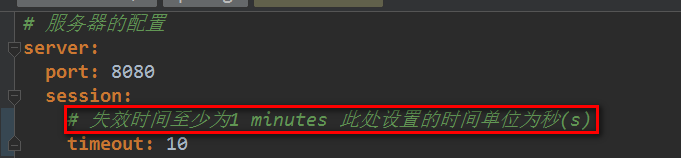

* 上面的配置发现10秒之后，Session还是没有生效，查看Spring Boot中session设置源码：
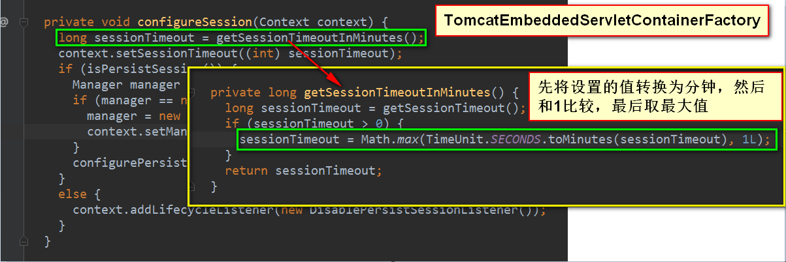

* 加上注释，等待一分钟后，发现Session失效了


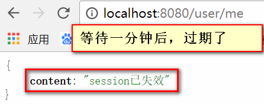

##### Session并发控制
* 模拟并发的测试效果
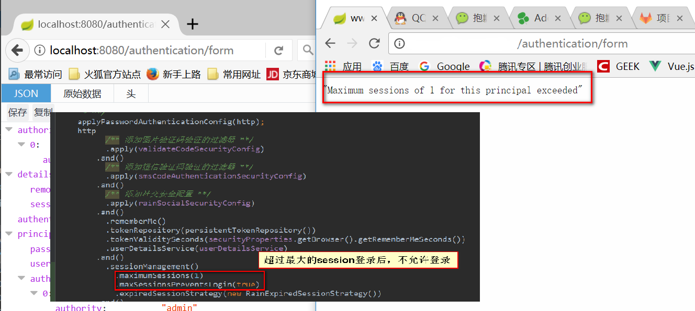

* Session管理的控制安全配置 
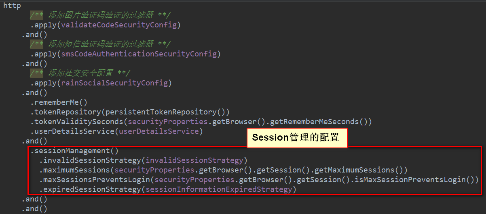

* Session过期和Session失效的Bean处理
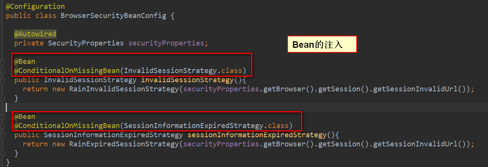
```java
package com.jhon.rain.security.browser;

import com.jhon.rain.security.browser.session.RainExpiredSessionStrategy;
import com.jhon.rain.security.browser.session.RainInvalidSessionStrategy;
import com.jhon.rain.security.core.properties.SecurityProperties;
import org.springframework.beans.factory.annotation.Autowired;
import org.springframework.boot.autoconfigure.condition.ConditionalOnMissingBean;
import org.springframework.context.annotation.Bean;
import org.springframework.context.annotation.Configuration;
import org.springframework.security.web.session.InvalidSessionStrategy;
import org.springframework.security.web.session.SessionInformationExpiredStrategy;

/**
 * <p>功能描述</br> 浏览器按钮配置bean</p>
 *
 * @author jiangy19
 * @version v1.0
 * @FileName BrowserSecurityBeanConfig
 * @date 2017/10/26 17:58
 */
@Configuration
public class BrowserSecurityBeanConfig {

	@Autowired
	private SecurityProperties securityProperties;

	@Bean
	@ConditionalOnMissingBean(InvalidSessionStrategy.class)
	public InvalidSessionStrategy invalidSessionStrategy(){
		return new RainInvalidSessionStrategy(securityProperties.getBrowser().getSession().getSessionInvalidUrl());
	}

	@Bean
	@ConditionalOnMissingBean(SessionInformationExpiredStrategy.class)
	public SessionInformationExpiredStrategy sessionInformationExpiredStrategy(){
		return new RainExpiredSessionStrategy(securityProperties.getBrowser().getSession().getSessionInvalidUrl());
	}
}
```
##### 集群Session管理
* 集群情况下的问题：
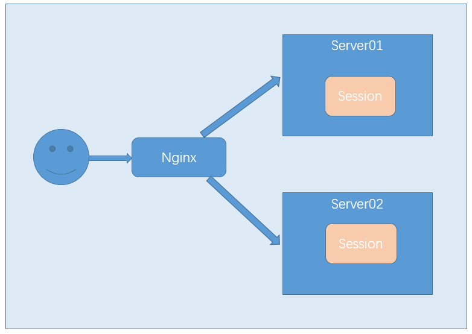

* 集群情况下Session共享问题的解决方式：Spring Session
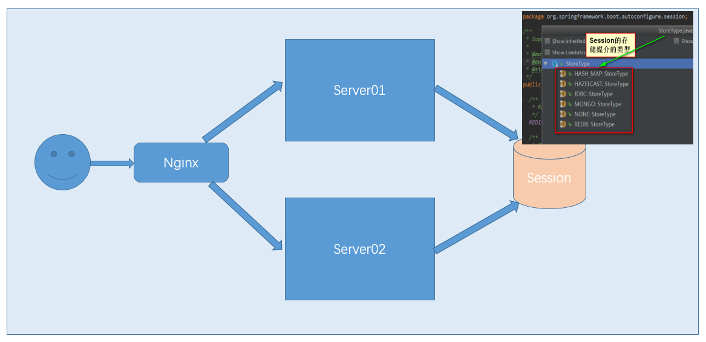

* 使用Redis来存储Session方式的处理
    * 1.Session是访问非常频繁的
    * 2.Session是有一个时效性的，而Redis是自带超时的策略
* No Talk,Show Me The Code
    * 注意：Session存放到Redis中的时候，需要注意Session中的对象是需要序列化的，
    * 对于我们的验证码，BaseValidateCode需要实现Serializable接口，并且图片是不需要存放的，只需要存储验证码和过期时间
    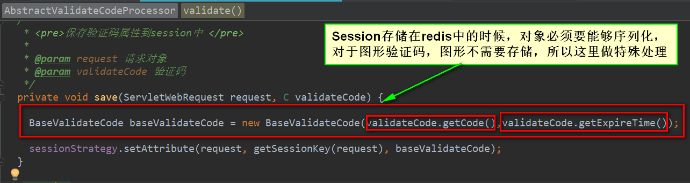
    
* 开启两个应用，一个在8080端口，一个在8090端口
  * 首先用8080来登陆，调用/user/me接口,出现如下信息：
  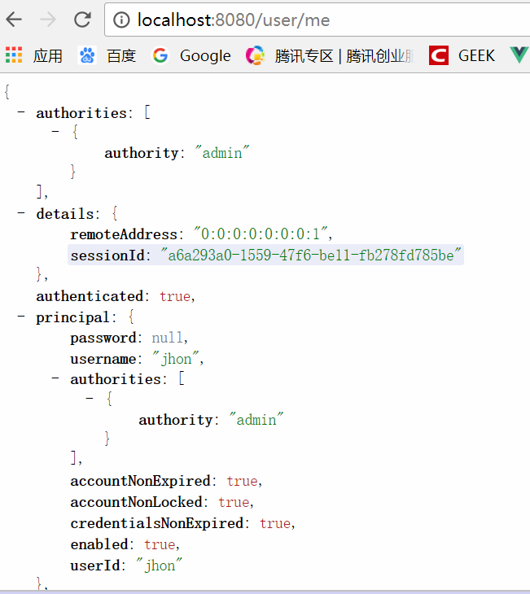
  * 然后在同一个浏览器中使用8090端口，直接调用/user/me接口，出现如下信息：
  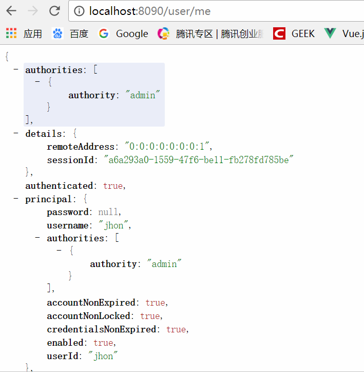
  * 到这发现两个应用直接session是互通的了，我们到redis中去查看一下：
  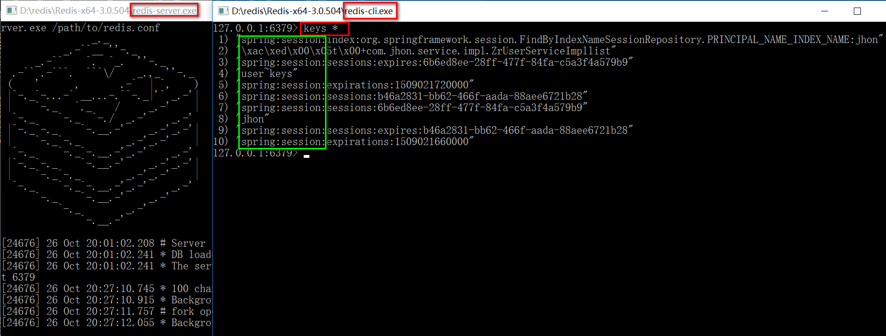
  * 使用FireFox再登录一下，试一下并发的控制是否生效了
  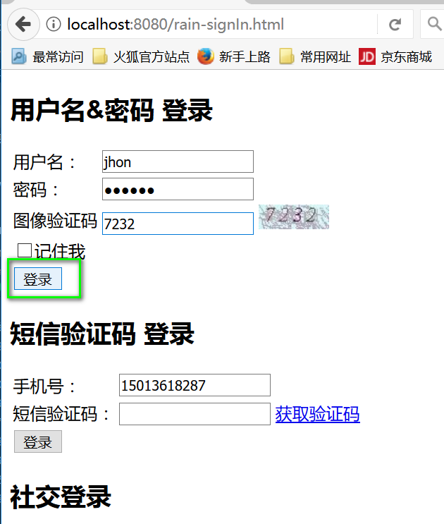
  * 最后刷新一下Google浏览器，出现Session过期的提示
  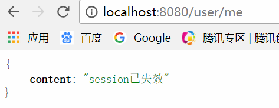