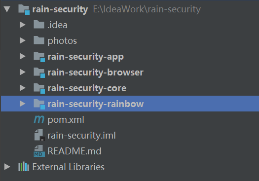

#### Springboot @ComponentScan 注解不支持扫描jar包中组件解决办法

##### 1.项目采用maven多模块方式，层次结构如下


##### 2.项目的启动类路径
com.jhon.rain.RainbowApplication
```java
package com.jhon.rain;

import org.springframework.boot.SpringApplication;
import org.springframework.boot.autoconfigure.SpringBootApplication;
import org.springframework.web.bind.annotation.RestController;
import springfox.documentation.swagger2.annotations.EnableSwagger2;

/**
 * <p>功能描述</br> 启动程序 </p>
 *
 * @author jiangy19
 * @version v1.0
 * @FileName RainbowApplication
 * @date 2017/10/15 15:35
 */
@SpringBootApplication
@RestController
@EnableSwagger2
public class RainbowApplication {

	public static void main(String[] args) {
		SpringApplication.run(RainbowApplication.class, args);
	}

}
```

##### 3.处于代码重用的考虑，想在browser模块中，增加一个Spring Security基于FromLogin的登陆认证配置
* 创建一个类路径为：com.jhon.security.BrowserSecurityConfig.java
```java
package com.jhon.security;

import org.springframework.context.annotation.Configuration;
import org.springframework.security.config.annotation.web.builders.HttpSecurity;
import org.springframework.security.config.annotation.web.configuration.WebSecurityConfigurerAdapter;

/**
 * <p>功能描述</br> PC端安全配置 </p>
 *
 * @author jiangy19
 * @version v1.0
 * @FileName FormAuthenticationConfig
 * @date 2017/10/18 19:44
 */
@Configuration
public class BrowserSecurityConfig extends WebSecurityConfigurerAdapter {

	@Override
	protected void configure(HttpSecurity http) throws Exception {
		http.formLogin()
						.and()
						.authorizeRequests()
						.anyRequest()
						.authenticated();
	}
}
```
* 启动项目后，发现FormLogin的认证方式一直没有生效，刚开始以为是代码问题，后面仔细看了下，没发现问题
* 基于上面的分析，发现不是代码问题，那就肯定是代码上的注解没有生效，然后想了想，Spring Boot的文档中有提到过
> @ComponentScan扫描的时候，只扫描当前程序所在包结构（包含子包）中声明的组件

* 最后，将路径修改为和启动类一样的包路径，即：
BrowserSecurityConfig.java
* 问题终于得到解决了 V^V 。