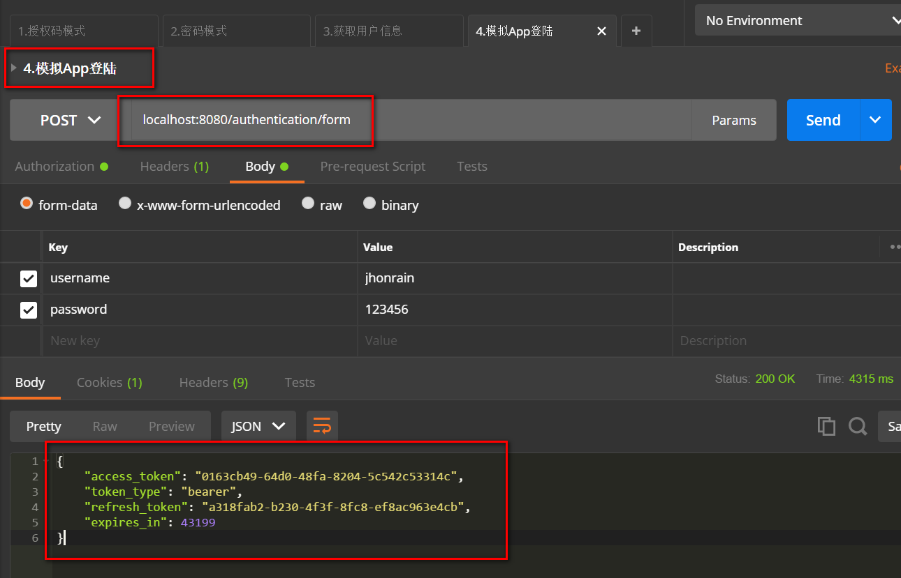

#### SpringSecurityOAuth重构用户名密码登陆
App端登录成功后的处理器 

```java
package com.jhon.rain.security.app.authentication;

import com.fasterxml.jackson.databind.ObjectMapper;
import com.jhon.rain.security.core.enums.LoginResponseTypeEnum;
import com.jhon.rain.security.core.properties.SecurityProperties;
import lombok.extern.slf4j.Slf4j;
import org.apache.commons.collections.MapUtils;
import org.apache.commons.lang.StringUtils;
import org.springframework.beans.factory.annotation.Autowired;
import org.springframework.security.authentication.BadCredentialsException;
import org.springframework.security.core.Authentication;
import org.springframework.security.crypto.codec.Base64;
import org.springframework.security.oauth2.common.OAuth2AccessToken;
import org.springframework.security.oauth2.common.exceptions.UnapprovedClientAuthenticationException;
import org.springframework.security.oauth2.provider.*;
import org.springframework.security.oauth2.provider.token.AuthorizationServerTokenServices;
import org.springframework.security.web.authentication.SavedRequestAwareAuthenticationSuccessHandler;
import org.springframework.social.oauth2.GrantType;
import org.springframework.stereotype.Component;

import javax.servlet.ServletException;
import javax.servlet.http.HttpServletRequest;
import javax.servlet.http.HttpServletResponse;
import java.io.IOException;

/**
 * <p>功能描述</br> 登录成功的处理器 </p>
 *
 * @author jiangy19
 * @version v1.0
 * @FileName RainAuthenticationSuccessHandler
 * @date 2017/10/19 21:35
 */
@Component("rainAuthenticationSuccessHandler")
@Slf4j
public class RainAuthenticationSuccessHandler extends SavedRequestAwareAuthenticationSuccessHandler {

	@Autowired
	private ObjectMapper objectMapper;

	@Autowired
	private SecurityProperties securityProperties;

	@Autowired
	private ClientDetailsService clientDetailsService;

	@Autowired
	private AuthorizationServerTokenServices authorizationServerTokenServices;

	@Override
	public void onAuthenticationSuccess(HttpServletRequest request, HttpServletResponse response,
	                                    Authentication authentication)
					throws IOException, ServletException {

		log.info("登录成功");

		/** Copy From BasicAuthenticationFilter **/
		String header = request.getHeader("Authorization");

		if (header == null || !header.startsWith("Basic ")) {
			throw new UnapprovedClientAuthenticationException("请求头中无client信息");
		}

		String[] tokens = extractAndDecodeHeader(header, request);
		assert tokens.length == 2;

		String clientId = tokens[0];
		String clientSecret = tokens[1];

		ClientDetails clientDetails = clientDetailsService.loadClientByClientId(clientId);
		if (clientDetails == null) {
			throw new UnapprovedClientAuthenticationException("ClientId 对应的信息不存在：" + clientId);
		}
		if (!StringUtils.equals(clientDetails.getClientSecret(), clientSecret)) {
			throw new UnapprovedClientAuthenticationException("ClientSecret不匹配：" + clientId);
		}

		TokenRequest tokenRequest = new TokenRequest(MapUtils.EMPTY_MAP,clientId,clientDetails.getScope(), "custome");
		OAuth2Request oAuth2Request = tokenRequest.createOAuth2Request(clientDetails);

		OAuth2Authentication oAuth2Authentication = new OAuth2Authentication(oAuth2Request,authentication);

		OAuth2AccessToken oAuth2AccessToken = authorizationServerTokenServices.createAccessToken(oAuth2Authentication);

		/** Modified Ended **/

		/** 将信息打印到页面 **/
		response.setContentType("application/json;charset=UTF-8");
		response.getWriter().write(objectMapper.writeValueAsString(oAuth2AccessToken));

	}


	/**
	 * <pre>解析头信息参数</pre>
	 *
	 * @param header
	 * @param request
	 * @return
	 * @throws IOException
	 */
	private String[] extractAndDecodeHeader(String header, HttpServletRequest request)
					throws IOException {

		byte[] base64Token = header.substring(6).getBytes("UTF-8");
		byte[] decoded;
		try {
			decoded = Base64.decode(base64Token);
		} catch (IllegalArgumentException e) {
			throw new BadCredentialsException("Failed to decode basic authentication token");
		}

		String token = new String(decoded, "UTF-8");

		int delim = token.indexOf(":");

		if (delim == -1) {
			throw new BadCredentialsException("Invalid basic authentication token");
		}
		return new String[]{token.substring(0, delim), token.substring(delim + 1)};
	}

}
```
App端 Spring Security安全配置
```java
package com.jhon.rain.security.app;

import com.jhon.rain.security.core.authentication.mobile.SmsCodeAuthenticationSecurityConfig;
import com.jhon.rain.security.core.constants.RainSecurityConstants;
import com.jhon.rain.security.core.properties.SecurityProperties;
import org.springframework.beans.factory.annotation.Autowired;
import org.springframework.context.annotation.Configuration;
import org.springframework.security.config.annotation.web.builders.HttpSecurity;
import org.springframework.security.oauth2.config.annotation.web.configuration.EnableResourceServer;
import org.springframework.security.oauth2.config.annotation.web.configuration.ResourceServerConfigurerAdapter;
import org.springframework.security.web.authentication.AuthenticationFailureHandler;
import org.springframework.security.web.authentication.AuthenticationSuccessHandler;
import org.springframework.social.security.SpringSocialConfigurer;

/**
 * <p>功能描述</br> 资源服务器的安全配置 </p>
 *
 * @author jiangy19
 * @version v1.0
 * @FileName RainResourceServerConfig
 * @date 2017/10/28 14:44
 */
@Configuration
@EnableResourceServer
public class RainResourceServerConfig extends ResourceServerConfigurerAdapter {

	@Autowired
	private SecurityProperties securityProperties;

	@Autowired
	private AuthenticationSuccessHandler rainAuthenticationSuccessHandler;

	@Autowired
	private AuthenticationFailureHandler rainAuthenticationFailureHandler;

	@Autowired
	private SmsCodeAuthenticationSecurityConfig smsCodeAuthenticationSecurityConfig;

	@Autowired
	private SpringSocialConfigurer rainSocialSecurityConfig;

	@Override
	public void configure(HttpSecurity http) throws Exception {
		/** 基础的配置
		 * 1.自定义登录请求地址
		 * 2.自定义登录验证的接口
		 * 3.登录成功和失败的处理
		 * **/
		http.formLogin()
						/** 自定义登录请求地址**/
						.loginPage(RainSecurityConstants.DEFAULT_UNAUTHENTICATION_URL)
						/** 自定义登录验证的接口 **/
						.loginProcessingUrl(RainSecurityConstants.DEFAULT_LOGIN_PROCESSING_URL_FORM)
						/** 登录成功处理器 **/
						.successHandler(rainAuthenticationSuccessHandler)
						/** 登录失败处理器 **/
						.failureHandler(rainAuthenticationFailureHandler);

		http
				/** 添加短信验证码验证的过滤器 **/
				.apply(smsCodeAuthenticationSecurityConfig)
				.and()
				/** 添加社交安全配置 **/
				.apply(rainSocialSecurityConfig)
				.and()
				.authorizeRequests()
				.antMatchers(
								/** 默认未授权处理接口地址 **/
								RainSecurityConstants.DEFAULT_UNAUTHENTICATION_URL,
								/** 登录的页面【默认是系统默认的，可以自定义配置】 **/
								securityProperties.getBrowser().getLoginPage(),
								/** 默认手机验证码接口处理地址 **/
								RainSecurityConstants.DEFAULT_LOGIN_PROCESSING_URL_MOBILE,
								/** 生成验证码的接口地址 **/
								RainSecurityConstants.DEFAULT_VALIDATE_CODE_URL_PREFIX + "/*",
								securityProperties.getBrowser().getSignUpUrl(),
								/** session失效跳转的链接地址 **/
								securityProperties.getBrowser().getSession().getSessionInvalidUrl()+".json",
								securityProperties.getBrowser().getSession().getSessionInvalidUrl()+".html",
								/** 自定义退出地址 **/
								securityProperties.getBrowser().getSignOutUrl(),
								"/user/register"
				).permitAll()
				.anyRequest()
				.authenticated()
				.and()
				.csrf().disable(); /** CSRF 功能禁用 **/
	}
}
```

