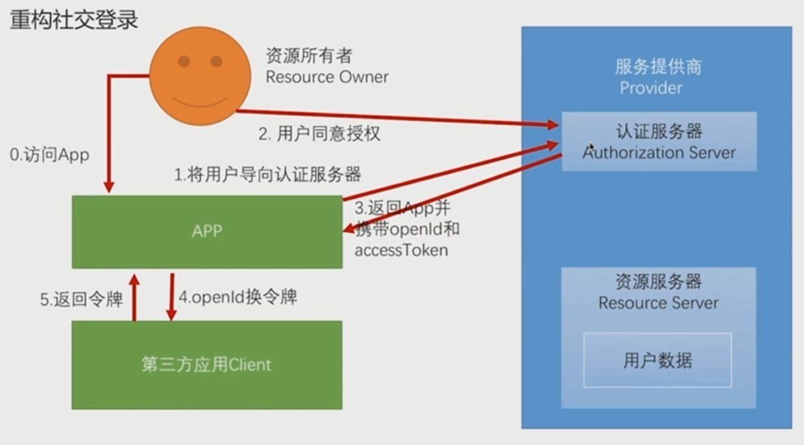
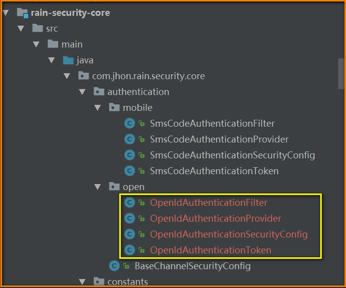
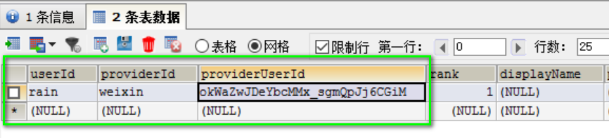
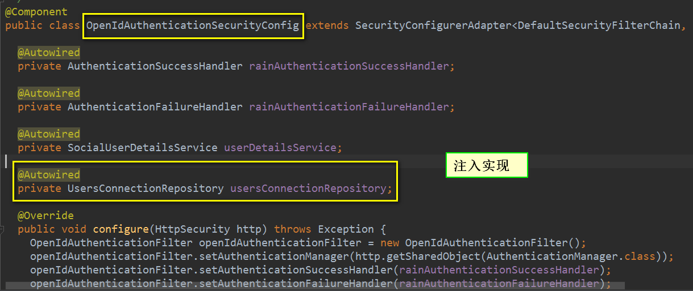
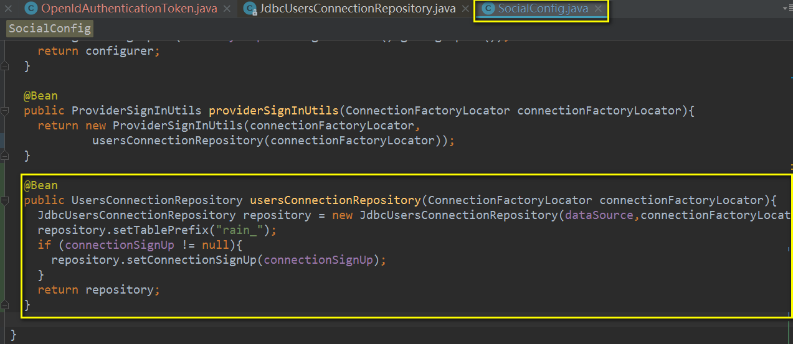
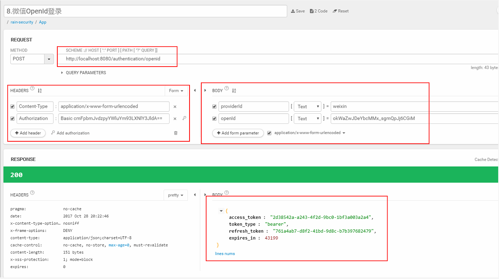
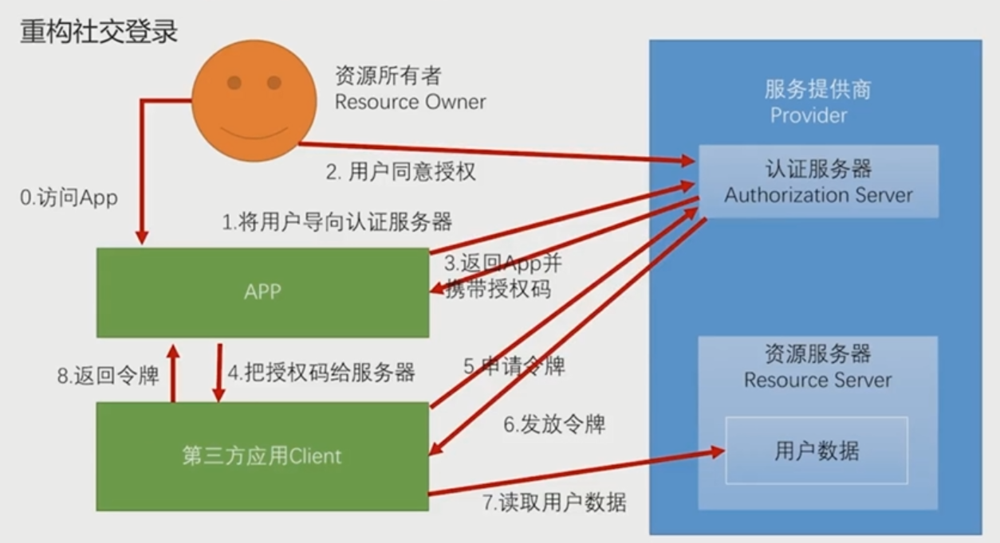

#### SpringSecurityOAuth重构社交登录

##### 重构的结构模式1


##### 代码重构：新增微信登录

* OpenIdAuthenticationToken
```java
package com.jhon.rain.security.core.authentication.open;

import org.springframework.security.authentication.AbstractAuthenticationToken;
import org.springframework.security.core.GrantedAuthority;
import org.springframework.security.core.SpringSecurityCoreVersion;
import org.springframework.security.core.userdetails.UserDetails;

import java.util.Collection;

/**
 * <p>功能描述</br> OpenId登录验证的Token</p>
 *
 * @author jiangy19
 * @version v1.0
 * @FileName OpenIdAuthenticationToken
 * @date 2017/10/28 18:34
 */
public class OpenIdAuthenticationToken extends AbstractAuthenticationToken {


	private static final long serialVersionUID = SpringSecurityCoreVersion.SERIAL_VERSION_UID;

	// ~ Instance fields
	// ================================================================================================

	private final Object principal; // openId
	private String providerId; // qq or weixin

	// ~ Constructors
	// ===================================================================================================

	/**
	 * This constructor can be safely used by any code that wishes to create a
	 * <code>UsernamePasswordAuthenticationToken</code>, as the {@link #isAuthenticated()}
	 * will return <code>false</code>.
	 *
	 */
	public OpenIdAuthenticationToken(String openId, String providerId) {
		super(null);
		this.principal = openId;
		this.providerId = providerId;
		setAuthenticated(false);
	}

	/**
	 * This constructor should only be used by <code>AuthenticationManager</code> or
	 * <code>AuthenticationProvider</code> implementations that are satisfied with
	 * producing a trusted (i.e. {@link #isAuthenticated()} = <code>true</code>)
	 * authentication token.
	 *
	 * @param openId
	 * @param authorities
	 */
	public OpenIdAuthenticationToken(Object openId,
	                                           Collection<? extends GrantedAuthority> authorities) {
		super(authorities);
		this.principal = openId;
		super.setAuthenticated(true); // must use super, as we override
	}

	// ~ Methods
	// ========================================================================================================


	public String getProviderId() {
		return providerId;
	}

	@Override
	public Object getCredentials() {
		return null;
	}

	public Object getPrincipal() {
		return this.principal;
	}

	public void setAuthenticated(boolean isAuthenticated) throws IllegalArgumentException {
		if (isAuthenticated) {
			throw new IllegalArgumentException(
							"Cannot set this token to trusted - use constructor which takes a GrantedAuthority list instead");
		}

		super.setAuthenticated(false);
	}

	@Override
	public void eraseCredentials() {
		super.eraseCredentials();
	}
}

```

* OpenIdAuthenticationFilter
```java
package com.jhon.rain.security.core.authentication.open;

import com.jhon.rain.security.core.constants.RainSecurityConstants;
import org.springframework.security.authentication.AuthenticationServiceException;
import org.springframework.security.core.Authentication;
import org.springframework.security.core.AuthenticationException;
import org.springframework.security.web.authentication.AbstractAuthenticationProcessingFilter;
import org.springframework.security.web.util.matcher.AntPathRequestMatcher;
import org.springframework.util.Assert;

import javax.servlet.http.HttpServletRequest;
import javax.servlet.http.HttpServletResponse;

/**
 * <p>功能描述</br> 使用openId登录的过滤器 </p>
 *
 * @author jiangy19
 * @version v1.0
 * @FileName OpenIdAuthenticationFilter
 * @date 2017/10/28 18:44
 */
public class OpenIdAuthenticationFilter extends AbstractAuthenticationProcessingFilter {


	// ~ Static fields/initializers
	// =====================================================================================

	private String openIdParameter = RainSecurityConstants.DEFAULT_PARAMETER_NAME_OPENID;
	private String providerIdParameter = RainSecurityConstants.DEFAULT_PARAMETER_NAME_PROVIDERID;
	private boolean postOnly = true;

	// ~ Constructors
	// ===================================================================================================

	public OpenIdAuthenticationFilter() {
		super(new AntPathRequestMatcher(RainSecurityConstants.DEFAULT_LOGIN_PROCESS_URL_OPENID, "POST"));
	}

	// ~ Methods
	// ========================================================================================================

	public Authentication attemptAuthentication(HttpServletRequest request,
	                                            HttpServletResponse response) throws AuthenticationException {
		if (postOnly && !request.getMethod().equals("POST")) {
			throw new AuthenticationServiceException(
							"Authentication method not supported: " + request.getMethod());
		}

		String openId = obtainOpenId(request);
		String providerId = obtainProviderId(request);

		if (openId == null) {
			openId = "";
		}

		if (providerId == null) {
			providerId = "";
		}

		openId = openId.trim();

		OpenIdAuthenticationToken authRequest = new OpenIdAuthenticationToken(openId,providerId);
		// Allow subclasses to set the "details" property
		setDetails(request, authRequest);

		return this.getAuthenticationManager().authenticate(authRequest);
	}

	/**
	 * Enables subclasses to override the composition of the password, such as by
	 * including additional values and a separator.
	 * <p>
	 * This might be used for example if a postcode/zipcode was required in addition to
	 * the password. A delimiter such as a pipe (|) should be used to separate the
	 * password and extended value(s). The <code>AuthenticationDao</code> will need to
	 * generate the expected password in a corresponding manner.
	 * </p>
	 *
	 * @param request so that request attributes can be retrieved
	 *
	 * @return the password that will be presented in the <code>Authentication</code>
	 * request token to the <code>AuthenticationManager</code>
	 */
	protected String obtainOpenId(HttpServletRequest request) {
		return request.getParameter(openIdParameter);
	}

	/**
	 * Enables subclasses to override the composition of the username, such as by
	 * including additional values and a separator.
	 *
	 * @param request so that request attributes can be retrieved
	 *
	 * @return the username that will be presented in the <code>Authentication</code>
	 * request token to the <code>AuthenticationManager</code>
	 */
	protected String obtainProviderId(HttpServletRequest request) {
		return request.getParameter(providerIdParameter);
	}

	/**
	 * Provided so that subclasses may configure what is put into the authentication
	 * request's details property.
	 *
	 * @param request that an authentication request is being created for
	 * @param authRequest the authentication request object that should have its details
	 * set
	 */
	protected void setDetails(HttpServletRequest request,
	                          OpenIdAuthenticationToken authRequest) {
		authRequest.setDetails(authenticationDetailsSource.buildDetails(request));
	}

	/**
	 * Sets the parameter name which will be used to obtain the username from the login
	 * request.
	 *
	 * @param openIdParameter the parameter name. Defaults to "username".
	 */
	public void setOpenIdParameter(String openIdParameter) {
		Assert.hasText(openIdParameter, "OpenID parameter must not be empty or null");
		this.openIdParameter = openIdParameter;
	}

	/**
	 * Sets the parameter name which will be used to obtain the password from the login
	 * request..
	 *
	 * @param providerIdParameter the parameter name. Defaults to "password".
	 */
	public void setProviderIdParameter(String providerIdParameter) {
		Assert.hasText(providerIdParameter, "Password parameter must not be empty or null");
		this.providerIdParameter = providerIdParameter;
	}

	/**
	 * Defines whether only HTTP POST requests will be allowed by this filter. If set to
	 * true, and an authentication request is received which is not a POST request, an
	 * exception will be raised immediately and authentication will not be attempted. The
	 * <tt>unsuccessfulAuthentication()</tt> method will be called as if handling a failed
	 * authentication.
	 * <p>
	 * Defaults to <tt>true</tt> but may be overridden by subclasses.
	 */
	public void setPostOnly(boolean postOnly) {
		this.postOnly = postOnly;
	}

	public final String getOpenIdParameter() {
		return openIdParameter;
	}

	public final String getProviderIdParameter() {
		return providerIdParameter;
	}
}

```

* OpenIdAuthenticationProvider
```java
package com.jhon.rain.security.core.authentication.open;

import org.springframework.security.authentication.AuthenticationProvider;
import org.springframework.security.authentication.InternalAuthenticationServiceException;
import org.springframework.security.core.Authentication;
import org.springframework.security.core.AuthenticationException;
import org.springframework.security.core.userdetails.UserDetails;
import org.springframework.social.connect.UsersConnectionRepository;
import org.springframework.social.security.SocialUserDetailsService;
import org.springframework.util.CollectionUtils;

import java.util.HashSet;
import java.util.Set;

/**
 * <p>功能描述</br> OpenId认证的服务提供商 </p>
 *
 * @author jiangy19
 * @version v1.0
 * @FileName OpenIdAuthenticationProvider
 * @date 2017/10/28 19:03
 */
public class OpenIdAuthenticationProvider implements AuthenticationProvider {

	private SocialUserDetailsService userDetailsService;

	private UsersConnectionRepository usersConnectionRepository;

	@Override
	public Authentication authenticate(Authentication authentication) throws AuthenticationException {
		OpenIdAuthenticationToken authenticationToken = (OpenIdAuthenticationToken) authentication;

		Set<String> providerUserIds = new HashSet<>();
		providerUserIds.add((String) authentication.getPrincipal());
		Set<String> userIds = usersConnectionRepository.findUserIdsConnectedTo(authenticationToken.getProviderId(), providerUserIds);

		if (CollectionUtils.isEmpty(userIds) || userIds.size() != 1) {
			throw new InternalAuthenticationServiceException("无法获取用户信息");
		}

		String userId = userIds.iterator().next();
		UserDetails user = userDetailsService.loadUserByUserId(userId);
		if (user == null) {
			throw new InternalAuthenticationServiceException("无法获取用户信息");
		}

		OpenIdAuthenticationToken authenticationResult = new OpenIdAuthenticationToken(user, user.getAuthorities());
		authenticationResult.setDetails(authenticationToken.getDetails());

		return authenticationResult;
	}

	@Override
	public boolean supports(Class<?> authentication) {
		return OpenIdAuthenticationToken.class.isAssignableFrom(authentication);
	}

	public SocialUserDetailsService getUserDetailsService() {
		return userDetailsService;
	}

	public void setUserDetailsService(SocialUserDetailsService userDetailsService) {
		this.userDetailsService =  userDetailsService;
	}

	public UsersConnectionRepository getUsersConnectionRepository() {
		return usersConnectionRepository;
	}

	public void setUsersConnectionRepository(UsersConnectionRepository usersConnectionRepository) {
		this.usersConnectionRepository = usersConnectionRepository;
	}
}

```

* OpenIdAuthenticationSecurityConfig
```java
package com.jhon.rain.security.core.authentication.open;

import org.springframework.beans.factory.annotation.Autowired;
import org.springframework.security.authentication.AuthenticationManager;
import org.springframework.security.config.annotation.SecurityConfigurerAdapter;
import org.springframework.security.config.annotation.web.builders.HttpSecurity;
import org.springframework.security.core.userdetails.UserDetailsService;
import org.springframework.security.web.DefaultSecurityFilterChain;
import org.springframework.security.web.authentication.AuthenticationFailureHandler;
import org.springframework.security.web.authentication.AuthenticationSuccessHandler;
import org.springframework.security.web.authentication.UsernamePasswordAuthenticationFilter;
import org.springframework.social.connect.UsersConnectionRepository;
import org.springframework.social.security.SocialUserDetailsService;
import org.springframework.stereotype.Component;

/**
 * <p>功能描述</br> openId登录方式的安全配置 </p>
 *
 * @author jiangy19
 * @version v1.0
 * @FileName OpenIdAuthenticationSecurityConfig
 * @date 2017/10/28 19:21
 */
@Component
public class OpenIdAuthenticationSecurityConfig extends SecurityConfigurerAdapter<DefaultSecurityFilterChain, HttpSecurity> {

	@Autowired
	private AuthenticationSuccessHandler rainAuthenticationSuccessHandler;

	@Autowired
	private AuthenticationFailureHandler rainAuthenticationFailureHandler;

	@Autowired
	private SocialUserDetailsService userDetailsService;

	@Autowired
	private UsersConnectionRepository usersConnectionRepository;

	@Override
	public void configure(HttpSecurity http) throws Exception {
		OpenIdAuthenticationFilter openIdAuthenticationFilter = new OpenIdAuthenticationFilter();
		openIdAuthenticationFilter.setAuthenticationManager(http.getSharedObject(AuthenticationManager.class));
		openIdAuthenticationFilter.setAuthenticationSuccessHandler(rainAuthenticationSuccessHandler);
		openIdAuthenticationFilter.setAuthenticationFailureHandler(rainAuthenticationFailureHandler);

		OpenIdAuthenticationProvider openIdAuthenticationProvider = new OpenIdAuthenticationProvider();
		openIdAuthenticationProvider.setUserDetailsService(userDetailsService);
		openIdAuthenticationProvider.setUsersConnectionRepository(usersConnectionRepository);

		http.authenticationProvider(openIdAuthenticationProvider)
						.addFilterAfter(openIdAuthenticationFilter, UsernamePasswordAuthenticationFilter.class);
	}
}

```
* OpenIdAuthenticationSecurityConfig中需要注入UsersConnectionRepository,而用户的信息是存储在db中的，

所以要示例化 JdbcUsersConnectionRepository,如下图中有引用，默认的是InMemoryUsersConnectionRepository：


* 重构代码：将JdbcUsersConnectionRepository作为Bean注入Spring容器中：


##### 模式1测试结果



##### 重构的结构模式2

